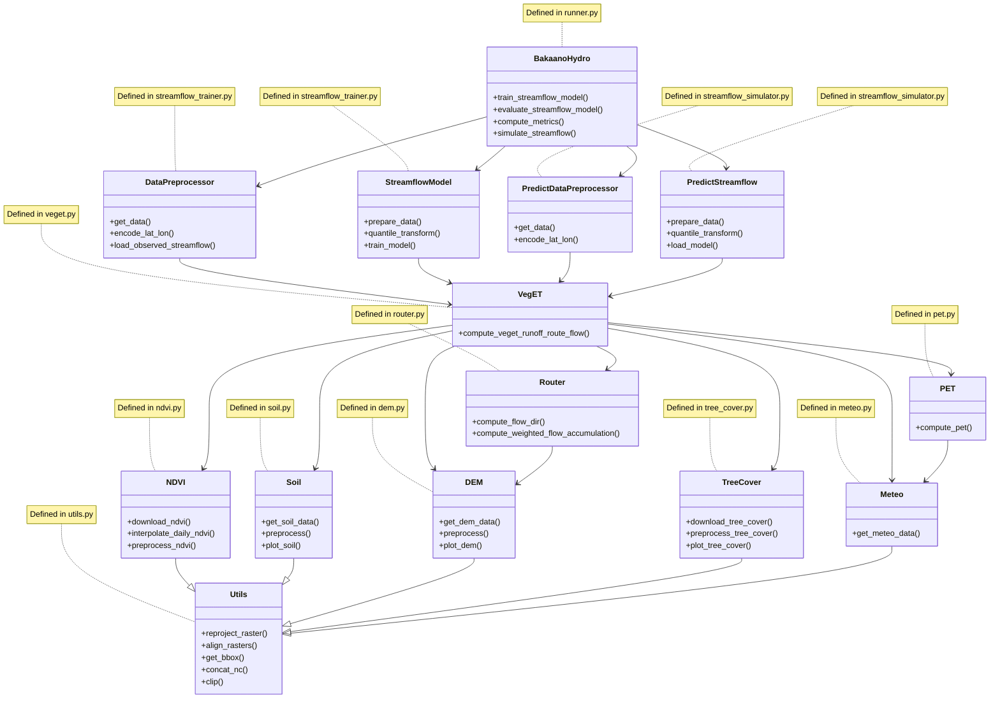

[](https://doi.org/10.5281/zenodo.15227201) [](https://github.com/confidence-duku/bakaano-hydro/blob/main/LICENSE) [](https://github.com/confidence-duku/bakaano-hydro/releases) [](https://github.com/confidence-duku/bakaano-hydro/commits/main) [](https://www.python.org/)


# Bakaano-Hydro

## Description
Bakaano-Hydro is a distributed hydrology-guided neural network model for streamflow prediction. Bakaano-Hydro employs a serial hybridization approach and integrates a gridded process-based rainfall-runoff method that captures spatial heterogeneity and dynamic interactions of meteorological forcings and physiographic attributes generating spatially distributed runoff estimates; a flow routing method propagating runoff through the river network based on topographic constraints to preserve hydrological connectivity.; and a sequential neural network that uses routed flow sequences extracted at hydrological stations to predict streamflow. This approach ensures that primary hydrological responses to climate, soil, topography, and vegetation interactions and changes are captured by process-based components, enhancing interpretability while leveraging deep learning for pattern recognition. 


Bakaano-Hydro leverages extensive data inputs—ranging from digital elevation models (DEMs) to meteorological time-series—and processes them through a robust sequence of automated steps. This includes the download, preprocessing, and alignment of source data, as well as regridding inputs to the desired spatial resolution, ensuring consistency and accuracy across all datasets.
It is highly adaptable, providing users with two primary options for data input: they can either let the model automatically download and preprocess all relevant input data or supply their own datasets. If users choose the latter, Bakaano-Hydro accommodates them by accepting data in the widely-used WGS84 geographic coordinate system (EPSG:4326), without the need for time-consuming clipping or regridding. The model seamlessly adjusts input data to match the DEM's spatial resolution, ensuring that all variables are consistently aligned for optimal performance.

## Installation

- Create and activate a conda environment 

```
conda create --name envname python=3.10.4
conda activate envname
```

- Install the Python libraries to that conda environment

```
sudo apt-get update
sudo apt-get install g++
pip install -r requirements.txt
```


## Usage

Bakaano-Hydro requires three primary data or inputs
1. Shapefile of study area or river basin
2. Observed streamflow data in NetCDF format from Global Runoff Data Center (https://portal.grdc.bafg.de/applications/public.html?publicuser=PublicUser#dataDownload/Home). Because Bakaano-Hydro aims to use only open-source data, it currently accepts observed streamflow data only from GRDC. 
3. Registration at Google Earth Engine (https://code.earthengine.google.com/register). Bakaano-Hydro retrieves, NDVI, tree cover and meteorological variables from ERA5-land or CHIRPS from Google Earth Engine Data Catalog. This platform requires prior registration for subsequent authentication during execution of the model

Model execution then involves only five steps. See the quick start notebook https://github.com/confidence-duku/bakaano-hydro/blob/main/quick_start.ipynb for guidance.


## Code architecture



## Support
For assistance, please contact Confidence Duku (confidence.duku@wur.nl)

## Contributing
No contributions are currently accepted.

## Authors and acknowledgment
See CITATION.cff file.

## License
Apache License
