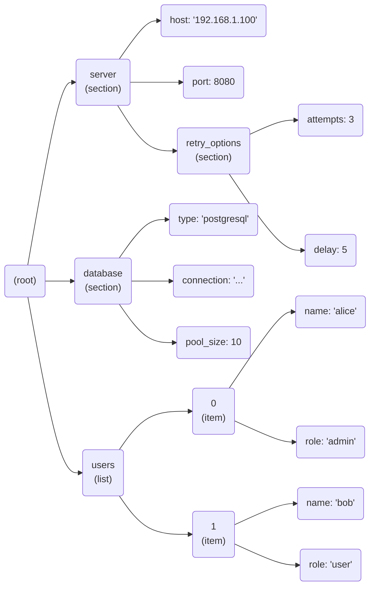

# ConfigGraphViz 📊


[](https://badge.fury.io/py/configgraphviz)
[](https://github.com/manyan-chan/ConfigGraphViz/actions/workflows/python-package.yml)
[](https://opensource.org/licenses/MIT)


Visualize the structure of your configuration files! `ConfigGraphViz` parses common config formats (INI, YAML, TOML) and generates Graphviz DOT language output, allowing you to create diagrams of your configuration hierarchy.

This helps understand complex configurations by showing sections, nested keys, lists, and values.

## Features

*   Parses INI (`.ini`), YAML (`.yaml`, `.yml`), and TOML (`.toml`) files.
*   Generates Graphviz DOT language output (`.dot` file content).
*   Visualizes nested structures (dictionaries/sections, lists).
*   Distinguishes sections, keys, lists, and values using different node shapes/colors (customizable via DOT attributes).
*   Simple Python API.
*   Requires Python 3.8+.
*   Type Hinted.

## Installation

Install from PyPI:

```bash
# Install required parsers too
pip install configgraphviz PyYAML "tomli; python_version < '3.11'"
```

Or install directly from GitHub:

```bash
# Make sure to install dependencies manually or via the repo's requirements
pip install git+https://github.com/manyan-chan/ConfigGraphViz.git 
pip install PyYAML "tomli; python_version < '3.11'" # Install deps separately
```

For local development:

```bash
git clone https://github.com/manyan-chan/ConfigGraphViz.git
cd ConfigGraphViz
pip install -e .[test] # Installs PyYAML, tomli, pytest etc.
```

**Note:** You need Graphviz installed separately to render the generated `.dot` files into images (e.g., PNG, SVG). See [Graphviz Download Page](https://graphviz.org/download/).

## Usage

1.  **Import:**
    ```python
    from configgraphviz import parse_config, build_dot_graph
    from pathlib import Path
    ```

2.  **Parse your configuration file:**
    ```python
    config_file = "path/to/your/config.yaml" # Or .ini, .toml

    try:
        parsed_data = parse_config(config_file)
        print("Successfully parsed config.")
    except (FileNotFoundError, ValueError, ImportError) as e:
        print(f"Error parsing config: {e}")
        exit()
    ```

3.  **Generate the DOT graph string:**
    ```python
    graph_name = Path(config_file).stem # Use filename as graph name
    dot_string = build_dot_graph(parsed_data, graph_name=graph_name)
    print("\nGenerated DOT output:")
    print(dot_string)
    ```

4.  **Save and Render (using Graphviz):**
    ```python
    output_dot_file = f"{graph_name}.dot"
    output_image_file = f"{graph_name}.png" # Or .svg, .pdf, etc.

    with open(output_dot_file, "w", encoding="utf-8") as f:
        f.write(dot_string)
    print(f"\nDOT graph saved to {output_dot_file}")

    # Optional: Use subprocess to call Graphviz's 'dot' command
    import subprocess
    import shutil

    if shutil.which("dot"): # Check if 'dot' command exists
        try:
            subprocess.run(["dot", "-Tpng", output_dot_file, "-o", output_image_file], check=True)
            print(f"Rendered graph image saved to {output_image_file}")
        except (subprocess.CalledProcessError, FileNotFoundError) as e:
            print(f"\nFailed to render graph using 'dot' command: {e}")
            print("Please ensure Graphviz is installed and in your system's PATH.")
    else:
        print("\nGraphviz 'dot' command not found.")
        print(f"You can render the DOT file manually: dot -Tpng {output_dot_file} -o {output_image_file}")
    ```

## Example Output

Given a simple YAML file (`example.yaml`):

```yaml
server:
  host: "192.168.1.100"
  port: 8080
  retry_options:
    attempts: 3
    delay: 5

database:
  type: postgresql
  connection: "..."
  pool_size: 10

users:
  - name: alice
    role: admin
  - name: bob
    role: user
```

Running the script will produce a `.dot` file. Rendering `example.yaml.dot` with `dot -Tpng example.yaml.dot -o example.yaml.png` produces the actual graph image using Graphviz.

The following **Mermaid diagram illustrates the *concept*** of the generated structure (Note: This is Mermaid syntax for demonstration in Markdown, not the DOT output itself. Actual layout by Graphviz may differ):



## Testing

Uses `pytest`. Install test dependencies (`pip install -e .[test]`) and run:

```bash
pytest
```

## Contributing

Contributions welcome! Please submit issues or PRs on [GitHub](https://github.com/manyan-chan/ConfigGraphViz).

## License

MIT License - see [LICENSE](LICENSE) file.