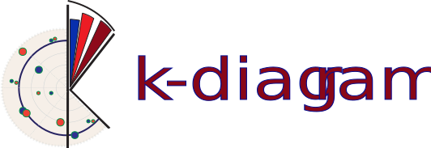

<br>

-----------------------------------------------------

# Unveiling Forecasting Insights with Polar Diagnostics 

[](https://github.com/earthai-tech/k-diagram/actions/workflows/python-package-conda.yml)
[](https://k-diagram.readthedocs.io/en/latest/?badge=latest)

[](https://github.com/psf/black)
[](https://github.com/earthai-tech/k-diagram/blob/main/CONTRIBUTING.md)
<!-- [](https://app.codecov.io/gh/earthai-tech/k-diagram) -->

🧭 **_Navigate the complexities of forecast uncertainty and model behavior with `k-diagram`'s specialized polar visualizations_**

`k-diagram` provides a suite of diagnostic polar plots ("k-diagrams") designed for comprehensive model evaluation, particularly uncertainty-aware forecasting. Go beyond traditional metrics and gain deeper insights into:

* **Forecast Uncertainty:** How reliable are your prediction intervals?
* **Model Drift:** Is your model's performance degrading over time or forecast horizons?
* **Anomaly Analysis:** Where and by how much does your model miss the mark?
* **Performance Patterns:** How does accuracy vary across different conditions or locations (represented angularly)?

Built with applications like **environmental science forecasting** (e.g., land subsidence, flood prediction, climate impacts) in mind, `k-diagram` helps you understand and communicate the nuances of your forecast models.

---

## ✨ Why k-diagram?

* **Intuitive Polar Perspective:** Visualize multi-dimensional aspects like uncertainty spread, temporal drift, and spatial patterns in a compact circular layout.
* **Targeted Diagnostics:** Functions specifically designed to assess interval coverage, consistency, anomaly magnitude, model velocity, and drift.
* **Uncertainty-Aware Evaluation:** Move beyond point-forecast accuracy and evaluate the reliability of your model's uncertainty estimates.
* **Identify Model Weaknesses:** Pinpoint where and when your forecasts are less reliable or exhibit significant anomalies.
* **Clear Communication:** Generate publication-ready plots to effectively communicate model performance and uncertainty characteristics.

---

## 📊 Gallery Highlights

Get a visual taste of `k-diagram`'s capabilities! Below are a few key
examples of the specialized polar plots for uncertainty analysis and
model evaluation. The complete set is available in the documentation.

---

### 1. Coverage Diagnostic

**Insight:** Assess if your prediction intervals (e.g., 90% interval) are well-calibrated. Do they actually cover the observed values at the expected rate?
**Visualization:** Points plotted at radius 1 (covered) or 0 (not covered). A reference line shows the overall empirical coverage rate.

```python
# Code Snippet
import kdiagram as kd
import pandas as pd
import numpy as np

# Dummy Data
N = 150
df = pd.DataFrame({
    'actual': np.random.normal(10, 2, N),
    'q10': 10 - np.random.uniform(1, 3, N),
    'q90': 10 + np.random.uniform(1, 3, N)
})

kd.plot_coverage_diagnostic(
    df,
    actual_col='actual',
    q_cols=['q10', 'q90'],
    title='Interval Coverage Check (Q10-Q90)',
    verbose=1
)
````


-----

### 2\. Anomaly Magnitude

**Insight:** Identify where actual values fall outside prediction intervals (anomalies) and visualize the magnitude of these errors. Differentiate between under- and over-predictions.
**Visualization:** Points representing anomalies plotted with radius indicating error magnitude and color indicating under/over-prediction type.

```python
# Code Snippet
import kdiagram as kd
# (Use df from previous example, adding some anomalies)
df.loc[::10, 'actual'] = df.loc[::10, 'q10'] - np.random.rand(len(df.loc[::10])) * 3 # Under
df.loc[5::10, 'actual'] = df.loc[5::10, 'q90'] + np.random.rand(len(df.loc[5::10])) * 4 # Over

kd.plot_anomaly_magnitude(
    df,
    actual_col='actual',
    q_cols=['q10', 'q90'],
    title='Prediction Anomaly Magnitude',
    cbar=True
)
```


-----

### 3\. Uncertainty Drift Over Time

**Insight:** See how the width of prediction intervals (uncertainty) evolves across different time steps or forecast horizons. Identify locations where uncertainty grows rapidly.
**Visualization:** Concentric rings represent time steps. The radius/shape of each ring indicates the (normalized) interval width at each location/angle.

```python
# Code Snippet
import kdiagram as kd
# (Requires df with multiple qlow/qup cols like sample_data_drift_uncertainty)
# Example using dummy data generation:
import pandas as pd
import numpy as np
years = range(2021, 2025)
N=100
df_drift = pd.DataFrame({'id': range(N)})
qlow_cols, qup_cols = [], []
for i, year in enumerate(years):
   ql, qu = f'q10_{year}', f'q90_{year}'
   qlow_cols.append(ql); qup_cols.append(qu)
   base = np.random.rand(N)*5; width=(np.random.rand(N)+0.5)*(1+i)
   df_drift[ql] = base; df_drift[qu]=base+width

kd.plot_uncertainty_drift(
    df_drift,
    qlow_cols=qlow_cols,
    qup_cols=qup_cols,
    dt_labels=[str(y) for y in years],
    title='Uncertainty Drift (Interval Width)'
)
```


-----

### 4\. Actual vs. Predicted

**Insight:** Directly compare actual observed values against model predictions (e.g., median forecast) point-by-point in a circular layout.
**Visualization:** Two lines or sets of points representing actual and predicted values. Vertical lines connect corresponding points, showing the error magnitude.

```python
# Code Snippet
import kdiagram as kd
import pandas as pd
import numpy as np
# Example using dummy data generation:
N=120
df_avp = pd.DataFrame({
    'actual': 10+5*np.sin(np.linspace(0,4*np.pi,N))+np.random.randn(N),
    'pred': 10+5*np.sin(np.linspace(0,4*np.pi,N))+np.random.randn(N)*0.5+1
})

kd.plot_actual_vs_predicted(
    df_avp,
    actual_col='actual',
    pred_col='pred',
    title='Actual vs. Predicted Comparison'
)
```


-----

Many more examples, including plots for interval consistency, velocity,
Taylor diagrams, and feature fingerprints, are available in the documentation.

➡️ **See the [Complete Gallery](https://k-diagram.readthedocs.io/en/latest/gallery/index.html)**

## 🚀 Installation

Get `k-diagram` easily via pip:

```bash
pip install k-diagram
```

**Development Install:**

To install for development (e.g., to contribute):

```bash
git clone [https://github.com/earthai-tech/k-diagram.git](https://github.com/earthai-tech/k-diagram.git)
cd k-diagram
pip install -e .[dev]
```

*(The `[dev]` installs dependencies useful for testing and documentation)*

**Dependencies:** `k-diagram` requires Python \>= 3.8 and standard scientific libraries like `numpy`, `pandas`, `matplotlib`, `seaborn`, and `scikit-learn`.

-----

## ⚡ Quick Start

Generate an **Interval Width** plot colored by the median prediction in just a few lines:

```python
import kdiagram as kd
import pandas as pd
import numpy as np

# 1. Create some sample data
np.random.seed(77)
n_points = 150
df = pd.DataFrame({
    'location': range(n_points),
    'elevation': np.linspace(100, 500, n_points), # For color
    'q10_val': np.random.rand(n_points) * 20
})
width = 5 + (df['elevation'] / 100) * np.random.uniform(0.5, 2, n_points)
df['q90_val'] = df['q10_val'] + width
df['q50_val'] = df['q10_val'] + width / 2

# 2. Generate the plot
ax = kd.plot_interval_width(
    df=df,
    q_cols=['q10_val', 'q90_val'],  # Lower and Upper quantiles
    z_col='q50_val',                # Color points by Q50 prediction
    title='Prediction Interval Width (Colored by Median)',
    cmap='plasma',
    s=35,
    cbar=True                       # Show color bar
)

# Plot is shown automatically (or use savefig='path/to/plot.png')
# import matplotlib.pyplot as plt
# plt.show() # Not needed if savefig is None
```


-----

## 💻 Using the CLI

`k-diagram` also provides a command-line interface for generating plots directly from CSV files.

**Check available commands:**

```bash
k-diagram --help
```

**Example: Generate a Coverage Diagnostic plot:**

```bash
k-diagram plot_coverage_diagnostic data.csv \
    --actual-col actual_obs \
    --q-cols q10_pred q90_pred \
    --title "Coverage for My Model" \
    --savefig coverage_plot.png
```

*(See `k-diagram <command> --help` for options specific to each plot type).*

-----

## 📚 Documentation

For detailed usage, API reference, and more examples, please visit the official documentation:

**[k-diagram.readthedocs.io](https://k-diagram.readthedocs.io/)** 

-----

## 🙌 Contributing

Contributions are welcome\! Whether it's bug reports, feature suggestions, or code contributions, please get involved.

1.  Check the **[Issues Tracker](https://github.com/earthai-tech/k-diagram/issues)** for existing bugs or ideas.
2.  Fork the repository.
3.  Create a new branch for your feature or fix.
4.  Make your changes and add tests.
5.  Submit a Pull Request.

Please refer to the [CONTRIBUTING](https://k-diagram.readthedocs.io/en/latest/contributing.html) page or the contributing section in the documentation for more detailed guidelines.

-----

## 📜 License

`k-diagram` is distributed under the terms of the **Apache License 2.0**. See the [LICENSE](https://github.com/earthai-tech/k-diagram/blob/main/LICENSE) file for details.

-----

## 📞 Contact & Support

  * **Bug Reports & Feature Requests:** The best place to report issues,
    ask questions about usage, or request new features is the
    [**GitHub Issues**](https://github.com/earthai-tech/k-diagram/issues) page for the project.

  * **Author Contact:** For direct inquiries related to the project's
    origins or specific collaborations, you can reach the author:

      * **Name:** Laurent Kouadio
      * 📧 **Email:** [etanoyau@gmail.com](mailto:etanoyau@gmail.com)
      * 💼 **LinkedIn:** [linkedin.com/in/laurent-kouadio-483b2baa](https://linkedin.com/in/laurent-kouadio-483b2baa)
      * 🆔 **ORCID:** [0000-0001-7259-7254](https://orcid.org/0000-0001-7259-7254)
