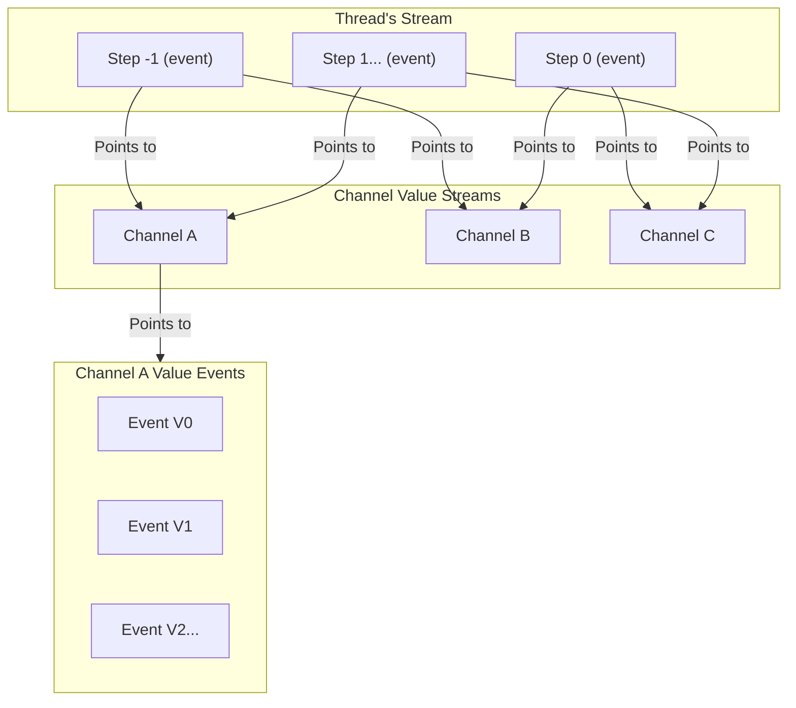

# LangGraph Checkpoint KurrentDB: Experimental

KurrentDB checkpoint implementation for LangGraph. 
This is an experimental release and not be ready to be used in production, yet.
This project is intended to show that KurrentDB has the right native capabilities to be used as a checkpointing mechanism for LangGraph.

If you would like to see a production version of the checkpointer, feel free to upvote this issue: https://github.com/kurrent-io/langgraph-checkpoint-kurrentdb/issues/3

## Overview

LangGraph is an orchestration framework for complex agentic systems.
This package provides a checkpointing mechanism for LangGraph using KurrentDB.
We use KurrentDB's event sourcing capabilities to store the state of the LangGraph execution.
The versioning of state is mapped to KurrentDB's native event versioning and every the channel value is kept into its own stream.
Every step in the thread then only has a pointer (channel value name and version) to the actual channel value (event). 
(Original Langgraph's channel versioning is also kept)



## Installation

```bash
pip install langgraph-checkpoint-kurrentdb
```

Or using Poetry:

```bash
poetry add langgraph-checkpoint-kurrentdb
```

## Usage

Setting up the KurrentDB checkpointer for your LangGraph:

```python
from langgraph.graph import StateGraph
from langgraph_checkpoint_kurrentdb import KurrentDBSaver
from kurrentdbclient import KurrentDBClient

# Initialize the KurrentDB client
client = KurrentDBClient(uri="esdb://localhost:2113?Tls=false")

# Create the KurrentDB checkpoint saver
saver = KurrentDBSaver(client)

# Create your LangGraph
builder = StateGraph(int)
builder.add_node("add_one", lambda x: x + 1)
builder.set_entry_point("add_one")
builder.set_finish_point("add_one")

# Compile with the KurrentDB checkpointer
graph = builder.compile(checkpointer=saver)

# Use thread ID to identify this execution
config = {"configurable": {"thread_id": "example-thread-1", "checkpoint_ns": ""}}
result = graph.invoke(42, config)

# Later, retrieve the state
state = graph.get_state(config)
```

## Tests
```bash
poetry run pytest --cov --cov-report=term-missing
```
