# LoRA‑Provenance `loraprov`

[](https://github.com/KeithTyser/lora-provenance/actions/workflows/ci.yml)  
  
<br>
📚 **Docs:** <https://keithtyser.github.io/lora-provenance>

Tamper‑evident **signatures** and **license lineage** for any LoRA / adapter file.

---

## Quick‑start

```bash
# install (after first PyPI release)
pip install loraprov

# generate a signing key
loraprov key generate alice

# sign an adapter
loraprov sign adapter.safetensors --parent-sha 6efa... --license MIT --key alice

# verify before deploying
loraprov verify adapter.safetensors
```

*Tip&nbsp;→* to protect Hugging Face pushes, enable the [pre‑upload filter](docs/hf_filter.md).  
Need compliance docs? `loraprov sbom adapter.safetensors` exports a **CycloneDX SBOM** instantly.

---

## Architecture

```mermaid
flowchart LR
    A[Developer] --> B["loraprov sign"]
    B --> C["Signed Adapter"]
    C --> D["loraprov verify<br/>(CI / Prod)"]
    B --> E["HF filter"]
    E --> C
    C --> F["SBOM export"]
```



---

## Why use LoRA‑Provenance?

| Problem | Benefit |
|---------|---------|
| Poisoned adapters | Signature mismatch blocks deployment |
| License ambiguity | License + parent SHA embedded at sign‑time |
| Compliance (EU AI Act, NIST AI RMF) | One‑line SBOM and full provenance chain |
| Reproducibility | Cite an immutable SHA‑256 instead of a URL |

---

## Roadmap

- WebAssembly verifier (browser demo)  
- Hardware‑backed keys (YubiKey)  
- Lineage visualizer (interactive graph)

---

### Contributing

1. `git clone …` → `poetry install`  
2. `poetry run pytest` (tests + lint)  
3. Open a PR – CI must stay green

Licensed under **Apache‑2.0** © 2025 Keith Tyser & contributors.
