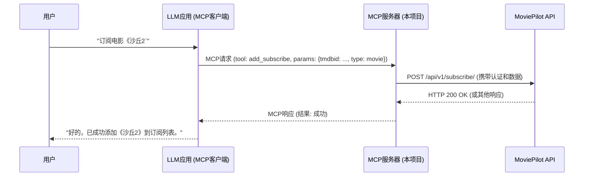

# MoviePilot MCP 服务器

[](https://opensource.org/licenses/MIT)

这是一个 **模型上下文协议 (MCP - Model Context Protocol)** 服务器实现，专门用于连接大型语言模型 (LLM)
与 [MoviePilot](https://github.com/jxxghp/MoviePilot) 媒体库自动化管理服务器。

## 目标

本项目旨在让用户能够通过自然语言与他们的 MoviePilot 实例进行交互，从而实现以下功能：

* **搜索和发现** 电影、电视剧及相关信息。
* **查询** 媒体详情、季集信息、演员阵容和推荐。
* **查找** 可用的下载资源 (种子)。
* **管理** 媒体订阅（添加、查看、更新、删除、启用/禁用）。
* **控制** 下载任务（添加、查看状态、暂停、恢复、删除）。
* **获取** 媒体库状态（最近添加、正在播放、检查存在性）。

通过将 MoviePilot 的功能暴露给 LLM，用户可以在支持 MCP 的聊天应用（如 Claude App 或集成了 MCP 的客户端）中，用对话的方式轻松管理媒体库。

## 工作原理

本项目实现了一个 MCP 服务器，它充当了 MCP 客户端 (集成在 LLM 应用中) 和你的 MoviePilot 服务器之间的桥梁：

1. **用户** 通过支持 MCP 的 **LLM 应用 (MCP 主机/客户端)** 发出指令 (例如："帮我订阅电影《沙丘2》")。
2. **LLM 应用** 将指令解析，识别出意图和参数，并根据 MCP 协议向 **本项目实现的 MCP 服务器** 发出请求。
3. **MCP 服务器** 接收请求，将其转换为对 **MoviePilot 服务器** 的相应 REST API 调用。
4. **MoviePilot 服务器** 执行操作 (如添加订阅)。
5. **MoviePilot 服务器** 将结果返回给 **MCP 服务器**。
6. **MCP 服务器** 将结果格式化，通过 MCP 协议返回给 **LLM 应用**。
7. **LLM 应用** 将结果呈现给 **用户** (例如："好的，已成功添加《沙丘2》到订阅列表。")。



## 核心功能

基于 MoviePilot 的 API，本 MCP 服务器计划（或已）暴露以下核心功能作为 MCP Tools：

### 1. 搜索与发现

* **搜索媒体:** 根据标题/关键词查找电影、电视剧或人物。
    * *API:* `GET /api/v1/media/search`
    * *示例:* "搜索电影《星际穿越》", "找找演员 '基努·里维斯'"
* **获取TMDb趋势:** 获取TMDb上当前流行的电影或电视剧。
    * *MCP Tool:* `get_trending_media`
    * *示例:* "看看现在流行什么电影？", "推荐一些热门电视剧"
* **获取TMDb新作:** 获取TMDb即将上映的电影或最新播出的电视剧。
    * *MCP Tool:* `get_upcoming_or_newly_released_media`
    * *示例:* "最近有什么新上映的电影吗？", "有哪些最近开播的电视剧？"
* **浏览推荐/分类:** 查看来自豆瓣、TMDB等的推荐列表或分类。
    * *API:* `GET /api/v1/discover/*`, `GET /api/v1/recommend/*`
    * *示例:* "推荐一些豆瓣高分科幻片", "看看TMDB上正在热映的电影"

### 2. 获取详情

* **媒体详情:** 查询电影或剧集的详细信息（简介、评分、ID 等）。
    * *API:* `GET /api/v1/media/{mediaid}`
    * *示例:* "告诉我《沙丘2》的详细资料"
* **季集信息:** 查询剧集的季列表或特定季的集信息。
    * *API:* `GET /api/v1/media/seasons`, `GET /api/v1/tmdb/{tmdbid}/{season}` (及类似接口)
    * *示例:* "《老友记》有几季？", "看看《怪奇物语》第4季每一集的标题"

### 3. 资源查找

* **精确搜索资源:** 根据 TMDB ID 或豆瓣 ID 查找可下载的种子。
    * *API:* `GET /api/v1/search/media/{mediaid}`
    * *示例:* "帮我找《奥本海默》的下载资源", "搜索《最后生还者》第一季所有集的下载"
* **模糊搜索资源:** 根据关键词搜索种子。
    * *API:* `GET /api/v1/search/title`
    * *示例:* "搜索标题里有 '4K HDR 蜘蛛侠' 的资源"

### 4. 订阅管理

* **添加订阅:** 新增电影或电视剧的自动下载/监控。
    * *API:* `POST /api/v1/subscribe/`
    * *示例:* "订阅电影《沙丘2》", "订阅电视剧《黑暗荣耀》第一季，排除预告片"
* **查看订阅:** 列出所有当前订阅或特定订阅的详情。
    * *API:* `GET /api/v1/subscribe/`, `GET /api/v1/subscribe/{subscribe_id}`, `GET /api/v1/subscribe/media/{mediaid}`
    * *示例:* "我现在有哪些订阅？", "我订阅了《奥本海默》吗？"
* **更新订阅:** 修改现有订阅的设置（如过滤规则）。
    * *API:* `PUT /api/v1/subscribe/`
    * *示例:* "把我《最后生还者》的订阅改成只下载特效字幕组的版本"
* **删除订阅:** 取消订阅。
    * *API:* `DELETE /api/v1/subscribe/{subscribe_id}`, `DELETE /api/v1/subscribe/media/{mediaid}`
    * *示例:* "取消我的《沙丘2》订阅"
* **启用/禁用订阅:** 暂停或恢复订阅的自动搜索。
    * *API:* `PUT /api/v1/subscribe/status/{subid}`
    * *示例:* "暂停《权力的游戏》的订阅"

### 5. 下载任务管理

* **添加下载:** 下载一个具体的种子。
    * *API:* `POST /api/v1/download/`
    * *示例:* "下载刚才找到的那个《奥本海默》4K种子"
* **查看下载:** 列出当前正在进行的下载任务。
    * *API:* `GET /api/v1/download/`
    * *示例:* "看看现在有哪些任务在下载？进度怎么样？"
* **控制下载:** 暂停、恢复或删除下载任务。
    * *API:* `GET /api/v1/download/stop/{hash}`, `GET /api/v1/download/start/{hash}`, `DELETE /api/v1/download/{hash}`
    * *示例:* "暂停《沙丘2》的下载", "恢复下载《奥本海默》", "把那个下载失败的任务删掉"

### 6. 状态与历史查询

* **媒体库状态:** 查看媒体服务器最近添加或正在播放的内容。
    * *API:* `GET /api/v1/mediaserver/latest`, `GET /api/v1/mediaserver/playing`
    * *示例:* "我Jellyfin库里最近加了什么？", "现在有人在用Plex看电影吗？"
* **检查存在性:** 查询某个媒体是否已在库中。
    * *API:* `GET /api/v1/mediaserver/exists`
    * *示例:* "我库里有《星际穿越》了吗？", "《老友记》第一季全集都在吗？"
* **下载历史:** (可选) 查看过去的下载记录。
    * *API:* `GET /api/v1/history/download`
    * *示例:* "我上周下载了哪些电影？"

## 安装与设置

**先决条件:**

* Python 3.12+
* uv 包管理器
* 一个正在运行并可访问的 MoviePilot 服务器实例
* 一个支持 MCP 的 LLM 应用/客户端

**步骤:**

1. **克隆仓库:**
   ```bash
   git clone https://github.com/Pollo3470/MoviePilot-MCP
   cd MoviePilot-MCP
   ```
2. **配置:**
   创建 `.env` 文件 (可以从 `.env.example` 复制) 并填入必要的配置信息：
    ```dotenv
    # .env Example
    MOVIEPILOT_BASE_URL=http://your-moviepilot-ip:3000  # 你的 MoviePilot 地址

    # 配置认证方式
    # MOVIEPILOT_API_KEY=your_moviepilot_api_key  # MoviePilot 的 APIToken (API_KEY可用接口过少，暂时不推荐使用)
    MOVIEPILOT_USERNAME=your_moviepilot_username  # 你的 MoviePilot 用户名 (用于密码认证)
    MOVIEPILOT_PASSWORD=your_moviepilot_password  # 你的 MoviePilot 密码 (用于密码认证)
    ```
3. **安装依赖:**
   ```bash
   uv sync
   ```
4. **配置服务器:**
   TODO: CherryStudio stdio安装示例

## 配置项

* `MOVIEPILOT_BASE_URL`: MoviePilot 服务器的URL。
* `MOVIEPILOT_API_KEY`: MoviePilot 的 APIToken (可选，暂无作用)。
* `MOVIEPILOT_USERNAME`: 你的 MoviePilot 用户名 (用于密码认证)。
* `MOVIEPILOT_PASSWORD`: 你的 MoviePilot 密码 (用于密码认证)。

## 使用示例

启动 MCP 服务器并连接好 LLM 客户端后，你可以开始用自然语言与 MoviePilot 交互：

* "最近有什么好看的科幻电影推荐吗？" (触发 Discover/Recommend API)
* "帮我找找《瞬息全宇宙》这部电影的下载" (触发 Search Media -> Search Resource API)
* "我库里有《老友记》全集吗？" (触发 Mediaserver Exists API)
* "订阅《星期三》第一季，下载 1080p 的版本" (触发 Add Subscribe API)
* "现在下载进度怎么样？" (触发 Download List API)
* "暂停下载《阿凡达2》" (触发 Download Stop API)

## 开发状态

* 当前状态: 构建MCP stdio服务
* 未来计划: 逐步接入MoviePilot功能 提供MCP SSE部署方式

## 安全提示

* **本地运行:** 强烈建议在你的本地网络运行此 MCP 服务器，本服务器需要存储MP账密，请确保你的环境安全。
* **账号安全:** 建议建立一个专用的 MoviePilot 账号用于此 MCP 服务器，避免使用管理员账号。

## 贡献

欢迎贡献！如果你发现 Bug 或有功能建议，请提交 Issue。如果你想贡献代码，请 Fork 仓库并发起 Pull Request。

## 许可证

本项目采用 [MIT License](LICENSE) 授权。