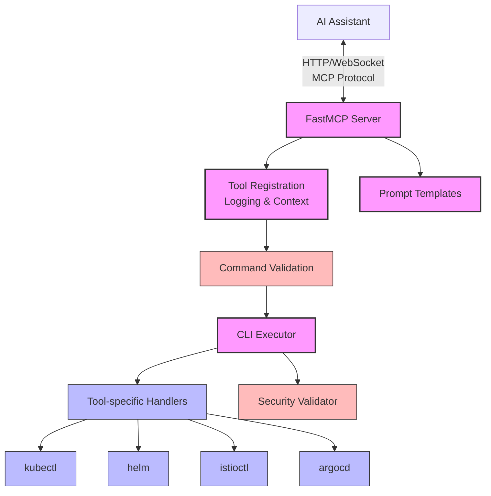
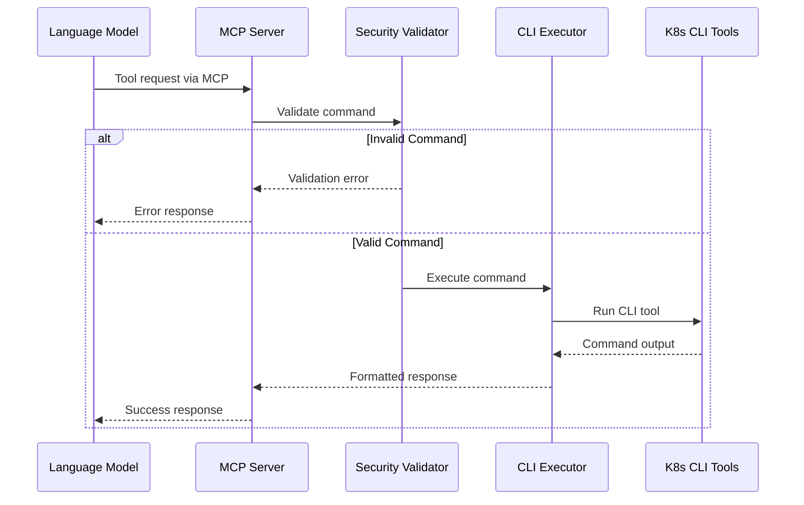
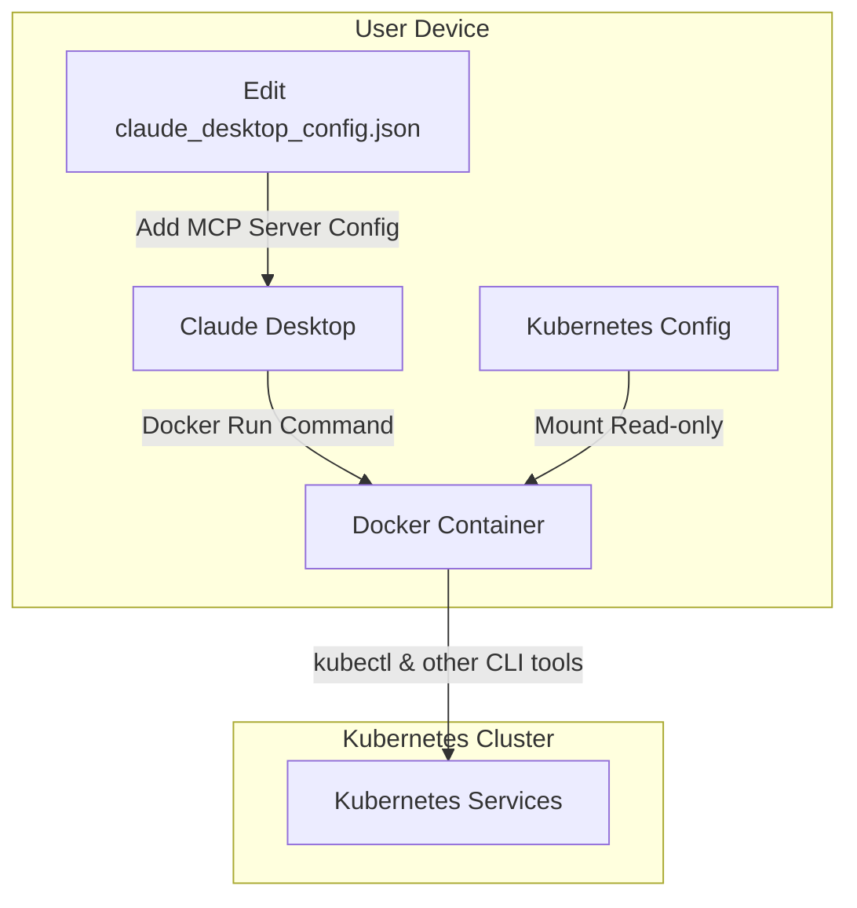
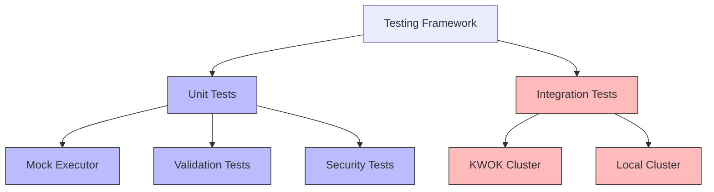
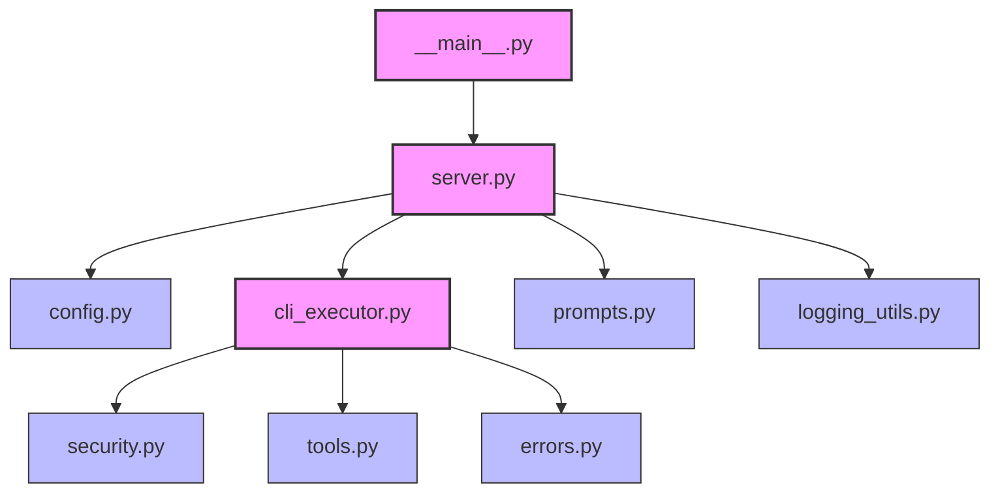

# K8s MCP Server

[](https://github.com/alexei-led/k8s-mcp-server/actions/workflows/ci.yml)
[](https://github.com/alexei-led/k8s-mcp-server/actions/workflows/release.yml)
[](https://codecov.io/gh/alexei-led/k8s-mcp-server)
[](https://www.python.org/downloads/)
[](https://opensource.org/licenses/MIT)
[](https://github.com/alexei-led/k8s-mcp-server/pkgs/container/k8s-mcp-server)

K8s MCP Server is a server for [Anthropic's MCP (Model Context Protocol)](https://www.anthropic.com/news/introducing-mcp) that allows running Kubernetes CLI tools such as `kubectl`, `istioctl`, `helm`, and `argocd` in a safe, containerized environment.

## Overview

K8s MCP Server acts as a secure bridge between language models (like Claude) and Kubernetes CLI tools. It enables language models to execute validated Kubernetes commands, retrieve command documentation, and process command output in a structured way.

## Demo: Deploy and Troubleshoot WordPress

**Session 1:** Using k8s-mcp-server and Helm CLI to deploy a WordPress application in the claude-demo namespace, then intentionally breaking it by scaling the MariaDB StatefulSet to zero.

**Session 2:** Troubleshooting session where we use k8s-mcp-server to diagnose the broken WordPress site through kubectl commands, identify the missing database issue, and fix it by scaling up the StatefulSet and configuring ingress access..

[Demo](https://private-user-images.githubusercontent.com/1898375/428398164-5ddce5bc-ec92-459b-a506-5d4442618a81.mp4?jwt=eyJhbGciOiJIUzI1NiIsInR5cCI6IkpXVCJ9.eyJpc3MiOiJnaXRodWIuY29tIiwiYXVkIjoicmF3LmdpdGh1YnVzZXJjb250ZW50LmNvbSIsImtleSI6ImtleTUiLCJleHAiOjE3NDMzNDE0OTEsIm5iZiI6MTc0MzM0MTE5MSwicGF0aCI6Ii8xODk4Mzc1LzQyODM5ODE2NC01ZGRjZTViYy1lYzkyLTQ1OWItYTUwNi01ZDQ0NDI2MThhODEubXA0P1gtQW16LUFsZ29yaXRobT1BV1M0LUhNQUMtU0hBMjU2JlgtQW16LUNyZWRlbnRpYWw9QUtJQVZDT0RZTFNBNTNQUUs0WkElMkYyMDI1MDMzMCUyRnVzLWVhc3QtMSUyRnMzJTJGYXdzNF9yZXF1ZXN0JlgtQW16LURhdGU9MjAyNTAzMzBUMTMyNjMxWiZYLUFtei1FeHBpcmVzPTMwMCZYLUFtei1TaWduYXR1cmU9YmUyNDExMGUzOGRlN2QxNWViMzhhOTE4Y2U1ZmRjMTQxYTI0OGNlNTFjNTRlMjFjNmQ3NTNhNGFmODNkODIzMSZYLUFtei1TaWduZWRIZWFkZXJzPWhvc3QifQ.hwKERwuQRXxHEYJ9d_fQ__XL1gj8l76nO6Yy6M4Uov8)

## Architecture

K8s MCP Server is designed with a focus on security, performance, and extensibility. The system comprises the following core components:



### Core Components

1. **Server Component**: Central controller that initializes the MCP server, registers tools and prompts, and handles client requests.

2. **Security Validator**: Checks command structure and content to prevent potentially dangerous operations, enforcing strict validation rules.

3. **CLI Executor**: Manages command execution, timeout handling, and output processing for all Kubernetes CLI tools.

4. **Tool-specific Handlers**: Specialized functions for each supported tool (kubectl, helm, istioctl, argocd) that provide appropriate command preprocessing and response formatting.

5. **Prompt Templates**: Pre-defined natural language templates for common Kubernetes operations to improve language model interactions.

### Command Execution Flow

The following diagram illustrates how commands flow through the system:



1. The language model sends a command request via the MCP protocol.
2. The server validates the command using security rules.
3. If valid, the command is executed with the appropriate CLI tool.
4. Results or errors are captured and formatted into a structured response.
5. The response is returned to the language model.

## Features

- Execute Kubernetes CLI commands securely with proper validation, timeouts and error handling
- Support for multiple Kubernetes CLI tools:
  - `kubectl`: Kubernetes command-line tool
  - `istioctl`: Command-line tool for Istio service mesh
  - `helm`: Kubernetes package manager
  - `argocd`: GitOps continuous delivery tool for Kubernetes
- Command piping capabilities with popular Linux CLI tools
- Detailed command validation and safety checks
- Configurable timeouts and output limits
- Comprehensive documentation and help retrieval
- Context and namespace management
- Pre-built prompt templates for common Kubernetes operations

## Requirements

To use K8s MCP Server with Claude Desktop, you need:

- Docker installed on your system
- Valid Kubernetes configuration in `~/.kube/config`
- Claude Desktop application

## Configuration

K8s MCP Server can be configured via environment variables that can be passed to the Docker container:

| Environment Variable | Description | Default | Required |
|----------------------|-------------|---------|----------|
| `K8S_MCP_TIMEOUT` | Default timeout for commands (seconds) | `300` | No |
| `K8S_MCP_MAX_OUTPUT` | Maximum output size (characters) | `100000` | No |
| `K8S_MCP_TRANSPORT` | Transport protocol to use ("stdio" or "sse") | `stdio` | No |
| `K8S_CONTEXT` | Kubernetes context to use | *current context* | No |
| `K8S_NAMESPACE` | Default Kubernetes namespace | `default` | No |
| `K8S_MCP_SECURITY_MODE` | Security mode ("strict" or "permissive") | `strict` | No |
| `K8S_MCP_SECURITY_CONFIG` | Path to security configuration YAML file | `None` | No |

For example, to use specific context and namespace, modify your Claude Desktop configuration:

```json
{
  "mcpServers": {
    "k8s-mcp-server": {
      "command": "docker",
      "args": [
        "run",
        "-i",
        "--rm",
        "-v",
        "~/.kube:/home/appuser/.kube:ro",
        "-e",
        "K8S_CONTEXT=my-cluster",
        "-e",
        "K8S_NAMESPACE=my-namespace",
        "ghcr.io/alexei-led/k8s-mcp-server:latest"
      ]
    }
  }
}
```

#### Using Custom Security Configuration

To use a custom security configuration file, mount it into the container and set the environment variable:

```json
{
  "mcpServers": {
    "k8s-mcp-server": {
      "command": "docker",
      "args": [
        "run",
        "-i",
        "--rm",
        "-v",
        "~/.kube:/home/appuser/.kube:ro",
        "-v",
        "/path/to/my-security-config.yaml:/app/security_config.yaml:ro",
        "-e",
        "K8S_MCP_SECURITY_CONFIG=/app/security_config.yaml",
        "ghcr.io/alexei-led/k8s-mcp-server:latest"
      ]
    }
  }
}
```

#### Running in Permissive Mode

To run in permissive mode (allow all commands, including potentially dangerous ones):

```json
{
  "mcpServers": {
    "k8s-mcp-server": {
      "command": "docker",
      "args": [
        "run",
        "-i",
        "--rm",
        "-v",
        "~/.kube:/home/appuser/.kube:ro",
        "-e",
        "K8S_MCP_SECURITY_MODE=permissive",
        "ghcr.io/alexei-led/k8s-mcp-server:latest"
      ]
    }
  }
}
```

## Integrating with Claude Desktop

To integrate K8s MCP Server with Claude Desktop, follow these steps:

1. **Locate the Claude Desktop configuration file**:
   - macOS: `~/Library/Application Support/Claude/claude_desktop_config.json`
   - Windows: `%APPDATA%\Claude\claude_desktop_config.json`

2. **Edit the configuration file** to include the K8s MCP Server:
   ```json
   {
     "mcpServers": {
       "kubernetes": {
         "command": "docker",
         "args": [
           "run",
           "-i",
           "--rm",
           "-v",
           "~/.kube:/home/appuser/.kube:ro",
           "ghcr.io/alexei-led/k8s-mcp-server:latest"
         ]
       }
     }
   }
   ```

   > **Note**: Make sure to replace `~/.kube` with the absolute path to your Kubernetes configuration directory, and update the image name if using a custom image.

3. **Restart Claude Desktop** to apply the changes
   - After restarting, you should see a hammer 🔨 icon in the bottom right corner of the input box
   - This indicates that the K8s MCP Server is available for use



### Using Kubernetes Tools in Claude

Once configured, you can ask Claude to perform Kubernetes operations:

- "Show me the pods in my default namespace using kubectl"
- "Help me deploy a new application with Helm"
- "Check the status of my Istio service mesh"
- "List all my Kubernetes deployments"

Claude will automatically use the appropriate Kubernetes CLI tools via the K8s MCP Server.
```

## API Reference

The server implements the [Model Context Protocol (MCP)](https://docs.anthropic.com/en/docs/agents-and-tools/model-context-protocol-mcp/) and provides the following tools:

### Documentation Tools

Each Kubernetes CLI tool has its own documentation function:

- `describe_kubectl(command=None)`: Get documentation for kubectl commands
- `describe_helm(command=None)`: Get documentation for Helm commands
- `describe_istioctl(command=None)`: Get documentation for Istio commands
- `describe_argocd(command=None)`: Get documentation for ArgoCD commands

### Execution Tools

Each Kubernetes CLI tool has its own execution function:

- `execute_kubectl(command, timeout=None)`: Execute kubectl commands
- `execute_helm(command, timeout=None)`: Execute Helm commands
- `execute_istioctl(command, timeout=None)`: Execute Istio commands
- `execute_argocd(command, timeout=None)`: Execute ArgoCD commands

### Command Piping

All execution tools support Unix command piping to filter and transform output:

```python
execute_kubectl(command="get pods -o json | jq '.items[].metadata.name'")
execute_helm(command="list | grep nginx")
```

### Configuration Options

#### Environment Variables

| Variable | Description | Default | Notes |
|----------|-------------|---------|-------|
| `K8S_MCP_TIMEOUT` | Command execution timeout (seconds) | 300 | Applies to all commands |
| `K8S_MCP_MAX_OUTPUT` | Maximum output size (characters) | 100000 | Truncates output if exceeded |
| `K8S_MCP_TRANSPORT` | Transport protocol | "stdio" | "stdio" or "sse" |
| `K8S_CONTEXT` | Kubernetes context | current | Uses kubectl current-context if empty |
| `K8S_NAMESPACE` | Default namespace | "default" | Applied to all commands |
| `K8S_MCP_SECURITY_MODE` | Security validation mode | "strict" | "strict" or "permissive" |
| `K8S_MCP_SECURITY_CONFIG` | Path to security config file | None | YAML configuration file |

#### Security Configuration File Format

The security configuration file uses YAML format with the following structure:

```yaml
# Dangerous command prefixes (prefix-based matching)
dangerous_commands:
  kubectl:
    - "kubectl delete"
    - "kubectl drain"
    # ...more dangerous commands

# Safe pattern exceptions (prefix-based matching)
safe_patterns:
  kubectl:
    - "kubectl delete pod"
    - "kubectl delete deployment"
    # ...more safe patterns

# Advanced regex pattern rules
regex_rules:
  kubectl:
    - pattern: "kubectl\\s+delete\\s+(-[A-Za-z]+\\s+)*--all\\b"
      description: "Deleting all resources of a type"
      error_message: "Custom error message shown to the user"
    # ...more regex rules
```

## Supported Tools and Commands

### kubectl

Execute and manage Kubernetes resources:

```
kubectl get pods
kubectl get deployments
kubectl describe pod my-pod
```

### istioctl

Manage Istio service mesh configuration:

```
istioctl analyze
istioctl proxy-status
istioctl dashboard
```

### helm

Manage Helm charts and releases:

```
helm list
helm install my-release my-chart
helm upgrade my-release my-chart
```

### argocd

Manage ArgoCD applications:

```
argocd app list
argocd app get my-app
argocd app sync my-app
```

## Testing

K8s MCP Server includes comprehensive test coverage with both unit and integration tests. The testing architecture is designed to be lightweight, fast, and representative of real-world usage.



### Running Integration Tests

Integration tests validate the command execution and response handling of k8s-mcp-server. By default, the tests use KWOK (Kubernetes Without Kubelet) to create a lightweight simulated Kubernetes cluster for testing.

#### Prerequisites

Integration tests require:
- `kubectl` installed and in your PATH
- `kwokctl` installed for the default KWOK-based testing (see below)
- Optional: `helm` for Helm-related tests
- Optional: A real Kubernetes cluster for advanced testing scenarios

#### Option 1: Using KWOK (Recommended)

[KWOK (Kubernetes Without Kubelet)](https://kwok.sigs.k8s.io/) provides a lightweight simulation of a Kubernetes cluster without requiring actual node or container execution. This is the default and recommended approach for running the integration tests.

1. **Install KWOK**:
   ```bash
   # For macOS with Homebrew:
   brew install kwokctl
   
   # For Linux or manual installation:
   KWOK_VERSION=$(curl -s https://api.github.com/repos/kubernetes-sigs/kwok/releases/latest | grep tag_name | cut -d '"' -f 4)
   curl -Lo kwokctl https://github.com/kubernetes-sigs/kwok/releases/download/${KWOK_VERSION}/kwokctl-$(go env GOOS)-$(go env GOARCH)
   curl -Lo kwok https://github.com/kubernetes-sigs/kwok/releases/download/${KWOK_VERSION}/kwok-$(go env GOOS)-$(go env GOARCH)
   chmod +x kwokctl kwok
   sudo mv kwokctl kwok /usr/local/bin/
   ```

2. **Run Integration Tests**:
   ```bash
   # Run all integration tests (KWOK cluster will be created automatically)
   pytest tests/integration -v
   
   # Run specific test
   pytest tests/integration/test_k8s_tools.py::test_kubectl_version -v
   
   # Skip cleanup of KWOK cluster for debugging
   K8S_SKIP_CLEANUP=true pytest tests/integration -v
   ```

The test framework will:
1. Automatically create a KWOK cluster for your tests
2. Run all integration tests against this cluster
3. Delete the cluster when tests complete (unless `K8S_SKIP_CLEANUP=true`)

Benefits of using KWOK:
- Extremely lightweight (no real containers or nodes)
- Fast startup and shutdown (seconds vs. minutes)
- Consistent and reproducible test environment
- No external dependencies or complex infrastructure

#### Option 2: Using Rancher Desktop

If you need to test against a real Kubernetes implementation, [Rancher Desktop](https://rancherdesktop.io/) provides a convenient way to run Kubernetes locally:

1. **Enable Kubernetes in Rancher Desktop**:
   - Open Rancher Desktop
   - Go to Preferences → Kubernetes
   - Ensure Kubernetes is enabled and running

2. **Configure Environment Variables**:
   ```bash
   # Required: Tell tests to use your existing cluster instead of KWOK
   export K8S_MCP_TEST_USE_EXISTING_CLUSTER=true
   
   # Optional: Specify Rancher Desktop context
   export K8S_CONTEXT=rancher-desktop
   
   # Optional: Skip cleanup of test namespaces
   export K8S_SKIP_CLEANUP=true
   ```

3. **Run Integration Tests**:
   ```bash
   pytest tests/integration -v
   ```

#### Option 3: Using Another Existing Kubernetes Cluster

For testing against production-like environments or specific Kubernetes distributions:

```bash
# Set required environment variables
export K8S_MCP_TEST_USE_EXISTING_CLUSTER=true

# Optionally specify a context
export K8S_CONTEXT=my-cluster-context

# Run the tests
pytest -m integration
```

This approach works with any Kubernetes distribution (EKS, GKE, AKS, k3s, k0s, etc.).

#### Option 4: Setting Up a Local Kubernetes Cluster for Development

For local development, we recommend setting up a lightweight Kubernetes cluster:

**Using k3s (Recommended for Linux):**

[k3s](https://k3s.io/) is a certified lightweight Kubernetes distribution:

```bash
# Install k3s
curl -sfL https://get.k3s.io | sh -

# Get kubeconfig (sudo is required to read the config)
sudo cat /etc/rancher/k3s/k3s.yaml > ~/.kube/k3s-config
# Fix permissions
chmod 600 ~/.kube/k3s-config
# Set KUBECONFIG to use this file
export KUBECONFIG=~/.kube/k3s-config

# Verify it's running
kubectl get nodes
```

**Using k0s (Recommended for all platforms):**

[k0s](https://k0sproject.io/) is a zero-friction Kubernetes distribution:

```bash
# Install k0s
curl -sSLf https://get.k0s.sh | sh

# Create a single-node cluster
sudo k0s install controller --single
sudo k0s start

# Get kubeconfig
sudo k0s kubeconfig admin > ~/.kube/k0s-config
chmod 600 ~/.kube/k0s-config
export KUBECONFIG=~/.kube/k0s-config

# Verify it's running
kubectl get nodes
```

**Using Minikube:**

[Minikube](https://minikube.sigs.k8s.io/docs/start/) creates a local Kubernetes cluster within a VM or container:

```bash
# Install Minikube
# macOS with Homebrew:
brew install minikube

# Start a cluster
minikube start

# Verify it's running
kubectl get nodes
```

**Using Kind (Kubernetes in Docker):**

[Kind](https://kind.sigs.k8s.io/docs/user/quick-start/) runs Kubernetes clusters using Docker containers as nodes:

```bash
# Install Kind
# macOS with Homebrew:
brew install kind

# Create a cluster
kind create cluster --name k8s-mcp-test

# Verify it's running
kubectl get nodes
```

**Using K3d (Lightweight Kubernetes):**

[K3d](https://k3d.io/) is a lightweight wrapper to run [k3s](https://k3s.io/) in Docker:

```bash
# Install K3d
# macOS with Homebrew:
brew install k3d

# Create a cluster
k3d cluster create k8s-mcp-test

# Verify it's running
kubectl get nodes
```

#### Environment Variables for Integration Tests

You can customize the integration tests with these environment variables:

| Environment Variable | Description | Default |
|----------------------|-------------|---------|
| `K8S_MCP_TEST_USE_KWOK` | Use KWOK to create a test cluster | `true` |
| `K8S_MCP_TEST_USE_EXISTING_CLUSTER` | Use existing cluster instead of creating a new one | `false` |
| `K8S_CONTEXT` | Kubernetes context to use for tests | *current context* |
| `K8S_SKIP_CLEANUP` | Skip cleanup of test resources | `false` |

Example usage:

```bash
# Force using KWOK even if other variables are set
export K8S_MCP_TEST_USE_KWOK=true
pytest -m integration

# Use existing cluster with a specific context
export K8S_MCP_TEST_USE_EXISTING_CLUSTER=true
export K8S_CONTEXT=my-dev-cluster
pytest -m integration

# Skip cleanup of test resources (useful for debugging)
export K8S_SKIP_CLEANUP=true
pytest -m integration
```

#### Continuous Integration with GitHub Actions

The project includes GitHub Actions workflows that automatically run integration tests:

1. **CI Workflow**: Runs unit tests on every PR to ensure code quality
2. **Integration Tests Workflow**: Sets up a KWOK cluster and runs integration tests against it

The integration test workflow:
- Installs KWOK on the CI runner
- Creates a lightweight simulated Kubernetes cluster
- Installs all required CLI tools (kubectl, helm, istioctl, argocd)
- Runs all tests marked with the 'integration' marker
- Cleans up the KWOK cluster when done

You can also manually trigger the integration tests from the GitHub Actions tab, with an option to enable debugging if needed.

#### Why KWOK for Testing?

KWOK (Kubernetes Without Kubelet) provides significant advantages for testing Kubernetes command execution:

1. **Lightweight and Fast**: KWOK clusters start in seconds without requiring container runtime
2. **Focus on API Interaction**: Perfect for testing Kubernetes CLI commands and API responses
3. **Consistent Environment**: Provides deterministic responses for predictable testing
4. **Resource Efficiency**: Eliminates the overhead of running actual containers or nodes
5. **CI/CD Friendly**: Ideal for continuous integration pipelines with minimal resource requirements

Since our integration tests primarily validate command formation, execution, and output parsing rather than actual workload behavior, KWOK provides an ideal balance of fidelity and efficiency.

## Security Considerations

The server includes several safety features:

- **Isolation**: When running in Docker, the server operates in an isolated container environment
- **Read-only access**: Mount Kubernetes configuration as read-only (`-v ~/.kube:/home/appuser/.kube:ro`)
- **Non-root execution**: All processes run as a non-root user inside the container
- **Command validation**: Potentially dangerous commands require explicit resource names
- **Context separation**: Automatic context and namespace injection for commands

### Security Modes and Configuration

K8s MCP Server supports two security modes and customizable security rules:

- **Strict Mode** (default): All commands are validated against security rules
- **Permissive Mode**: Security validation is skipped, allowing all commands to execute

#### Setting Security Mode

To run in permissive mode (allow all commands):

```json
{
  "mcpServers": {
    "k8s-mcp-server": {
      "command": "docker",
      "args": [
        "run",
        "-i",
        "--rm",
        "-v",
        "~/.kube:/home/appuser/.kube:ro",
        "-e",
        "K8S_MCP_SECURITY_MODE=permissive",
        "ghcr.io/alexei-led/k8s-mcp-server:latest"
      ]
    }
  }
}
```

#### Customizing Security Rules

Security rules can be customized using a YAML configuration file. This allows for more flexibility than the built-in rules.

1. **Create a Security Configuration File**:
   Create a YAML file with your custom rules (e.g., `security_config.yaml`):

   ```yaml
   # Security configuration for k8s-mcp-server
   
   # Potentially dangerous command patterns (prefix-based)
   dangerous_commands:
     kubectl:
       - "kubectl delete"
       - "kubectl drain"
       # Add your custom dangerous commands here
   
   # Safe pattern overrides (prefix-based)
   safe_patterns:
     kubectl:
       - "kubectl delete pod"
       - "kubectl delete deployment"
       # Add your custom safe patterns here
   
   # Advanced regex pattern rules
   regex_rules:
     kubectl:
       - pattern: "kubectl\\s+delete\\s+(-[A-Za-z]+\\s+)*--all\\b"
         description: "Deleting all resources of a type"
         error_message: "Deleting all resources is restricted. Specify individual resources to delete."
       # Add your custom regex rules here
   ```

2. **Mount the Configuration File in Docker**:
   ```json
   {
     "mcpServers": {
       "k8s-mcp-server": {
         "command": "docker",
         "args": [
           "run",
           "-i",
           "--rm",
           "-v",
           "~/.kube:/home/appuser/.kube:ro",
           "-v",
           "/path/to/security_config.yaml:/security_config.yaml:ro",
           "-e",
           "K8S_MCP_SECURITY_CONFIG=/security_config.yaml",
           "ghcr.io/alexei-led/k8s-mcp-server:latest"
         ]
       }
     }
   }
   ```

#### Configuration Structure

The security configuration YAML file has three main sections:

1. **dangerous_commands**: Dictionary of command prefixes that are considered dangerous for each tool
2. **safe_patterns**: Dictionary of command prefixes that override dangerous commands (exceptions)
3. **regex_rules**: Advanced regex patterns for more complex validation rules

Each regex rule should include:
- **pattern**: Regular expression pattern to match against commands
- **description**: Description of what the rule checks for
- **error_message**: Custom error message to display when the rule is violated

#### Examples

**Example 1: Restricting Namespace Operations**

```yaml
regex_rules:
  kubectl:
    - pattern: "kubectl\\s+.*\\s+--namespace=kube-system\\b"
      description: "Operations in kube-system namespace"
      error_message: "Operations in kube-system namespace are restricted."
```

**Example 2: Allowing Additional Safe Patterns**

```yaml
safe_patterns:
  kubectl:
    - "kubectl delete pod"
    - "kubectl delete job"
    - "kubectl delete cronjob"
```

**Example 3: Restricting Dangerous File System Access**

```yaml
regex_rules:
  kubectl:
    - pattern: "kubectl\\s+exec\\s+.*\\s+-[^-]*c\\s+.*(rm|mv|cp|curl|wget|chmod)\\b"
      description: "Dangerous file operations in exec"
      error_message: "File system operations within kubectl exec are restricted."
```

## Project Architecture and Code Structure

K8s MCP Server is organized around a modular architecture that separates concerns and promotes maintainability:



### Key Components:

1. **server.py**: The central component that initializes the MCP server, registers tools and prompts, and manages client connections. It implements the Model Context Protocol and handles request/response lifecycle.

2. **cli_executor.py**: Manages the execution of CLI commands with proper validation, timeout handling, and error capture. It translates between the abstract tool requests and the concrete CLI commands.

3. **security.py**: Implements command validation rules and security checks to prevent potentially dangerous operations. It enforces restrictions on allowed commands and parameters.

4. **tools.py**: Defines common utilities, data structures, and helper functions for working with Kubernetes commands.

5. **prompts.py**: Registers and defines template prompts for common Kubernetes operations to improve AI interactions.

6. **config.py**: Manages configuration settings for the server, including environment variables, default values, and supported CLI tools.

7. **errors.py**: Provides standardized error handling, custom exceptions, and error formatting.

8. **logging_utils.py**: Implements consistent logging infrastructure across the application.

### Design Principles:

- **Separation of Concerns**: Each module has a well-defined responsibility and role.
- **Centralized Configuration**: Settings are managed through a single configuration module.
- **Standardized Error Handling**: Consistent error treatment across all components.
- **Extensibility**: The architecture makes it easy to add support for new Kubernetes CLI tools.
- **Security First**: Security validation is integrated throughout the command lifecycle.
- **Fault Tolerance**: Robust error handling and recovery mechanisms.

This architecture allows for flexibility while maintaining simplicity, with clear interfaces between components and well-defined responsibilities.

## For Contributors

If you're interested in contributing to K8s MCP Server, here's an overview of the project structure:

### Project Structure

```
k8s-mcp-server/
├── src/
│   └── k8s_mcp_server/
│       ├── server.py       # MCP server initialization and tool registration
│       ├── cli_executor.py # Command execution and process management
│       ├── security.py     # Command validation and security rules
│       ├── tools.py        # Shared utilities and data structures
│       ├── errors.py       # Standardized error handling
│       ├── prompts.py      # Prompt templates for common operations
│       ├── config.py       # Configuration and settings
│       └── logging_utils.py # Logging infrastructure
├── tests/
│   ├── unit/               # Unit tests (no K8s cluster required)
│   └── integration/        # Integration tests (requires K8s cluster or KWOK)
└── deploy/
    └── docker/             # Docker deployment configuration
```

### Development Workflow

1. **Setup Development Environment**:
   ```bash
   git clone https://github.com/alexei-led/k8s-mcp-server.git
   cd k8s-mcp-server
   uv venv -p 3.13
   source .venv/bin/activate
   uv pip install -e ".[dev]"
   ```

2. **Run Tests**:
   ```bash
   # Unit tests
   pytest -m unit
   
   # Integration tests (using KWOK)
   pytest -m integration
   ```

3. **Submit Pull Requests**:
   - Fork the repository
   - Create your feature branch (`git checkout -b feature/amazing-feature`)
   - Commit your changes (`git commit -m 'Add some amazing feature'`)
   - Push to the branch (`git push origin feature/amazing-feature`)
   - Open a Pull Request

### Contribution Guidelines

- **Code Style**: Follow PEP 8 and the project's style guide (enforced via `ruff`)
- **Documentation**: Keep code comments and documentation up-to-date with changes
- **Testing**: Add tests for new functionality with good coverage
- **Simplicity**: Favor simple, maintainable solutions over complex ones
- **Security**: Keep security as a primary consideration in all changes
- **Dependencies**: Add new dependencies only when they provide significant value

### Development and Debugging

K8s MCP Server is built using the [Model Context Protocol Python SDK](https://github.com/modelcontextprotocol/python-sdk). Here are some tips for developing and debugging:

#### Using MCP Inspector

The MCP Inspector is a powerful tool for local development and testing:

```bash
# Install the MCP CLI if not already installed
pip install "mcp[cli]"

# Run the server with the inspector
mcp dev src/k8s_mcp_server/server.py
```

The inspector provides:
- Interactive testing of tools and prompts
- Visualization of request/response flows
- Direct execution of commands without Claude Desktop

#### Local Development Without Docker

For quick iteration during development:

```bash
# Set up a development environment
uv venv -p 3.13
source .venv/bin/activate
uv pip install -e ".[dev]"

# Run the server directly
python -m k8s_mcp_server

# Or use the MCP run command
mcp run src/k8s_mcp_server/server.py
```

#### Debugging Tips

1. **Enable Debug Logging**:
   ```bash
   export LOGLEVEL=DEBUG
   python -m k8s_mcp_server
   ```

2. **Test Individual Tools**:
   Use the MCP Inspector to test specific tools in isolation before integrating with Claude.

3. **Inspect MCP Protocol**:
   Monitor the raw MCP protocol messages using the inspector to understand how Claude interacts with your server.

4. **Local Testing with Claude Desktop**:
   During development, you can point Claude Desktop to your local server instead of using Docker:
   ```json
   {
      "mcpServers": {
      "k8s-mcp-server": {
        "command": "docker",
        "args": [
          "run",
          "-i",
          "--rm",
          "--network=host",
          "-v",
          "/Users/YOUR_USER_NAME/.kube:/home/appuser/.kube",
          "ghcr.io/alexei-led/k8s-mcp-server:latest"
        ]
      }
    }
   }
   ```

### Development Best Practices

- **Modular Design**: Create reusable, single-purpose components
- **Error Handling**: Implement robust error handling with helpful messages
- **Logging**: Use appropriate logging levels (debug, info, error)
- **Security**: Follow input validation and safe execution practices
- **Testing**: Write comprehensive unit and integration tests
- **Documentation**: Document complex logic and architectural decisions
- **Backward Compatibility**: Maintain compatibility with existing clients when possible

## License

This project is licensed under the MIT License - see the [LICENSE](LICENSE) file for details.