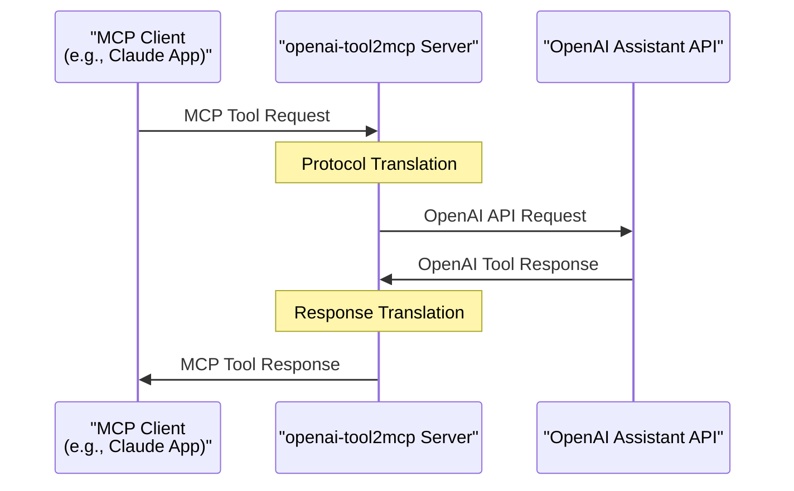
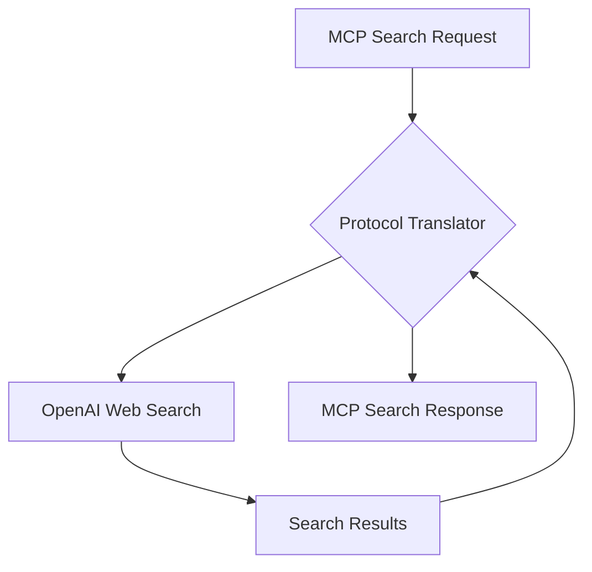
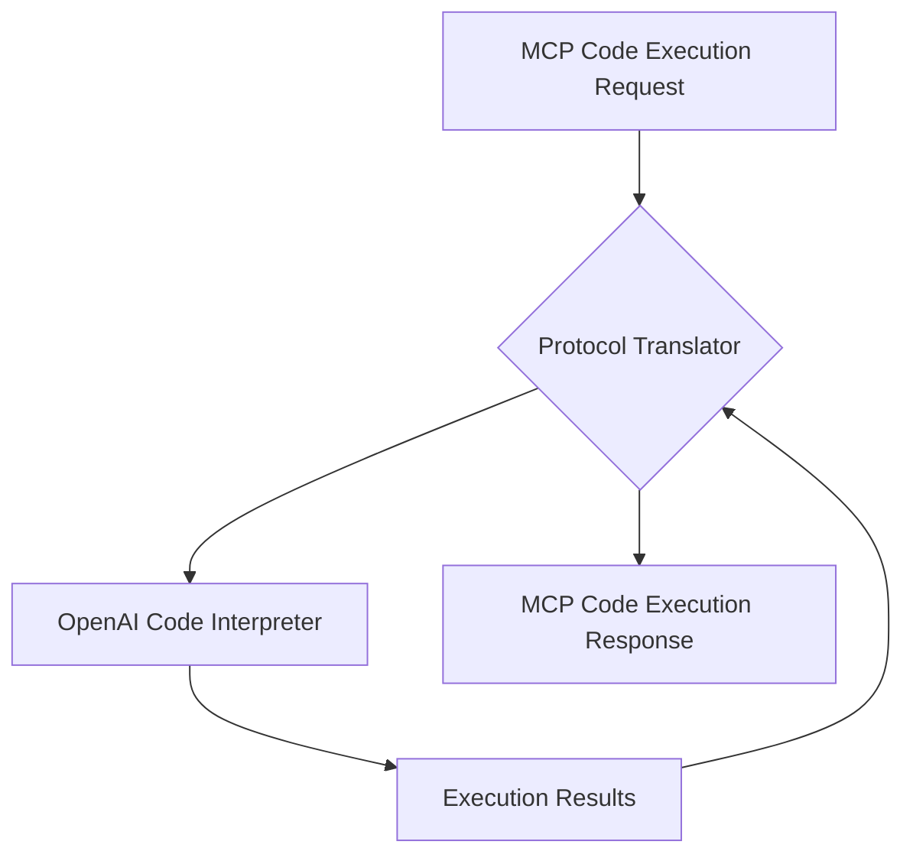

# Architecture Overview

This document provides a technical overview of how openai-tool2mcp bridges the OpenAI Assistant API with Model Context Protocol (MCP) servers.

## System Architecture

openai-tool2mcp is designed as a protocol translation layer that sits between MCP-compatible clients and the OpenAI API:

## Protocol Translation

### MCP to OpenAI Translation

MCP requests follow the [Model Context Protocol specification](https://modelcontextprotocol.io/llms-full.txt), which defines a standard for tool usage. openai-tool2mcp maps these requests to OpenAI's Assistant API format:

| MCP Component   | OpenAI Equivalent |
| --------------- | ----------------- |
| Tool ID         | Tool type         |
| Tool parameters | Tool parameters   |
| Tool context    | Thread context    |
| Instructions    | System prompt     |

### OpenAI to MCP Translation

Responses from OpenAI tools are translated back to MCP format:

| OpenAI Component  | MCP Equivalent        |
| ----------------- | --------------------- |
| Tool output       | Tool response content |
| Error information | Error messages        |
| Metadata          | Tool context updates  |

## Architectural Components

The system consists of the following main components:

### 1. MCP Server Interface

- Implements the MCP protocol specification
- Provides HTTP endpoints for tool invocation
- Manages MCP contexts and sessions

### 2. Protocol Translator

- Converts between MCP and OpenAI formats
- Maps tool identifiers and parameters
- Handles different serialization formats

### 3. OpenAI Client

- Manages connections to OpenAI API
- Handles authentication and API key management
- Implements rate limiting and error handling

### 4. Tool Registry

- Maintains mappings between OpenAI tools and MCP tools
- Provides configuration for tool-specific parameters
- Handles tool capability discovery

## Data Flow

1. **Request Phase**:

   - MCP client sends a tool request to the server
   - Server validates the MCP request format
   - Protocol translator converts to OpenAI format
   - Request is sent to OpenAI API

2. **Processing Phase**:

   - OpenAI processes the tool request
   - Tool executes the requested operation
   - Results are returned to OpenAI

3. **Response Phase**:
   - OpenAI API returns tool output
   - Protocol translator converts to MCP format
   - MCP-formatted response is sent to client

## Security Considerations

- **API Key Management**: OpenAI API keys are securely stored and never exposed to clients
- **Request Validation**: All incoming requests are validated before processing
- **Rate Limiting**: Implements rate limiting to prevent API abuse
- **Error Handling**: Robust error handling prevents information leakage

## Tool-Specific Implementations

### Web Search Tool

The Web Search tool maps MCP search requests to OpenAI's built-in web search capability:

### Code Interpreter Tool

The Code Interpreter tool maps MCP code execution requests to OpenAI's code interpreter:

## State Management

MCP and OpenAI have different approaches to maintaining state:

- **MCP**: Uses explicit contexts that are passed with each request
- **OpenAI**: Uses threads and assistant sessions

openai-tool2mcp handles this difference by:

1. Creating OpenAI threads for each MCP session
2. Persisting thread IDs and mapping them to MCP contexts
3. Maintaining a session store for consistent tool state

## Extension Points

The architecture is designed for extensibility:

- **Tool Adapters**: New tool adapters can be added to support additional OpenAI tools
- **Custom Mapping Rules**: Rules for mapping between protocols can be customized
- **Middleware Support**: Processing pipelines can be extended with custom middleware
