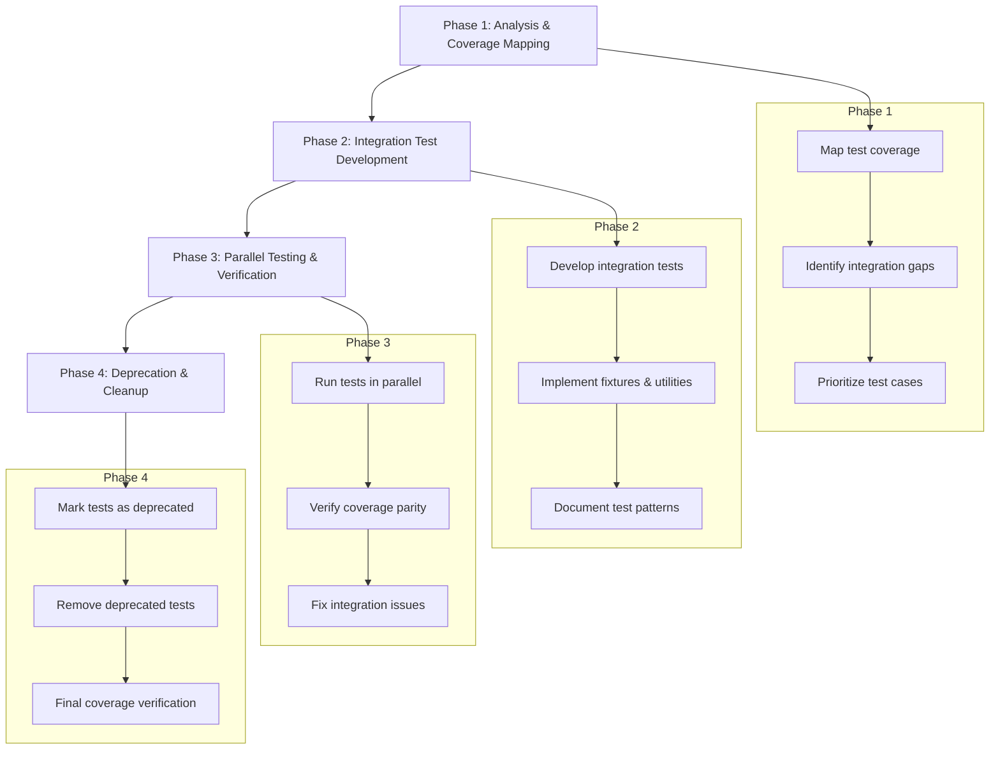

# Test Migration Plan: Unit Tests to Integration Tests

## Background

As detailed in [ADR-002: Real API Testing](./adr/002_real_api_testing.md), we've identified that mock-based unit tests in this project have proven to be brittle and unreliable. This document outlines a comprehensive plan to migrate away from these problematic unit tests and replace them with more reliable integration tests.

## Current State

The following unit tests have been identified for replacement with integration tests:

### Must Replace (High Priority)
- `tests/unit/converters/common/test_pagination_unit.py` 
- `tests/unit/operations/*` (currently includes `test_repositories_ops.py`)
- `tests/unit/tools/*` (includes `test_registration_tools.py` and repositories subdirectory)

### Consider Replacing (Medium Priority)
- `tests/unit/converters/issues/*`
- `tests/unit/converters/repositories/*`
- `tests/unit/converters/users/*`
- `tests/unit/utils/test_environment.py`

## Migration Strategy

We will follow a four-phase approach to ensure a safe transition from unit tests to integration tests while maintaining or improving test coverage.



### Phase 1: Analysis & Coverage Mapping

1. **Map Current Coverage**:
   - Run pytest with coverage on all unit tests to establish baseline
   - Generate detailed coverage reports for each deprecated test file
   - Extract test cases and assertion patterns from unit tests

2. **Identify Integration Test Gaps**:
   - Map unit test coverage to existing integration tests
   - Document areas with no integration test coverage
   - Identify edge cases and error paths in current unit tests

3. **Prioritize Test Development**:
   - Create prioritized list of missing integration tests
   - Group tests by module/functionality
   - Estimate effort required for each test group

### Phase 2: Integration Test Development

1. **Develop Integration Tests**:
   - Create integration tests for operations module first (highest priority)
   - Implement tests for tools module second
   - Address converter tests last (lower complexity)
   - Focus on maintaining same behavior coverage as unit tests

2. **Standard Implementation Pattern**:
   ```python
   @pytest.mark.integration
   def test_operation_name(test_owner, test_repo_name, unique_id, test_cleanup, with_retry):
       """Test description covering same behavior as unit test."""
       # Create parameters with unique identifiers
       params = SomeParams(
           owner=test_owner,
           repo=test_repo_name,
           # unique parameters using unique_id
       )
       
       # Call operation with retry for rate limiting
       @with_retry
       def operation_with_retry():
           return operation_function(params)
       
       result = operation_with_retry()
       
       # Register resources for cleanup
       test_cleanup.add_resource(resource_type, resource_id)
       
       # Assert same expectations as unit test
       assert condition(result)
   ```

3. **Implement Missing Fixtures**:
   - Create any additional fixtures needed for comprehensive testing
   - Reuse standard fixtures from integration/conftest.py
   - Develop helpers for test-specific setup/verification

### Phase 3: Parallel Testing & Verification

1. **Run Tests in Parallel**:
   - Keep unit tests while adding integration tests
   - Run both test suites to verify coverage parity
   - Use coverage reports to identify gaps

2. **Coverage Verification**:
   - Compare coverage reports for unit and integration tests
   - Ensure integration tests cover all code paths in unit tests
   - Address any coverage gaps before proceeding

3. **Fix Integration Test Issues**:
   - Resolve any failures or inconsistencies in integration tests
   - Update test helpers and utilities as needed
   - Document any edge cases or GitHub API limitations

### Phase 4: Deprecation & Cleanup

1. **Mark Tests as Deprecated**:
   - Add `@pytest.mark.deprecated` to unit tests
   - Add deprecation notes in the docstrings
   - Update test documentation to reflect changes

2. **Remove Deprecated Tests**:
   - Remove unit tests once integration tests proven reliable
   - Update documentation to reflect the change
   - Update CI/CD configuration to remove deprecated test runs

3. **Final Coverage Verification**:
   - Run full test suite with coverage
   - Ensure coverage meets or exceeds pre-migration levels
   - Document any intentional coverage differences

## Implementation Plan by Module

### Operations Module

| Unit Test | Integration Replacement | Priority |
|-----------|-------------------------|----------|
| test_repositories_ops.py | tests/integration/operations/repositories/test_*_integration.py | High |
| (Missing operation tests) | tests/integration/operations/issues/test_*_integration.py | High |

### Tools Module

| Unit Test | Integration Replacement | Priority |
|-----------|-------------------------|----------|
| test_registration_tools.py | tests/integration/tools/test_registration_integration.py | High |
| tools/repositories/* | tests/integration/tools/repositories/test_*_integration.py | Medium |

### Converters Module

| Unit Test Pattern | Integration Replacement Pattern | Priority |
|-------------------|--------------------------------|----------|
| converters/issues/* | tests/integration/converters/issues/test_*_integration.py | Medium |
| converters/repositories/* | tests/integration/converters/repositories/test_*_integration.py | Medium |
| converters/users/* | tests/integration/converters/users/test_*_integration.py | Low |
| converters/common/test_pagination_unit.py | tests/integration/converters/common/test_pagination_integration.py | Medium |

### Utils Module

| Unit Test | Integration Replacement | Priority |
|-----------|-------------------------|----------|
| test_environment.py | tests/integration/utils/test_environment_integration.py | Low |

## Test Coverage Strategy

For each operation or tool being tested:

1. **Test Happy Path**: Verify standard functionality with valid inputs
2. **Test Parameter Variations**: Test different combinations of parameters
3. **Test Error Paths**: Verify proper error handling for invalid inputs
4. **Test Edge Cases**: Address boundary conditions and special inputs
5. **Test Rate Limiting**: Ensure proper handling of GitHub API rate limits

## Timeline and Resources

This migration can be completed in four sprints:

1. **Sprint 1**: Analysis and coverage mapping
   - Complete coverage analysis of unit tests
   - Document integration test requirements
   - Set up metrics for measuring migration progress

2. **Sprint 2**: High-priority integration tests
   - Implement integration tests for operations
   - Implement integration tests for tools
   - Verify coverage parity for high-priority modules

3. **Sprint 3**: Medium and low-priority integration tests
   - Implement remaining integration tests
   - Fix any issues identified in previous sprint
   - Begin parallel testing of all modules

4. **Sprint 4**: Verification and cleanup
   - Complete parallel testing verification
   - Remove deprecated tests
   - Update documentation and CI/CD configuration

## Risks and Mitigations

| Risk | Mitigation |
|------|------------|
| Rate limit exceeded during testing | Implement robust retry mechanisms and rate limit handling |
| Integration tests slower than unit tests | Improve test organization to minimize API calls; implement caching where appropriate |
| GitHub API behavior changes | Use test-specific repositories and focus on behaviors, not implementation details |
| Missing coverage in integration tests | Run parallel tests before deprecating unit tests; only remove after verifying coverage |
| Test environment inconsistencies | Document setup requirements; use consistent fixtures and test helpers |

## Success Criteria

The migration will be considered successful when:

1. All deprecated unit tests have equivalent or better integration test coverage
2. Integration tests verify the same behaviors as the unit tests they replace
3. Test coverage metrics remain the same or improve
4. CI/CD pipeline runs successfully with only integration tests
5. Documentation is updated to reflect the new testing strategy

## Coverage Analysis Tools

We will use the following tools to measure and verify test coverage:

1. **pytest-cov**: For generating coverage reports
2. **Coverage.py**: For detailed coverage analysis
3. **Custom scripts**: For comparing coverage between test suites

## Next Steps

1. Troubleshoot and fix failing integration tests
2. Redesign the approach for tool registration testing based on the actual server implementation
3. Continue with coverage analysis to ensure integration tests provide adequate coverage
4. After successful test verification, proceed with deletion of the unit tests

## Progress Report (March 12, 2025)

### Completed Work
1. Created a comprehensive test migration plan
2. Developed a coverage analysis tool in `scripts/coverage/test_coverage_analyzer.py`
3. Implemented two new integration test files to replace unit tests:
   - `tests/integration/operations/repositories/test_files_operations_integration.py`
   - `tests/integration/operations/repositories/test_branch_operations_integration.py`

### Challenges Encountered
1. Integration tests have failures that need to be troubleshooted
2. Attempted to create a tool registration integration test but encountered import errors with incorrect module assumptions
3. Need to reconsider the approach for testing tool registration functionality based on the actual server implementation

### Next Phase
1. Fix integration test failures and ensure tests run successfully against the test repository
2. Implement more targeted coverage analysis to guide further test development
3. Take a different approach for tool registration testing that aligns with the codebase structure
4. Develop more integration tests to cover the remaining unit tests
