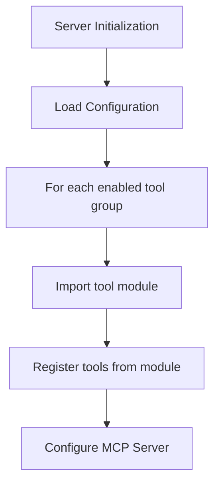

# ADR 006: Modular Tool Architecture

## Status
Accepted

## Context
The PyGithub MCP Server's `server.py` currently defines and registers all tools directly in a monolithic file. While this approach works for the current set of issue-related tools, the roadmap outlines plans for dozens of additional tools across multiple categories (repositories, pull requests, etc.) according to ROADMAP.md.

The current architecture creates several challenges:
- The `server.py` file will become unwieldy and difficult to maintain as we add more tools
- There's no mechanism to selectively enable or disable groups of tools
- Tool organization doesn't reflect the logical grouping in the GitHub API
- Code ownership and development becomes more difficult with a monolithic approach
- Testing becomes more complex as the file grows

Additionally, the roadmap specifically calls for "configurable tool groups" where users can choose to expose specific categories of tools based on their needs.

## Decision
We will implement a modular architecture for tool registration with the following key components:

1. **Tool Module Organization**:
   - Create a dedicated `tools/` package with subdirectories for each tool category
   - Move existing issue tools to `tools/issues/tools.py`
   - Each tool category module will expose a consistent registration interface

2. **Configuration System**:
   - Implement a flexible configuration mechanism in a dedicated `config/` package
   - Support enabling/disabling entire tool groups
   - Allow configuration via files and environment variables
   - Establish sensible defaults based on typical usage patterns

3. **Tool Registration System**:
   - Create a decorator-based tool registration system
   - Support dynamic tool loading based on configuration

4. **Simplified Server Initialization**:
   - Refactor `server.py` to focus on server configuration and startup
   - Delegate tool registration to the modular system



## Implementation Details

### New Directory Structure

```
src/pygithub_mcp_server/
├── tools/
│   ├── __init__.py            # Tool registration system
│   ├── issues/                # Each category gets its own directory
│   │   ├── __init__.py        # Exports all tools in the category
│   │   └── tools.py           # Actual tool implementations
│   ├── repositories/
│   │   ├── __init__.py
│   │   └── tools.py
│   ├── pull_requests/
│   │   ├── __init__.py
│   │   └── tools.py
│   └── ...                    # Additional tool categories
├── config/
│   ├── __init__.py
│   └── settings.py            # Configuration system
└── server.py                  # Simplified main server file
```

### Configuration System Implementation

The configuration system will support both file-based and environment variable configuration:

```python
# src/pygithub_mcp_server/config/settings.py
import os
import json
from pathlib import Path
from typing import Dict, Any

DEFAULT_CONFIG = {
    "tool_groups": {
        "issues": {"enabled": True},
        "repositories": {"enabled": False},
        "pull_requests": {"enabled": False},
        # etc.
    }
}

def load_config() -> Dict[str, Any]:
    """Load configuration from file and environment variables."""
    config = DEFAULT_CONFIG.copy()
    
    # Load from config file if it exists
    config_path = os.environ.get("PYGITHUB_MCP_CONFIG")
    if config_path and Path(config_path).exists():
        with open(config_path, "r") as f:
            file_config = json.load(f)
            # Merge with default config
            for key, value in file_config.items():
                if key in config and isinstance(config[key], dict) and isinstance(value, dict):
                    config[key].update(value)
                else:
                    config[key] = value
    
    # Override from environment variables
    for group in config["tool_groups"]:
        env_var = f"PYGITHUB_ENABLE_{group.upper()}"
        if env_var in os.environ:
            config["tool_groups"][group]["enabled"] = (
                os.environ[env_var].lower() in ("1", "true", "yes")
            )
    
    return config
```

### Tool Registration System Implementation

The tool registration system will use a decorator-based approach for consistency:

```python
# src/pygithub_mcp_server/tools/__init__.py
import importlib
import logging
from functools import wraps
from typing import Dict, List, Callable, Any

logger = logging.getLogger(__name__)

# Registry to store tool metadata
_tool_registry = {}

def tool():
    """Decorator to register a function as an MCP tool."""
    def decorator(func):
        _tool_registry[func.__name__] = func
        return func
    return decorator

def register_tools(mcp, tools):
    """Register multiple tools with the MCP server."""
    for tool_func in tools:
        mcp.tool()(tool_func)  # Register with MCP

def load_tools(mcp, config):
    """Load and register tools based on configuration."""
    for group_name, group_config in config["tool_groups"].items():
        if not group_config.get("enabled", False):
            logger.debug(f"Tool group '{group_name}' is disabled")
            continue
            
        logger.debug(f"Loading tool group: {group_name}")
        try:
            # Import the tool module dynamically
            module_path = f"pygithub_mcp_server.tools.{group_name}"
            module = importlib.import_module(module_path)
            
            # Call the register function
            if hasattr(module, "register"):
                module.register(mcp)
            else:
                logger.warning(f"No register function found in {module_path}")
        except ImportError as e:
            logger.error(f"Failed to import tool group '{group_name}': {e}")
        except Exception as e:
            logger.error(f"Error loading tool group '{group_name}': {e}")
```

### Tool Module Implementation

Each tool category would follow a consistent pattern:

```python
# src/pygithub_mcp_server/tools/issues/tools.py
import json
import logging
import traceback
from mcp.server.fastmcp import FastMCP
from pygithub_mcp_server.schemas.issues import CreateIssueParams, ListIssuesParams
from pygithub_mcp_server.operations import issues
from pygithub_mcp_server.errors import GitHubError, format_github_error
from pygithub_mcp_server.tools import tool

logger = logging.getLogger(__name__)

@tool()
def create_issue(params: CreateIssueParams) -> dict:
    """Create a new issue in a GitHub repository."""
    try:
        logger.debug(f"create_issue called with params: {params}")
        result = issues.create_issue(
            params.owner,
            params.repo,
            title=params.title,
            body=params.body,
            assignees=params.assignees,
            labels=params.labels,
            milestone=params.milestone
        )
        logger.debug(f"Got result: {result}")
        return {"content": [{"type": "text", "text": json.dumps(result, indent=2)}]}
    except GitHubError as e:
        logger.error(f"GitHub error: {e}")
        return {
            "content": [{"type": "error", "text": format_github_error(e)}],
            "is_error": True
        }
    except Exception as e:
        logger.error(f"Unexpected error: {e}")
        logger.error(traceback.format_exc())
        error_msg = str(e) if str(e) else "An unexpected error occurred"
        return {
            "content": [{"type": "error", "text": f"Internal server error: {error_msg}"}],
            "is_error": True
        }

@tool()
def list_issues(params: ListIssuesParams) -> dict:
    """List issues from a GitHub repository."""
    # Implementation (moved from server.py)
    # ...

# Register all tools in this module
def register(mcp: FastMCP):
    """Register all issue tools with the MCP server."""
    from pygithub_mcp_server.tools import register_tools
    register_tools(mcp, [
        create_issue, 
        list_issues,
        # Include all other issue-related tools here
    ])
```

### Main Server Simplification

The server.py file becomes much cleaner and more focused:

```python
# src/pygithub_mcp_server/server.py
import logging
import os
import sys
from pathlib import Path
from mcp.server.fastmcp import FastMCP
from pygithub_mcp_server.config import load_config
from pygithub_mcp_server.tools import load_tools
from pygithub_mcp_server.version import VERSION

# Set up logging
log_dir = Path(__file__).parent.parent.parent / 'logs'
if not log_dir.exists():
    os.makedirs(log_dir)

log_file = log_dir / 'pygithub_mcp_server.log'
logger = logging.getLogger()  # Get root logger
logger.setLevel(logging.INFO)
logging.basicConfig(
    level=logging.INFO,
    format='%(asctime)s - %(name)s - %(levelname)s - %(message)s',
    handlers=[
        logging.FileHandler(log_file),
        logging.StreamHandler(sys.stderr)
    ],
    force=True
)
logger = logging.getLogger(__name__)
logger.debug("Logging initialized")

def create_server():
    """Create and configure the MCP server."""
    # Create FastMCP server instance
    mcp = FastMCP(
        "pygithub-mcp-server",
        version=VERSION,
        description="GitHub API operations via MCP"
    )
    
    # Load configuration
    config = load_config()
    
    # Load and register tools based on configuration
    load_tools(mcp, config)
    
    return mcp

if __name__ == "__main__":
    server = create_server()
    server.run()
```

## Example Configuration File

The user can create a configuration file (e.g., `pygithub_mcp_config.json`) to customize which tool groups are enabled:

```json
{
  "tool_groups": {
    "issues": {"enabled": true},
    "repositories": {"enabled": true},
    "pull_requests": {"enabled": false},
    "discussions": {"enabled": false},
    "search": {"enabled": true}
  }
}
```

This can be specified via the `PYGITHUB_MCP_CONFIG` environment variable:

```
PYGITHUB_MCP_CONFIG=/path/to/pygithub_mcp_config.json
```

Alternatively, individual tool groups can be enabled/disabled via environment variables:

```
PYGITHUB_ENABLE_REPOSITORIES=true
PYGITHUB_ENABLE_PULL_REQUESTS=false
```

## Consequences

### Positive
- Improved code organization with clear separation of concerns
- Ability to selectively enable/disable tool groups
- Easier maintenance as each tool category is isolated
- Better support for team collaboration with clearer ownership
- Simplified testing of individual tool modules
- Future-proof structure that scales with the roadmap
- Clear extension points for new tool categories
- More consistent error handling and logging

### Negative
- Initial effort required for refactoring
- Additional complexity in the codebase
- Need to maintain consistent patterns across tool modules
- Potential overhead from dynamic imports
- Migration period for existing functionality

## Implementation Plan

1. Phase 1: Foundation (Week 1)
   - Create the new directory structure
   - Implement the core configuration system
   - Set up the tool registration framework
   - Document the new architecture

2. Phase 2: Migration (Week 2)
   - Move existing issue tools to the new structure
   - Update the server initialization to use the new system
   - Validate all functionality works as expected
   - Update tests to reflect the new architecture

3. Phase 3: Expansion (Ongoing)
   - Implement new tool categories following the established pattern
   - Add configuration options for new tool groups
   - Enhance the configuration system based on feedback

4. Phase 4: Documentation and Refinement (Ongoing)
   - Update user documentation
   - Refine API based on usage patterns
   - Add additional configuration options as needed

## References
- [ROADMAP.md](../../ROADMAP.md) - Tool groups and development plans
- [FastMCP Documentation](https://mcp-sdk.readthedocs.io/)
- [GitHub API Object Structure](https://docs.github.com/en/rest)
