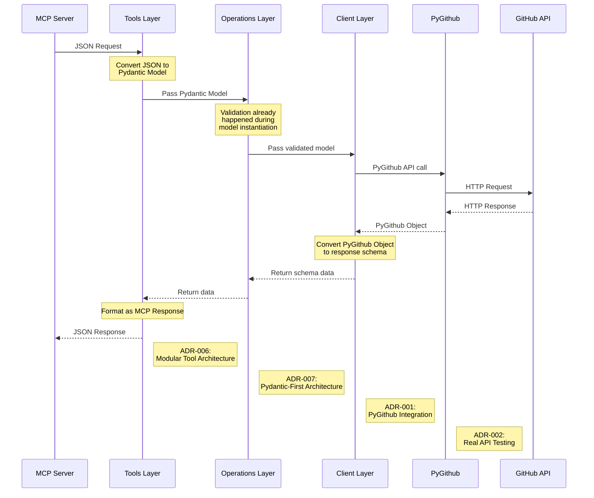
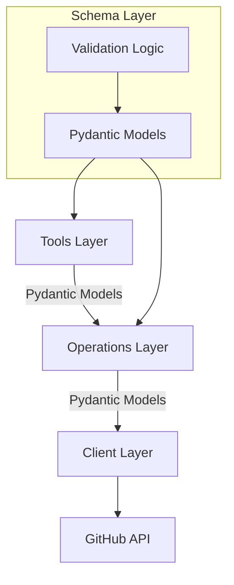
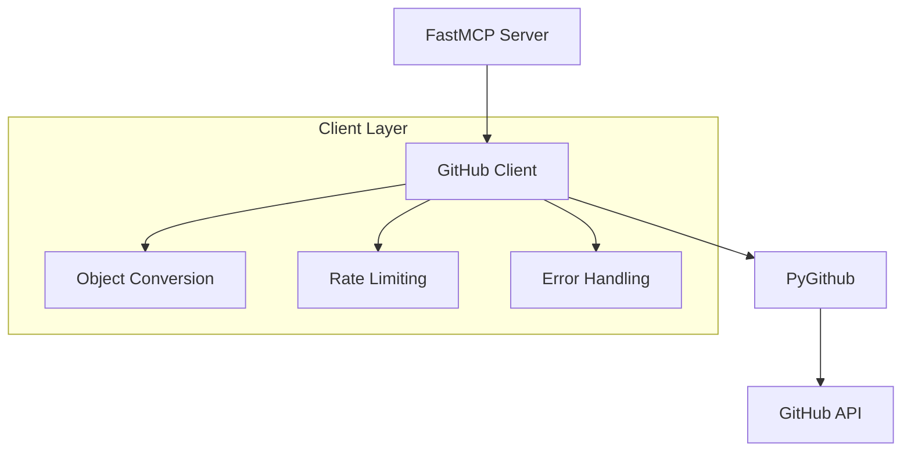
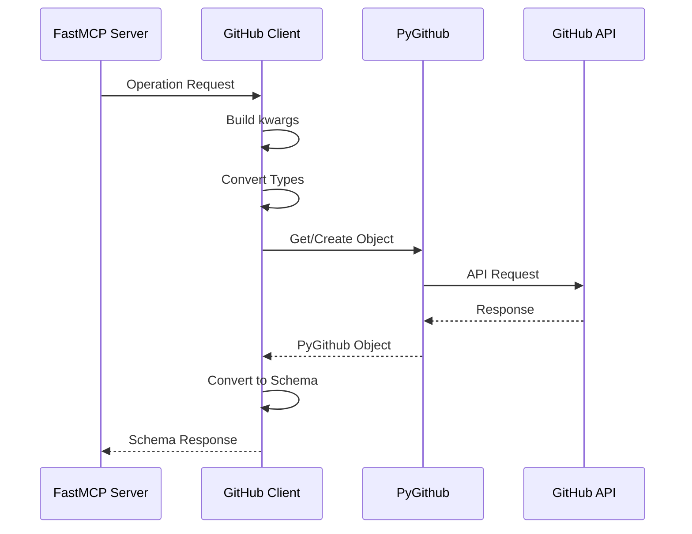
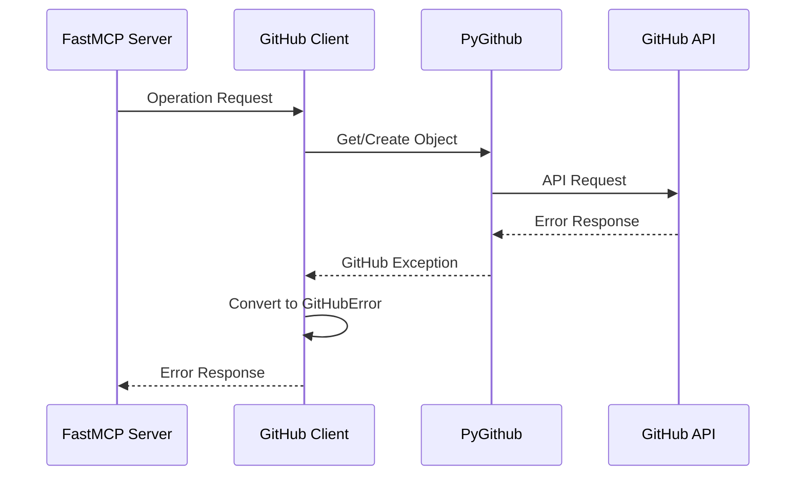

# System Patterns

> **Note:** This document provides detailed implementation patterns and best practices for the PyGithub MCP Server. For a high-level overview of the technology stack and architecture, please refer to [`tech_context.md`](tech_context.md).

## System Architecture Overview

This diagram provides a comprehensive view of how the various architectural decisions work together in the PyGithub MCP Server:

```mermaid
flowchart TD
    subgraph "MCP Server"
        direction TB
        
        subgraph "Tools Layer (ADR-006)"
            ToolReg["Tool Registration System"]
            IssueTools["Issue Tools"]
            RepoTools["Repository Tools"]
            PRTools["PR Tools"]
            Config["Configuration System"]
            
            ToolReg --> IssueTools
            ToolReg --> RepoTools
            ToolReg --> PRTools
            Config --> ToolReg
        end
        
        subgraph "Operations Layer"
            Issues["Issue Operations"]
            Repos["Repository Operations"]
            PRs["PR Operations"]
            
            IssueTools --> Issues
            RepoTools --> Repos
            PRTools --> PRs
        end
        
        subgraph "Client Layer (ADR-001)"
            Client["GitHub Client"]
            RateLimit["Rate Limit Handling"]
            
            Issues --> Client
            Repos --> Client
            PRs --> Client
            Client --> RateLimit
        end
        
        PyGithub["PyGithub Library"]
        Client --> PyGithub
    end
    
    GitHub["GitHub API"]
    PyGithub --> GitHub
    
    subgraph "Schema Layer (ADR-003, ADR-004)"
        direction TB
        BaseModels["Base Models"]
        IssueModels["Issue Models"]
        RepoModels["Repository Models"]
        PRModels["PR Models"]
        Validation["Field Validators"]
        
        BaseModels --- IssueModels
        BaseModels --- RepoModels
        BaseModels --- PRModels
        Validation -.- IssueModels
        Validation -.- RepoModels
        Validation -.- PRModels
    end
    
    IssueTools <-.-> IssueModels
    RepoTools <-.-> RepoModels
    PRTools <-.-> PRModels
    
    Issues <-.-> IssueModels
    Repos <-.-> RepoModels
    PRs <-.-> PRModels
    
    subgraph "Data Transformation (ADR-005)"
        direction TB
        IssueConv["Issue Converters"]
        RepoConv["Repository Converters"]
        UserConv["User Converters"]
        CommonConv["Common Converters"]
        
        IssueConv --> CommonConv
        RepoConv --> CommonConv
        UserConv --> CommonConv
    end
    
    Client --> IssueConv
    Client --> RepoConv
    Client --> UserConv
    
    subgraph "Testing (ADR-002)"
        direction TB
        UnitTests["Unit Tests"]
        IntegTests["Integration Tests"]
        TestData["Test Data Classes"]
        
        UnitTests --- TestData
        IntegTests --> GitHub
    end
    
    style IssueModels fill:#f9f,stroke:#333,stroke-width:2px
    style RepoModels fill:#f9f,stroke:#333,stroke-width:2px
    style PRModels fill:#f9f,stroke:#333,stroke-width:2px
    style BaseModels fill:#f9f,stroke:#333,stroke-width:2px
    
    style Client fill:#bbf,stroke:#333,stroke-width:2px
    style PyGithub fill:#bbf,stroke:#333,stroke-width:2px
    
    style Issues fill:#bfb,stroke:#333,stroke-width:2px
    style Repos fill:#bfb,stroke:#333,stroke-width:2px
    style PRs fill:#bfb,stroke:#333,stroke-width:2px
    
    style IssueTools fill:#fbb,stroke:#333,stroke-width:2px
    style RepoTools fill:#fbb,stroke:#333,stroke-width:2px
    style PRTools fill:#fbb,stroke:#333,stroke-width:2px
    style ToolReg fill:#fbb,stroke:#333,stroke-width:2px
    style Config fill:#fbb,stroke:#333,stroke-width:2px
```



### Request Flow (ADR-007: Pydantic-First Architecture)

This diagram shows the end-to-end flow of a request through the system, highlighting how the Pydantic-First Architecture works:



## Core Architecture

### Pydantic-First Architecture


### GitHub Integration


### Component Relationships

1. GitHub Client (Singleton)
   - Manages PyGithub instance
   - Handles authentication
   - Provides conversion utilities
   - Manages rate limiting
   - Centralizes error handling

2. Operation Modules
   - Use GitHub client for API interactions
   - Accept Pydantic models directly (ADR-007)
   - Maintain consistent patterns
   - Focus on specific domains
   - Handle pagination

3. Schema Layer
   - Models based on PyGithub objects
   - Organized by domain (ADR-003)
   - Enhanced validation (ADR-004)
   - Clear type definitions
   - Documented relationships

4. Tools Layer
   - Organized by domain (ADR-006)
   - Configuration-driven registration
   - Decorator-based tool system
   - Consistent error handling
   - Clean MCP protocol interface

## Best Practices

### 1. Pydantic Model Usage
- Define all input parameters as Pydantic models
- Let Pydantic handle validation at model instantiation
- Pass models directly between layers
- Define field validators for special validation needs
- Use strict=True to prevent unwanted type coercion

### 2. Tool Implementation
- Organize tools by domain (issues, repositories, etc.)
- Use the @tool() decorator for registration
- Register tools through the module's register function
- Consistent error handling across all tools
- Clear parameter validation through Pydantic models

### 3. Error Handling
- Use GitHubError for all client-facing errors
- Provide clear error messages with context
- Handle rate limits with exponential backoff
- Include resource information in error messages
- Consistent formatting across all error types

### 4. Testing
- Use real API interactions instead of mocks for integration tests
- Use dataclasses instead of MagicMock for unit tests
- Focus on testing behavior rather than implementation
- Implement proper cleanup for test resources
- Tag resources created during tests for identification
- Separate unit tests from integration tests by directory structure
- Mark integration tests with @pytest.mark.integration
- Test both success and error paths
- Verify that tests remain isolated and don't affect each other
- Use dependency injection for easier test parameterization

### 5. Configuration
- Use environment variables for deployment configuration
- Provide sensible defaults for all settings
- Clear precedence rules for configuration sources
- Document all configuration options
- Support selective tool group enabling/disabling

### 6. Optional Parameter Handling
- Only include parameters in kwargs when they have non-None values
- Convert primitive types to PyGithub objects before passing (e.g., milestone number → Milestone object)
- Handle object conversion errors explicitly
- Document parameter requirements in docstrings
- Test with various parameter combinations

## Implementation Patterns

### 1. Pydantic-First Operations
```python
# Pattern for operations layer with Pydantic-First architecture
from typing import List, Dict, Any
from ..schemas.issues import ListIssuesParams
from ..client import GitHubClient
from github import GithubException

def list_issues(params: ListIssuesParams) -> List[Dict[str, Any]]:
    """List issues in a repository.

    Args:
        params: Validated parameters for listing issues

    Returns:
        List of issues from GitHub API

    Raises:
        GitHubError: If the API request fails or validation fails
    """
    try:
        client = GitHubClient.get_instance()
        repository = client.get_repo(f"{params.owner}/{params.repo}")

        # Build kwargs from Pydantic model
        kwargs = {"state": params.state or 'open'}
        
        # Add optional parameters only if provided
        if params.sort:
            kwargs["sort"] = params.sort
        if params.direction:
            kwargs["direction"] = params.direction
        if params.since:
            kwargs["since"] = params.since
        
        # Get paginated issues and handle pagination
        paginated_issues = repository.get_issues(**kwargs)
        issues = get_paginated_items(paginated_issues, params.page, params.per_page)
        
        # Convert each issue to our schema
        return [convert_issue(issue) for issue in issues]
    except GithubException as e:
        raise client._handle_github_exception(e)
```

### 2. Pydantic-First Tools
```python
# Pattern for tools layer with Pydantic-First architecture
from ..schemas.issues import ListIssuesParams
from pygithub_mcp_server.tools import tool
from pygithub_mcp_server.operations import issues
from pygithub_mcp_server.errors import GitHubError, format_github_error

@tool()
def list_issues(params: ListIssuesParams) -> dict:
    """List issues from a GitHub repository.
    
    Args:
        params: Parameters for listing issues
    
    Returns:
        List of issues from GitHub API
    """
    try:
        # Pass the validated Pydantic model directly to operations
        result = issues.list_issues(params)
        return {"content": [{"type": "text", "text": json.dumps(result, indent=2)}]}
    except GitHubError as e:
        return {
            "content": [{"type": "error", "text": format_github_error(e)}],
            "is_error": True
        }
```

### 3. Tool Registration and Configuration
```python
# In tools/issues/__init__.py
def register(mcp):
    """Register all issue tools with the MCP server."""
    from pygithub_mcp_server.tools import register_tools
    from .tools import create_issue, list_issues, get_issue, update_issue
    
    register_tools(mcp, [
        create_issue,
        list_issues,
        get_issue,
        update_issue,
        # Other issue tools
    ])

# In server.py
from pygithub_mcp_server.config import load_config
from pygithub_mcp_server.tools import load_tools

def create_server():
    """Create and configure the MCP server."""
    # Create FastMCP server instance
    mcp = FastMCP(
        "pygithub-mcp-server",
        version=VERSION,
        description="GitHub API operations via MCP"
    )
    
    # Load configuration
    config = load_config()
    
    # Load and register tools based on configuration
    load_tools(mcp, config)
    
    return mcp
```

### 4. Validation Error Handling
```python
# Pattern for consistent validation error handling
import functools
from pydantic import ValidationError
from .github import GitHubError

def validation_error_to_github_error(func):
    """Decorator to convert Pydantic ValidationError to GitHubError."""
    @functools.wraps(func)
    def wrapper(*args, **kwargs):
        try:
            return func(*args, **kwargs)
        except ValidationError as e:
            errors = e.errors()
            if errors:
                field = errors[0].get('loc', ['unknown'])[0]
                message = errors[0].get('msg', 'Invalid value')
                error_msg = f"Validation error: {field} - {message}"
            else:
                error_msg = "Invalid input data"
                
            raise GitHubError(error_msg)
    return wrapper
```

### 5. Schema Conversion
```python
# Pattern for object conversion
def convert_issue(issue):
    """Convert a PyGithub Issue object to our schema format."""
    return {
        "number": issue.number,
        "title": issue.title,
        "body": issue.body,
        "state": issue.state,
        "created_at": issue.created_at.isoformat(),
        "updated_at": issue.updated_at.isoformat(),
        "user": {
            "login": issue.user.login,
            "id": issue.user.id,
            "url": issue.user.html_url
        },
        "labels": [{"name": label.name, "color": label.color} for label in issue.labels],
        "comments": issue.comments,
        "url": issue.html_url
    }
```

### 6. Error Handling
```python
# Pattern for error handling
try:
    github_obj = client.operation()
    return convert_github_object(github_obj)
except GithubException as e:
    raise GitHubError(str(e))
```

#### Error Types and Handling

The system defines several specific error types to provide clear, actionable feedback:

1. **GitHubResourceNotFoundError (Status Code: 404)**
   - Indicates the requested resource does not exist
   - Common scenarios: Repository not found, issue not found, comment not found
   - Example message: "Issue not found" or "Repository not found"

2. **GitHubAuthenticationError (Status Code: 401)**
   - Authentication failed or token is invalid
   - Common scenarios: Invalid token, expired token, token lacks required scopes
   - Example message: "Authentication failed. Please verify your GitHub token."

3. **GitHubPermissionError (Status Code: 403)**
   - User lacks permission for the requested operation
   - Common scenarios: Insufficient repository permissions, organization access required
   - Example message: "You don't have permission to perform this operation."

4. **GitHubRateLimitError (Status Code: 403 with rate limit headers)**
   - API rate limit exceeded
   - Includes reset time in error object
   - Example message: "API rate limit exceeded. Please wait before making more requests."
   - Usage example:
     ```python
     except GitHubRateLimitError as e:
         print(f"Rate limit exceeded. Resets at: {e.reset_at}")
     ```

5. **GitHubValidationError (Status Code: 422)**
   - Request validation failed
   - Common scenarios: Invalid field values, missing required fields
   - Example format:
     ```
     Validation failed:
     - title: cannot be blank (missing_field)
     - labels: invalid format (invalid)
     ```

6. **GitHubError (Base error type)**
   - Base error type for unhandled or unexpected errors
   - Common scenarios: Network issues, server errors, unexpected API responses

#### Error Handling Best Practices

1. **Catch specific error types first:**
   ```python
   try:
       # GitHub operation
   except GitHubResourceNotFoundError:
       # Handle 404
   except GitHubValidationError:
       # Handle validation
   except GitHubError:
       # Handle other errors
   ```

2. **Check error response data for additional context:**
   ```python
   except GitHubError as e:
       if e.response:
           # Handle with context
       else:
           # Handle generic error
   ```

3. **Handle rate limits gracefully:**
   ```python
   except GitHubRateLimitError as e:
       wait_time = e.reset_at - datetime.now()
       logger.warning(f"Rate limit hit. Waiting {wait_time}")
       # Implement backoff strategy
   ```

4. **Resource Type Detection:**
   The error handler automatically detects the type of resource from the error message or response data:
   ```python
   if "issue" in error_msg.lower():
       resource_type = "issue"
   elif "repository" in error_msg.lower():
       resource_type = "repository"
   ```

### 7. Pagination Handling
```python
# In converters/common/pagination.py
def get_paginated_items(paginated_list, page=None, per_page=None):
    """Get items from a PyGithub PaginatedList with pagination support.
    
    Args:
        paginated_list: PyGithub PaginatedList object
        page: Optional page number (1-based)
        per_page: Optional items per page
        
    Returns:
        List of items from the paginated list
    """
    if page is not None and per_page is not None:
        # Use both page and per_page for precise pagination
        start = (page - 1) * per_page
        end = start + per_page
        try:
            return list(paginated_list[start:end])
        except IndexError:
            # Handle case where start is beyond the list length
            return []
    elif page is not None:
        # Use default per_page value (30) with specified page
        try:
            return paginated_list.get_page(page - 1)
        except IndexError:
            return []
    elif per_page is not None:
        # Get just the first per_page items
        try:
            return list(paginated_list[:per_page])
        except IndexError:
            return []
    else:
        # No pagination, get all items (use with caution!)
        return list(paginated_list)
```

## Security Considerations

### Authentication

1. **Token Security**
   - Personal Access Tokens (PATs) should never be committed to source control
   - Set token via `GITHUB_PERSONAL_ACCESS_TOKEN` environment variable
   - Use fine-grained tokens with minimal required permissions
   - Example:
     ```python
     # Set token securely via environment
     token = os.getenv("GITHUB_PERSONAL_ACCESS_TOKEN")
     if not token:
         raise GitHubError("Token not configured")
     ```

2. **Token Permissions**
   - Repository permissions determine available operations:
     - Read: View issues, comments, labels
     - Write: Create/update issues, add labels
     - Admin: Manage repository settings
   - Operations fail with `GitHubPermissionError` if permissions are insufficient

### Access Control

1. **Repository Access**
   - Private repositories return 404 "Not Found" instead of 401/403
   - This is a GitHub security feature to prevent repository enumeration
   - Same response whether repository doesn't exist or user lacks access
   - Helps prevent information disclosure about private repositories

2. **Rate Limiting**
   - Rate limits help prevent abuse
   - Limits tracked per token/IP
   - Secondary rate limits may apply
   - Rate limit errors include reset time
   - Implement retry logic with backoff

### Content Security

1. **Content Sanitization**
   - GitHub automatically sanitizes HTML content
   - Script tags are removed
   - javascript: URLs are blocked
   - HTML is rendered as markdown

2. **Input Validation**
   - Use schema validation to enforce constraints
   - Invalid input results in `GitHubValidationError`

### Security Logging

Important events to log:
- Authentication failures
- Permission denied errors
- Rate limit hits
- Invalid access attempts
- Content validation failures

Example logging:
```python
# Authentication failure
logger.error("Authentication failed", extra={
    "token_prefix": token[:4] if token else None,
    "error": str(e)
})

# Permission denied
logger.warning("Permission denied", extra={
    "operation": operation_name,
    "resource": resource_id
})

# Rate limit
logger.debug("Rate limit hit", extra={
    "reset_at": e.reset_at,
    "operation": operation_name
})
```

## System Flow

### Operation Flow


### Error Flow


## Design Patterns

### 1. Singleton Pattern (GitHub Client)
```python
class GitHubClient:
    _instance = None

    @classmethod
    def get_instance(cls):
        if cls._instance is None:
            cls._instance = cls()
        return cls._instance
```

### 2. Factory Pattern (Object Conversion)
```python
class GitHubObjectFactory:
    @staticmethod
    def create_from_github_object(obj):
        if isinstance(obj, github.Issue.Issue):
            return convert_issue(obj)
        elif isinstance(obj, github.Repository.Repository):
            return convert_repository(obj)
        elif isinstance(obj, github.PullRequest.PullRequest):
            return convert_pull_request(obj)
        # ... other object types
        else:
            raise ValueError(f"Unsupported GitHub object type: {type(obj)}")
```

### 3. Strategy Pattern (Error Handling)
```python
class ErrorHandler:
    def handle_error(self, error):
        if isinstance(error, RateLimitExceededException):
            return handle_rate_limit(error)
        elif isinstance(error, UnknownObjectException):
            return handle_not_found(error)
        elif isinstance(error, GithubException):
            if error.status == 403:
                return handle_permission_error(error)
            # ... other status codes
        return handle_unknown_error(error)
```

### 4. Decorator Pattern (Tool Registration)
```python
def tool():
    """Decorator to register a function as an MCP tool."""
    def decorator(func):
        func._is_tool = True
        return func
    return decorator
```
## Testing Patterns

### 1. Testing Philosophy and Principles

Based on ADR 002, our testing approach follows these core principles:

- **No Mocks for Integration Tests**: Use real API interactions instead of mock objects for accurate behavior verification 
- **Dataclasses for Unit Tests**: Use Python's dataclasses instead of MagicMock for cleaner, type-safe test objects
- **Behavior-Focused Testing**: Test what functions do, not how they do it
- **Isolated Tests**: Each test should be independent and not affect others
- **Test Coverage Prioritization**: Focus on high-risk and critical paths first

Testing follows a layer-based structure that mirrors the application architecture:

```
tests/
├── unit/                  # Fast tests with no external dependencies
│   ├── client/            # Tests for client module
│   ├── config/            # Tests for configuration
│   ├── converters/        # Tests for converters
│   ├── schemas/           # Tests for schema validation
│   └── utils/             # Tests for utility functions
└── integration/           # Tests using the real GitHub API
    ├── client/            # Tests for client with real API
    ├── operations/        # Tests for API operations with real endpoints
    │   ├── issues/        # Tests for issue operations
    │   ├── repositories/  # Tests for repository operations
    │   └── users/         # Tests for user operations
    └── tools/             # Tests for MCP tools with real API
```

### 2. Unit Testing with Dataclasses

In accordance with ADR 002, we use Python's dataclasses instead of MagicMock objects for cleaner, more maintainable tests:

```python
from dataclasses import dataclass

@dataclass
class RepositoryOwner:
    login: str
    id: int = 12345
    html_url: str = "https://github.com/test-user"

@dataclass
class Repository:
    id: int
    name: str
    full_name: str
    owner: RepositoryOwner
    private: bool = False
    html_url: str = "https://github.com/test-user/test-repo"
    description: str = None

def test_convert_repository():
    # Given
    owner = RepositoryOwner(login="test-user")
    repo = Repository(
        id=98765,
        name="test-repo",
        full_name="test-user/test-repo",
        owner=owner
    )
    
    # When
    result = convert_repository(repo)
    
    # Then
    assert result["id"] == 98765
    assert result["name"] == "test-repo"
    assert result["owner"]["login"] == "test-user"
```

Benefits of this approach include:
- Type safety with IDE autocomplete
- No unexpected attribute creation
- Clear object structure that mirrors real objects
- Better representation in test failure output
- Prevention of bugs from typos in attribute names

### 3. Integration Testing with Real API

For integration tests, we interact with the actual GitHub API:

```python
@pytest.mark.integration
def test_create_issue_integration(test_owner, test_repo, test_cleanup):
    """Test creating an issue in a real GitHub repository."""
    # Generate a unique identifier for this test
    test_id = str(uuid.uuid4())[:8]
    title = f"Test Issue {test_id}"
    body = f"This is a test issue created by integration tests - {test_id}"
    
    # Create the Pydantic model (already validated)
    params = CreateIssueParams(
        owner=test_owner,
        repo=test_repo,
        title=title,
        body=body
    )
    
    # Call the operation (no mocks)
    result = issues.create_issue(params)
    
    # Register for cleanup
    test_cleanup.add_issue(test_owner, test_repo, result["number"])
    
    # Assertions against real API response
    assert result["title"] == title
    assert result["body"] == body
    assert result["state"] == "open"
    assert "number" in result
    
    # Verify the issue was actually created by fetching it
    verification = issues.get_issue(GetIssueParams(
        owner=test_owner,
        repo=test_repo,
        issue_number=result["number"]
    ))
    assert verification["title"] == title
```

### 4. Test Fixtures and Helpers

We use pytest fixtures to create test data and manage resources:

```python
@pytest.fixture
def test_owner():
    """Get the GitHub owner for test operations."""
    return os.environ.get("GITHUB_TEST_OWNER", "test-owner")

@pytest.fixture
def test_repo():
    """Get the GitHub repository for test operations."""
    return os.environ.get("GITHUB_TEST_REPO", "test-repo")

@pytest.fixture
def test_cleanup():
    """Fixture to track and clean up test resources."""
    cleanup = TestCleanup()
    yield cleanup
    cleanup.cleanup_all()

class TestCleanup:
    """Helper to track and clean up test resources."""
    
    def __init__(self):
        self.issues = []
        self.comments = []
        # Other resource types...
    
    def add_issue(self, owner, repo, issue_number):
        """Track an issue for cleanup."""
        self.issues.append((owner, repo, issue_number))
    
    def cleanup_all(self):
        """Clean up all tracked resources."""
        client = GitHubClient.get_instance()
        
        # Clean up issues
        for owner, repo, issue_number in self.issues:
            try:
                repository = client.get_repo(f"{owner}/{repo}")
                issue = repository.get_issue(issue_number)
                if not issue.closed:
                    issue.edit(state="closed")
            except Exception as e:
                logger.warning(f"Failed to clean up issue {owner}/{repo}#{issue_number}: {e}")
        
        # Clean up other resource types...
```

### 5. Context Managers for Environment Testing

For testing environment-dependent code like command-line interfaces:

```python
@contextmanager
def capture_stdout():
    """Capture stdout for testing."""
    new_stdout = StringIO()
    old_stdout = sys.stdout
    sys.stdout = new_stdout
    try:
        yield new_stdout
    finally:
        sys.stdout = old_stdout

def test_main_function():
    """Test main function output."""
    with capture_stdout() as stdout:
        main(["--version"])
        output = stdout.getvalue()
    
    assert "version" in output.lower()
```

### 6. Rate Limit Handling in Tests

To handle GitHub API rate limits during tests:

```python
@pytest.mark.integration
def test_rate_limited_operation(test_owner, test_repo):
    """Test operation with retry for rate limits."""
    max_retries = 3
    retry_count = 0
    
    while retry_count < max_retries:
        try:
            params = ListIssuesParams(owner=test_owner, repo=test_repo)
            result = issues.list_issues(params)
            # Test passed
            break
        except GitHubError as e:
            if "rate limit exceeded" in str(e).lower() and retry_count < max_retries - 1:
                # Calculate backoff time (exponential)
                wait_time = 2 ** retry_count * 5  # 5, 10, 20 seconds
                logger.warning(f"Rate limited, retrying in {wait_time} seconds...")
                time.sleep(wait_time)
                retry_count += 1
            else:
                # Either not a rate limit error or we've used all retries
                raise
    
    # Perform test assertions
    assert isinstance(result, list)
```

### 7. Maintainable Test Strategies

Write tests that remain valid even as the codebase evolves:

```python
# BAD - Hardcoded expectations that break when defaults change
assert config["tool_groups"]["repositories"]["enabled"] is False

# GOOD - Dynamic checks that adapt to changes in defaults
for group, settings in DEFAULT_CONFIG["tool_groups"].items():
    assert config["tool_groups"][group]["enabled"] == settings["enabled"]
```

Always ensure mock functions match the actual function signatures:

```python
# BAD - Outdated mock that doesn't match the real method signature
def get_repository_mock(params):  # Expecting a Pydantic model
    # But the real function expects: get_repository(owner, repo)
    # This will fail with: TypeError: ... takes 1 positional argument but 2 were given

# GOOD - Correctly matching the function signature
def get_repository_mock(owner, repo):  # Matches real signature
    # Will work correctly with the actual implementation
```

### 8. Testing Error Conditions

Test both success and error paths:

```python
def test_nonexistent_repository():
    """Test behavior when repository doesn't exist."""
    params = ListIssuesParams(
        owner="non-existent-user-123456",  # Unlikely to exist
        repo="non-existent-repo-123456"
    )
    
    with pytest.raises(GitHubError) as exc_info:
        issues.list_issues(params)
    
    assert "not found" in str(exc_info.value).lower()
    assert exc_info.value.status == 404
```

### 8. Test Tagging and Identification

Identify resources created by tests for easier tracking and cleanup:

```python
def create_test_issue(owner, repo, test_id):
    """Create an issue with a unique test identifier."""
    params = CreateIssueParams(
        owner=owner,
        repo=repo,
        title=f"Test Issue {test_id}",
        body=f"Test issue created by automated tests. Test ID: {test_id}"
    )
    return issues.create_issue(params)
```

### 9. Parameterized Tests

Use pytest's parameterize feature for testing multiple scenarios:

```python
@pytest.mark.parametrize("state", ["open", "closed", "all"])
def test_list_issues_with_different_states(test_owner, test_repo, state):
    """Test listing issues with different state filters."""
    params = ListIssuesParams(
        owner=test_owner,
        repo=test_repo,
        state=state
    )
    
    result = issues.list_issues(params)
    
    if state == "all":
        # Should include both open and closed issues
        assert any(issue["state"] == "open" for issue in result) or \
               any(issue["state"] == "closed" for issue in result)
    else:
        # All issues should match the requested state
        assert all(issue["state"] == state for issue in result)
```

### 10. Resource Management in Tests

Implement robust resource management for tests to prevent test pollution:

```python
@pytest.fixture(scope="session")
def test_environment():
    """Set up test environment with resources that all tests can use."""
    # Create session-level resources
    client = GitHubClient.get_instance()
    test_owner = os.environ.get("GITHUB_TEST_OWNER")
    test_repo = os.environ.get("GITHUB_TEST_REPO")
    
    # Set up test data
    test_resources = {}
    
    # Create a test issue that can be reused
    repository = client.get_repo(f"{test_owner}/{test_repo}")
    test_issue = repository.create_issue(
        title="Test Issue for Integration Tests",
        body="This is a persistent test issue used for integration tests."
    )
    test_resources["issue_number"] = test_issue.number
    
    # Return the resources
    yield test_resources
    
    # We don't clean up session-level resources here because they are reused
    # across multiple test runs
```

### 11. Testing with Large Repositories

When testing operations on repositories with many issues, it's important to use pagination to avoid performance problems:

```python
# Before (problematic with large repos):
issues = list_issues(ListIssuesParams(
    owner=owner,
    repo=repo,
    state="closed"
))

# After (works efficiently with large repos):
issues = list_issues(ListIssuesParams(
    owner=owner,
    repo=repo,
    state="closed",
    per_page=20,    # Limit results to avoid hanging
    page=1          # Only get first page
))
```

This change ensures tests run efficiently even in repositories with hundreds or thousands of issues.

### 12. API Response Time Testing

Test API response times to ensure proper handling:

```python
@pytest.mark.integration
@pytest.mark.slow
def test_list_issues_performance(test_owner, test_repo):
    """Test that listing issues completes within a reasonable time."""
    params = ListIssuesParams(
        owner=test_owner,
        repo=test_repo,
        state="all",  # Fetch all issues to test performance with larger data set
        per_page=20,  # Limit results to avoid hanging with large repos
        page=1        # Only get first page
    )
    
    start_time = time.time()
    results = issues.list_issues(params)
    end_time = time.time()
    
    # Timing assertion: Operation should complete in under 5 seconds
    assert end_time - start_time < 5.0
    
    # Results should be a list
    assert isinstance(results, list)
    
    # Note: Always include pagination parameters when testing with repositories that may
    # have a large number of issues (e.g., 400+). Without pagination, the code may
    # attempt to retrieve all matching issues at once, causing tests to hang or timeout.
```

### 12. CI/CD Test Configuration

For CI/CD pipelines, configure tests to run efficiently:

```yaml
# Example GitHub Actions configuration
name: Run Tests

on:
  push:
    branches: [ main ]
  pull_request:
    branches: [ main ]

jobs:
  test:
    runs-on: ubuntu-latest
    
    steps:
    - uses: actions/checkout@v2
    
    - name: Set up Python
      uses: actions/setup-python@v2
      with:
        python-version: '3.11'
    
    - name: Install dependencies
      run: |
        python -m pip install --upgrade pip
        pip install -e ".[dev]"
    
    - name: Run unit tests
      run: pytest tests/unit/ -v
    
    - name: Run integration tests
      if: github.event_name == 'push' && github.ref == 'refs/heads/main'
      run: pytest tests/integration/ -v --run-integration
      env:
        GITHUB_TEST_TOKEN: ${{ secrets.GITHUB_TEST_TOKEN }}
        GITHUB_TEST_OWNER: ${{ secrets.GITHUB_TEST_OWNER }}
        GITHUB_TEST_REPO: ${{ secrets.GITHUB_TEST_REPO }}
```

### 13. Testing Lifecycle Actions

For comprehensive testing of resource lifecycles:

```python
@pytest.mark.integration
def test_issue_lifecycle(test_owner, test_repo, test_cleanup):
    """Test the full lifecycle of an issue."""
    # 1. Create an issue
    test_id = str(uuid.uuid4())[:8]
    create_params = CreateIssueParams(
        owner=test_owner,
        repo=test_repo,
        title=f"Lifecycle Test Issue {test_id}",
        body=f"Testing complete issue lifecycle - {test_id}"
    )
    
    created = issues.create_issue(create_params)
    test_cleanup.add_issue(test_owner, test_repo, created["number"])
    
    # 2. Get the issue
    get_params = GetIssueParams(
        owner=test_owner,
        repo=test_repo,
        issue_number=created["number"]
    )
    retrieved = issues.get_issue(get_params)
    assert retrieved["number"] == created["number"]
    
    # 3. Update the issue
    update_params = UpdateIssueParams(
        owner=test_owner,
        repo=test_repo,
        issue_number=created["number"],
        title=f"Updated Lifecycle Test Issue {test_id}",
        state="closed"
    )
    updated = issues.update_issue(update_params)
    assert updated["title"] == update_params.title
    assert updated["state"] == "closed"
    
    # 4. Add a comment
    comment_params = IssueCommentParams(
        owner=test_owner,
        repo=test_repo,
        issue_number=created["number"],
        body=f"Test comment for issue lifecycle - {test_id}"
    )
    comment = issues.create_issue_comment(comment_params)
    test_cleanup.add_comment(test_owner, test_repo, created["number"], comment["id"])
    
    # 5. Verify comment
    assert comment["body"] == comment_params.body
    
    # 6. Re-open issue
    reopen_params = UpdateIssueParams(
        owner=test_owner,
        repo=test_repo,
        issue_number=created["number"],
        state="open"
    )
    reopened = issues.update_issue(reopen_params)
    assert reopened["state"] == "open"
```
## Tool Reference

The system provides a set of tools for interacting with GitHub's API. All tools follow consistent patterns for parameters and returns.

### Issue Management Tools

1. **create_issue**
   - Creates a new issue in a repository
   - Required parameters: `owner`, `repo`, `title`
   - Optional parameters: `body`, `assignees`, `labels`, `milestone`
   - Notes: 
     - Non-existent labels will be created automatically
     - HTML content in body will be sanitized and rendered as markdown

2. **get_issue**
   - Retrieves details about a specific issue
   - Required parameters: `owner`, `repo`, `issue_number`
   - Returns 404 if issue doesn't exist or for private repositories without access

3. **update_issue**
   - Updates an existing issue
   - Required parameters: `owner`, `repo`, `issue_number`
   - Optional parameters: `title`, `body`, `state`, `labels`, `assignees`, `milestone`
   - Notes: Only provided fields will be updated

4. **list_issues**
   - Lists issues in a repository
   - Required parameters: `owner`, `repo`
   - Optional parameters: `state`, `labels`, `sort`, `direction`, `since`, `page`, `per_page`
   - Defaults to open issues if state not provided

### Comment Management Tools

1. **add_issue_comment**
   - Adds a comment to an issue
   - Required parameters: `owner`, `repo`, `issue_number`, `body`

2. **list_issue_comments**
   - Lists comments on an issue
   - Required parameters: `owner`, `repo`, `issue_number`
   - Optional parameters: `since`, `page`, `per_page`

3. **update_issue_comment**
   - Updates an existing comment
   - Required parameters: `owner`, `repo`, `issue_number`, `comment_id`, `body`

4. **delete_issue_comment**
   - Deletes a comment from an issue
   - Required parameters: `owner`, `repo`, `issue_number`, `comment_id`

### Label Management Tools

1. **add_issue_labels**
   - Adds labels to an issue
   - Required parameters: `owner`, `repo`, `issue_number`, `labels`
   - Notes: Non-existent labels are created automatically with default color

2. **remove_issue_label**
   - Removes a label from an issue
   - Required parameters: `owner`, `repo`, `issue_number`, `label`
   - Notes: Label name is case-sensitive

### Content Handling

All text content (issue body, comments) supports GitHub Flavored Markdown with features like:
- Headers, lists, code blocks, tables
- Task lists, mentions, references
- Emoji shortcodes

GitHub automatically processes HTML content, with most HTML tags removed for security.

## Documentation Patterns

### 1. Function Documentation
```python
def operation_name(params: ParamsType) -> ResultType:
    """Operation description.
    
    Args:
        params: Parameter description
        
    Returns:
        Description of return value
        
    Raises:
        GitHubError: Error conditions
    """
```

### 2. Class Documentation
```python
class ClassName:
    """Class description.
    
    Attributes:
        attr_name: Attribute description
        
    Methods:
        method_name: Method description
    """
```

### 3. Schema Documentation
```python
class SchemaModel(BaseModel):
    """Schema description.
    
    Maps to PyGithub ObjectType.
    See: [link to PyGithub docs]
    """
```

## Validation Patterns

### 1. Field Validation
```python
class SchemaModel(BaseModel):
    model_config = ConfigDict(strict=True)
    
    title: str = Field(..., description="Title field", strict=True)
    
    @field_validator('title')
    @classmethod
    def validate_title(cls, v):
        """Validate that title is not empty."""
        if not v.strip():
            raise ValueError("title cannot be empty")
        return v
```

### 2. Datetime Validation
```python
class DateTimeModel(BaseModel):
    since: Optional[datetime] = Field(
        None, 
        description="Filter by date (ISO 8601 format with timezone: YYYY-MM-DDThh:mm:ssZ)"
    )
    
    @field_validator('since', mode='before')
    @classmethod
    def validate_since(cls, v):
        """Convert string dates to datetime objects.
        
        Accepts:
        - ISO 8601 format strings with timezone (e.g., "2020-01-01T00:00:00Z")
        - ISO 8601 format strings with timezone without colon (e.g., "2020-01-01T12:30:45-0500")
        - datetime objects
        
        Returns:
        - datetime object
        
        Raises:
        - ValueError: If the string is not a valid ISO 8601 datetime with timezone
        """
        if isinstance(v, str):
            # Check for ISO format with time component and timezone
            if not ('T' in v and ('+' in v or 'Z' in v or '-' in v.split('T')[1])):
                raise ValueError(
                    f"Invalid ISO format datetime: {v}. "
                    f"Must be in format YYYY-MM-DDThh:mm:ss+00:00 or YYYY-MM-DDThh:mm:ssZ"
                )
            
            try:
                # Handle 'Z' timezone indicator by replacing with +00:00
                v = v.replace('Z', '+00:00')
                
                # Handle timezone formats without colons (e.g., -0500 -> -05:00)
                # Check if there's a timezone part (+ or - followed by 4 digits)
                if ('+' in v or '-' in v.split('T')[1]):
                    # Find the position of the timezone sign
                    sign_pos = max(v.rfind('+'), v.rfind('-'))
                    if sign_pos > 0:
                        timezone_part = v[sign_pos:]
                        # If timezone doesn't have a colon and has 5 chars (e.g., -0500)
                        if ':' not in timezone_part and len(timezone_part) == 5:
                            # Insert colon between hours and minutes
                            v = v[:sign_pos+3] + ':' + v[sign_pos+3:]
                
                return datetime.fromisoformat(v)
            except ValueError:
                raise ValueError(
                    f"Invalid ISO format datetime: {v}. "
                    f"Contains invalid date/time components."
                )
        return v
```

### 3. Enum Validation
```python
class StateModel(BaseModel):
    state: Optional[str] = Field(
        None, 
        description=f"Issue state: {', '.join(VALID_STATES)}"
    )
    
    @field_validator('state')
    @classmethod
    def validate_state(cls, v):
        """Validate that state is one of the allowed values."""
        if v is not None and v not in VALID_STATES:
            raise ValueError(f"Invalid state: {v}. Must be one of: {', '.join(VALID_STATES)}")
        return v
```

### 4. Numeric Validation
```python
class PaginationModel(BaseModel):
    page: Optional[int] = Field(
        None, 
        description="Page number for pagination (1-based)"
    )
    per_page: Optional[int] = Field(
        None, 
        description="Results per page (max 100)"
    )
    
    @field_validator('page')
    @classmethod
    def validate_page(cls, v):
        """Validate that page is a positive integer."""
        if v is not None and v < 1:
            raise ValueError("Page number must be a positive integer")
        return v
    
    @field_validator('per_page')
    @classmethod
    def validate_per_page(cls, v):
        """Validate that per_page is a positive integer <= 100."""
        if v is not None:
            if v < 1:
                raise ValueError("Results per page must be a positive integer")
            if v > 100:
                raise ValueError("Results per page cannot exceed 100")
        return v
```

### 5. URL Validation
```python
class UrlModel(BaseModel):
    url: str = Field(..., description="URL to a resource")
    
    @field_validator('url')
    @classmethod
    def validate_url(cls, v):
        """Validate that URL is properly formatted."""
        if not v:
            raise ValueError("URL cannot be empty")
            
        # Simple URL validation to check for protocol and domain
        if not (v.startswith('http://') or v.startswith('https://')):
            raise ValueError("URL must start with http:// or https://")
            
        # Split URL to extract domain
        try:
            parsed = urlparse(v)
            if not parsed.netloc:
                raise ValueError("URL must contain a valid domain")
        except Exception:
            raise ValueError("Invalid URL format")
            
        return v
```

### 6. List Validation
```python
class ListModel(BaseModel):
    labels: Optional[List[str]] = Field(
        None, 
        description="List of label names"
    )
    
    @field_validator('labels')
    @classmethod
    def validate_labels(cls, v):
        """Validate that labels are properly formatted."""
        if v is not None:
            # Check if any label is empty
            if any(not label.strip() for label in v):
                raise ValueError("Labels cannot be empty strings")
                
            # Check for duplicates
            if len(v) != len(set(v)):
                raise ValueError("Labels must be unique")
                
        return v
```

### 7. Validation Testing Patterns

When testing validation in schemas:

```python
def test_schema_validation():
    """Test schema validation rules."""
    # Test valid data
    valid_params = ListIssuesParams(owner="test-owner", repo="test-repo")
    assert valid_params.owner == "test-owner"
    
    # Test invalid data
    with pytest.raises(ValidationError) as exc_info:
        ListIssuesParams(owner="", repo="test-repo")
    assert "owner cannot be empty" in str(exc_info.value).lower()
    
    # Test field validators
    with pytest.raises(ValidationError) as exc_info:
        ListIssuesParams(
            owner="test-owner", 
            repo="test-repo",
            state="invalid-state"
        )
    assert "invalid state" in str(exc_info.value).lower()
    
    # Test datetime validation
    with pytest.raises(ValidationError) as exc_info:
        ListIssuesParams(
            owner="test-owner", 
            repo="test-repo",
            since="2021-01-01"  # Missing time component
        )
    assert "invalid iso format datetime" in str(exc_info.value).lower()
```

### 8. Model Composition with Inheritance

Use inheritance to create composable schemas with shared validation:

```python
class PaginatedParams(BaseModel):
    """Base class for paginated parameters."""
    page: Optional[int] = Field(None, description="Page number (1-based)")
    per_page: Optional[int] = Field(None, description="Results per page (max 100)")
    
    @field_validator('page')
    @classmethod
    def validate_page(cls, v):
        if v is not None and v < 1:
            raise ValueError("Page number must be a positive integer")
        return v
    
    @field_validator('per_page')
    @classmethod
    def validate_per_page(cls, v):
        if v is not None:
            if v < 1:
                raise ValueError("Results per page must be a positive integer")
            if v > 100:
                raise ValueError("Results per page cannot exceed 100")
        return v

class RepositoryParams(BaseModel):
    """Base class for repository-related parameters."""
    owner: str = Field(..., description="Repository owner")
    repo: str = Field(..., description="Repository name")
    
    @field_validator('owner', 'repo')
    @classmethod
    def validate_not_empty(cls, v, info):
        if not v.strip():
            raise ValueError(f"{info.field_name} cannot be empty")
        return v

class ListIssuesParams(RepositoryParams, PaginatedParams):
    """Parameters for listing issues in a repository."""
    state: Optional[str] = Field(None, description="Issue state: open, closed, all")
    sort: Optional[str] = Field(None, description="Sort field: created, updated, comments")
    direction: Optional[str] = Field(None, description="Sort direction: asc, desc")
    since: Optional[datetime] = Field(None, description="Only issues updated at or after this time")
    labels: Optional[List[str]] = Field(None, description="Filter by label names")
    
    @field_validator('state')
    @classmethod
    def validate_state(cls, v):
        if v is not None and v not in ["open", "closed", "all"]:
            raise ValueError("Invalid state: must be one of: open, closed, all")
        return v
```

This inheritance model allows for reusing validation logic across multiple parameter types while keeping the code DRY.
