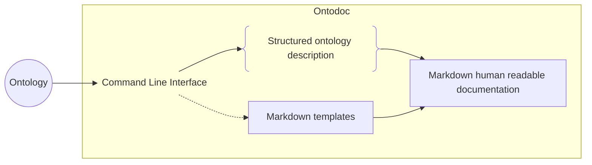

<p align="center">

</p>

# ontodoc

A python module to generate markdown documentation for ontologies.

Based on `rdflib` and `jinja2`.

## Getting Started 🚀

### Installation

```shell
pip install ontodoc
```

### Command line usage

```shell
python -m ontodoc
```

By default, the file named `ontology.ttl` will be used to generate your documentation in the `build` destination folder.

You can easily change settings as you need.
Available arguments :

| Argument name                         | Default        | Description                                           |
| ------------------------------------- | -------------- | ----------------------------------------------------- |
| `-i, --input INPUT`                   | `ontology.ttl` | _Input ontology file_                                 |
| `-o, --output OUTPUT`                 | `build/`       | _Output directory for the generated documentation_    |
| `-t, --templates TEMPLATES`           | `templates/`   | _Custom templates folder_                             |
| `-f, --footer, --no-footer`           | `true`         | _Add footer for each page_                            |
| `-c, --concatenate, --no-concatenate` | `false`        | _Concatenate documentation into an unique file_       |
| `-s, --schema, --no-schema`           | `true`         | _Display schemas_                                     |
| `-m, --model MODEL`                   | `markdown`     | _Model type for the documentation. markdown, gh_wiki_ |

### Automatically generate your documentation

You can explore `github actions` to automatically generate and publish your documentation.

## Example 👀

Look at the [example for _foaf_](https://github.com/StephaneBranly/ontodoc/blob/main/example/build/homepage.md) to see what type of documentation you can easily build in 2 lines!

## How does it work ? 🔧



## Contributing </>

Feel free to contribute to this open source project!

We need help to implement new features, fix bugs listed in [issues](https://github.com/StephaneBranly/ontodoc/issues).

If you have any idea, create your own issue.

## License 🔓

[Apache License 2.0](https://github.com/StephaneBranly/ontodoc/blob/main/LICENCE.txt)

## They already have integrated Ontodoc ♥️

_Comming soon..._
