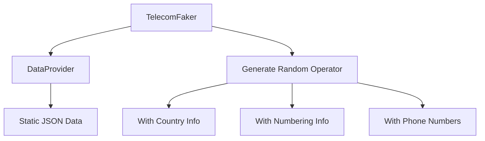

# TelecomFaker

A Python package for generating realistic telecom operator test data. Similar to Faker, but focused on telecom-specific information.

## Design



## Features

- Generate random telecom operator data with realistic information
- Access operator details by country, region, or randomly
- Get accurate numbering information (Prefix, MCC, MNC)
- Filter operators by size, country, or other attributes
- Built with real-world telecom data

## Installation

### For Users

```bash
pip install telecomfaker
```

### For Developers

1. Clone the repository:
```bash
git clone https://github.com/yourusername/telecomfaker.git
cd telecomfaker
```

2. Create and activate a virtual environment:
```bash
# Using venv
python -m venv venv
source venv/bin/activate  # On Windows: venv\Scripts\activate
```

3. Install development dependencies:
```bash
pip install -r requirements.txt
```

4. Install the package in development mode:
```bash
pip install -e .
```

## Development

### Running Tests

Run BDD tests with Behave:
```bash
behave
```

Run unit tests with pytest:
```bash
pytest
```

## Quick Start

### Python API

```python
from telecomfaker import TelecomFaker

# Create a TelecomFaker instance
faker = TelecomFaker()

# Get a random operator with all associated information
result = faker.generate_operator()
operator = result

print(f"Random Operator: {operator['name']} ({operator['country']})")
print(f"MCC: {operator['mcc']}, MNC: {operator['mnc']}")
print(f"Size: {operator['size']}")
print(f"MVNO: {'Yes' if operator['is_mvno'] else 'No'}")
```

### Command Line Interface

TelecomFaker includes a command-line interface for quick data generation:

```bash
# Generate a single operator in text format
telecomfaker

# Generate 5 operators in JSON format
telecomfaker --count 5 --format json

# Generate operators with a specific seed for reproducibility
telecomfaker --seed 42

# Save output to a file
telecomfaker --count 10 --format json --output operators.json
```

#### CLI Options

| Option | Description |
|--------|-------------|
| `--seed SEED` | Random seed for consistent generation |
| `--count COUNT` | Number of operators to generate (default: 1) |
| `--format {json,text}` | Output format (default: text) |
| `--output FILE` | Output file (default: stdout) |

#### Example Output (Text Format)

```
Operator: Vodafone
Country: Germany
MCC: 262
MNC: 02
Size: large
Type: MNO
```

#### Example Output (JSON Format)

```json
[
  {
    "name": "Vodafone",
    "country": "Germany",
    "mcc": "262",
    "mnc": "02",
    "size": "large",
    "is_mvno": false
  }
]
```

## Data Sources

TelecomFaker uses real-world data compiled from:

- ITU (International Telecommunication Union)
- Public MCC/MNC databases
- Telecom regulatory authorities
- Open-source telecom data repositories

## Contributing

1. Fork the repository
2. Create a feature branch: `git checkout -b feature-name`
3. Commit your changes: `git commit -am 'Add some feature'`
4. Push to the branch: `git push origin feature-name`
5. Submit a pull request

## License

This project is licensed under the MIT License - see the LICENSE file for details.
