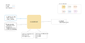

.. venco.py documentation source file, created for sphinx

.. _dataparsers:

DataParsers Level
===================================

DataParsers Input
---------------------------------------------------
**Config File (user_config.yaml):**

* encryption_password: <password> - Uses the password to read in the dataset
* split_overnight_trips: bool - Boolean to select whether to split overnight trips
* subset_vehicle_segment: bool - Boolena to decide whether to subset for specific vehicle class
* vehicle_segment - Specify which vehicle segment to consider

**Config File (dev_config.yaml):**

* data_variables - Selects the variables from the original dataset
* id_variables_names - Selects the name of unique identifiers of the vehicle/person carrying out the trip
* input_data_types - Specifies the data type of the data variables
* filters - Assigns values to the filters, which include inclusion, exclusion and equality relationships
* replacements - Replaces numeric variables with more explicit variables

**Disk Files: (dataset with mobility patterns)**

* National travel surveys
* Mobility patterns from traffic models

DataParsers Output
---------------------------------------------------

**Output Functions:**

* data = parse_data(configs=configs)
* data.process()

DataParsers Structure
---------------------------------------------------

DataParser (including IntermediateParsing) + ParkInference (including OvernightSplitter) + ParseMiD (specific dataset parsing)

DataParser Class
#################################################################

ParkInference Class
#################################################################
trip_id starts with 1 (real number from original dataset)
park_id starts with 0 (creation in the code)

Specific Dataset Parsing Classes
#################################################################

**ParseMiD**

**ParseKiD**

**ParseVF**
