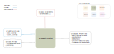
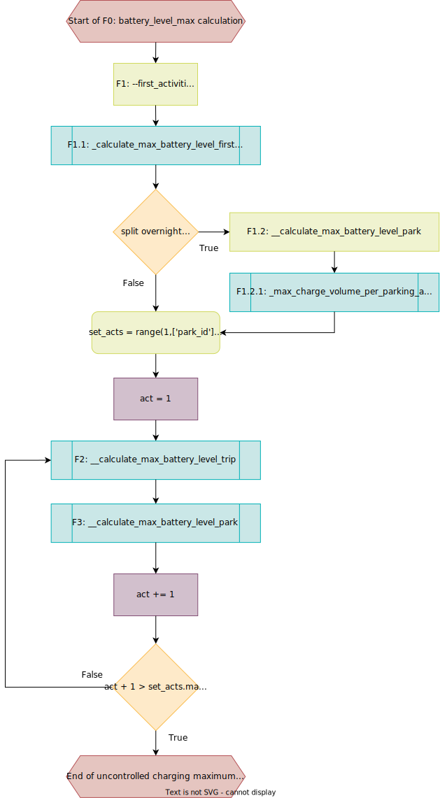
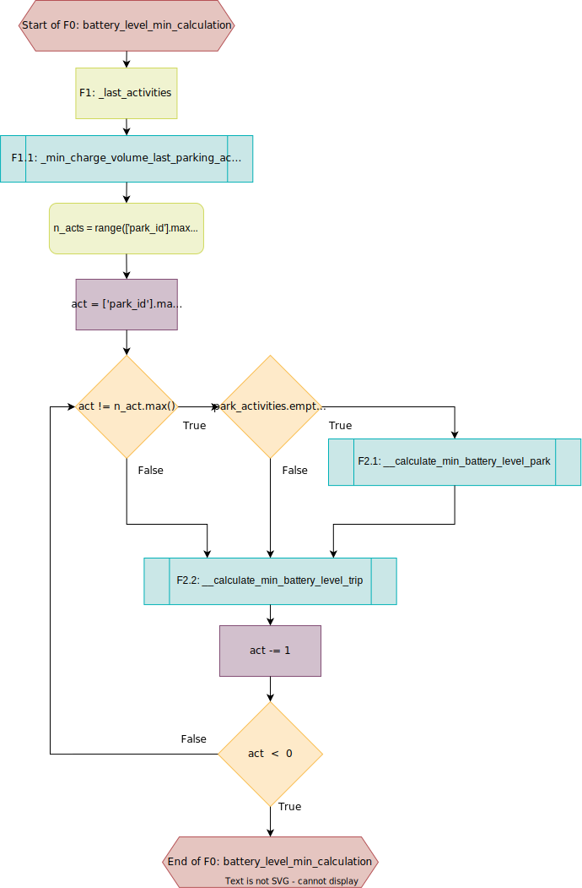

.. venco.py documentation source file, created for sphinx

.. _flexestimators:

FlexEstimators Level
===================================

FlexEstimators Input
---------------------------------------------------
**Config File (user_config.yaml):**

* filter_fuel_need: bool - Should activity chains that require fuel for trip distance satisfaction be filtered out?
* battery_capacity: <value> - Capacity in kWh of the vehicle battery 
* electric_consumption: <value> - Electric consumption in kWh/100 km, input assumption for specific electric consumption
* fuel_consumption: <value> - Fuel consumption in l/100 km, input assumption for specific fuel consumption for auxiliary fuel
* start_soc: <0-1> - State-of-Charge between 0 and 1 at beginning of activity chain
* maximum_soc: <0-1> - Percentage of maximum available battery capacity
* minimum_soc: <0-1> - Percentage of minimum available battery capacity
* max_iterations: <value>  - Technical parameter
* epsilon_battery_level: <value>  - Iterations stop once the difference between start and end battery level have decreased to this share of fleet battery level

**venco.py Classes:**

* GridModeller class output

FlexEstimators Output
---------------------------------------------------

**Output Functions:**

* flex = FlexEstimator(configs=configs, activities=grid.activities)
* flex.estimate_technical_flexibility_through_iteration()

**Disk Files:**

 * Electric battery drain (.csv) `drain`
 * Available charging power (.csv) `charging_power`
 * Uncontrolled charging profile (.csv) `uncontrolled_charging`
 * Maximum battery energy level (.csv) `max_battery_level`
 * Minimum battery energy level (.csv) `min_battery_level`

FlexEstimators Structure
---------------------------------------------------

FlexEstimator Class
#################################################################

The FlexEstimator calculates the charging sequences throughout the day based on the grid created in the GridModeller. 
A minimum and maximum battery charge is simulated via an iteration loop.

Drain Calculation
******************************

The calculation of drain is integrated in the overall iteration loop and based 
on the electric consumption given in the user config and the additional 
seasonal factors (adding consumption to seasons with higher consumption rates 
(e.g. winter))

Iterative Battery Level Calculation
*****************************************
.. something about the delta, epsilon iteration loop mentioning that max battery level calculation is part of this

**************************
Uncontrolled Charging
**************************

.. shorten this and add to battery level calculation profiles

Lithium-ion batteries are usually charged with CC-CV (Constant Current-
Constant Voltage). The battery is first charged at a CC up to a certain 
maximum allowable voltage limit, and then continues to be charged at a CV with 
decreasing current. For this reason, the calculated charging energy for the 
parking activities depends on the state-of-charge (SOC). CC charging is 
simulated in venco.py at constant power, while CV charging decreases linearly. 
The threshold-SOC defining the switch from CC to CV mode can be set in the 
configuration. As the SOC changes with time, the charged energy needs to be
recalculated within an iteration process. The number of iterations to be done 
can be selected in the config. More iterations will calculate the point of time 
where CC switches to CV more precisly and therefore calculate the energy 
charged more accurately

.. image:: ../figures/CCCV_process.png
	:align: center

*****************************
Max Battery Level Profile
*****************************

**Units:** max_battery_levels as well as max_charge_volumes are in kWh - usually 
the min_battery_level is close to the minimum battery capacity of an average 
vehicle.

When calculating the maximum charging cycle, the charging process is simulated 
by always charging the maximum amount of energy and as soon as the vehicle is 
plugged in. The vehicle is therefore charged with the power specified by the 
GridModellers as soon as it is parked, provided the duration of parking is 
longer than the minimum parking duration set in the configuration. As the start 
SOC of a parking activity is only ever known when the previous driving activity 
has been completed, the calculate_max_charge_volume function is part of the 
iteration through the individual activities shown in the diagram below. 

*****************************************
Charge Volume Calculation Steps
*****************************************
1. Identification and handling of first activities, that therefore start with 
the configuration-based start-SOC. All park activities are assigned a 
max_charge_volume from rated power and park time as well as all trips 
max_end_battery_levels are calculated.

2. Identify overnight trips to catch parking activities that are the first park 
activity of the unique_id but not the first activity (results from an overnight 
split trip that is moved to be the first activity, when outranging the 
24h day). Calculate max_charge_volume for those park activities as in step 1.

3. Start the iteration by defining the Iteration range based on the maximum 
number of activities found in the dataset.

4. Iterate trough all activity_ids and calculate the max_charge_volume and 
based on that the max_end_battery_levels for 
parking and trip events. This is implemented in a vectorized manner so the 
max_end_battery_levels of e.g. all 3rd trips are calculated parallely. Because 
of the path dependency (start SOC of a trip is equal to the end-SOC of the 
previous parking activity which depends on the start-SOC of the same parking 
activity), the procedure cannot be implemented totally vectorized. 

5. End Iteration if all activities are handled.

Min Battery Level Profile
***************************************

**Units:** min_battery_levels as well as min_charge_volumes are in kWh - usually 
the max_battery_level is close to the maximum (average) battery capacity of an 
average vehicle.

During the minimum charging cycle, only as much is charged as is needed for the 
next upcoming driving activity and the charging process is shifte to the latest 
possible timeframe of the parking activtiy (as late as possible). The last 
activity serves as the start for this iteration, as this should end with an 
empty battery. 

The respective iteration loop runs the other way round (from high activity IDs 
to lower ones, i.e. anti-chronologically), the parking activities are always 
handled first, depending on the temporally subsequent trip that has already 
been handled, but this time in a different act_id.

***********************************
Charge Volume Calculation Steps 2
***********************************
1. Identification and handling of last activities, that therefore end with the 
configuration based minimum-SOC. Calculation of the min_charge_volume is part 
of this, executed with a start-SOC of the charging being the minimum SOC

2. Start the iteration by defining the iteration range based on the maximum 
number of activities found in the dataset.

3. Catch the maximum act_id while the min_charge_volume was already calculated 
in step 1 and therefore only calculate the min_battery_start_level for the 
trips.

4. Handle all other act_ids by always calculating the min_charge_volume and 
min_battery_level_end for a park activity and follow with the trips that took 
place chronologically before that.

5. End Iteration if all activities are handled.
