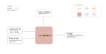

.. venco.py documentation source file, created for sphinx

.. _gridmodellers:

GridModellers Level
===================================

GridModellers Input
---------------------------------------------------
**Config File (user_config.yaml):**

* minimum_parking_time: <seconds> - Charging power is set to zero if parking time lower than <minimum_parking_time> in seconds
* grid_model: "simple" - Options are "simple" and "probability"
* losses: True - Take into account charging station losses
* force_last_trip_home: True - Require that all last trips end home
* rated_power_simple: <kW> - Nominal rated power to be used with simple grid model
* charging_infrastructure_mappings - True-False to the respective type of charging infrastucture
* grid_availability_distribution - Assing probability distribution for each parking purpose

GridModellers Output
---------------------------------------------------
**Output Functions:**

* grid = GridModeller(configs=configs, activities=data.activities)
* grid.assign_grid()

**Disk File:**

* Activity dataset including rated and available charging power for all vehicles (.csv)

GridModellers Structure
---------------------------------------------------

This file documents the GridModeller class of venco.py. It presents a methodology of allocation of charging infrastructure for every hour of a trip  and also calculation of transaction start hour.
There are currently two ways for grid assignment in venco.py.

Profile for connection capacity of the fleet `charging_power`
############################################################

General description
*************************
This profile represents the hourly maximum charging capacity of the electric vehicle fleet. Charging can never be higher than this profile but may be
lower since not all charging stations run on full capacity or it is attractive for balancing renewable feed-in to not charge at full capacity.
Currently, only one charging capacity per run of venco.py can be taken into account.

**Units:** Profiles are in percentage (between 0 and 1), defined as share of number of vehicles of the overall vehicle fleet.

1.	Simple Grid Assignment
------------------------------------------
	Charging availability is allocated based on a binary TRUE/FALSE mapping to a respective trip purpose and this is specified in venco.py-config.
	It is assumed that the vehicels are charged when they are parked. With this modeling technique, the purpose diary is converted into a binary
	grid connection diary with same format but consisting only of TRUE/FALSE values.

2.	Probability Based Grid Assignment
--------------------------------------------------
	In this technique, a probability based grid modeling is considered. Each purpose is given a certain probability for allocation of charging
	infrastructure. Probability distribution is defined in the venco.py-config as follows,

+-----------------+-----------------+-----------------+
|     Purpose     | Probability     | Charging Power  |
+=================+=================+=================+
| Driving   	  | 1               | 0               |
+-----------------+-----------------+-----------------+
| Home      	  | | 0.5           | | 3.7           |
|                 | | 0.25          | | 11            |
|                 | | 0.15          | | 22            |
|                 | | 0.1           | | 0             |
+-----------------+-----------------+-----------------+
| Work      	  | | 0.5           | | 11            |
|                 | | 0.35          | | 22            |
|                 | | 0.15          | | 0             |
+-----------------+-----------------+-----------------+
| School,      	  | | 0.5           | | 11            |
| Shopping &      | | 0.35          | | 22            |
| Leisure         | | 0.15          | | 0             |
+-----------------+-----------------+-----------------+
| Other      	  | | 0.2           | | 11            |
|                 | | 0.1           | | 22            |
|                 | | 0.7           | | 0             |
+-----------------+-----------------+-----------------+

	Every purpose is assigned a probability between 0 to 1 and based on the probability distribution defined in config,
	a charging station is allotted to that particular purpose. Also, the probability only changes if there is a change of purpose in the next hour.
	We assume that for home charging, the vehicle is connected to the same charging column capacity of 1st hour whenever it is returned home during the whole day.

