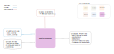

.. venco.py documentation source file, created for sphinx

.. _postprocessors:

PostProcessors Level
===================================

PostProcessors Input
---------------------------------------------------
**Config File (user_config.yaml):**

* start_weekday: 1 - Number corresponding to start day of the week for annual profile (1=Monday)

**venco.py Classes:**

 * ProfileAggregator class output (5 profiles)

PostProcessors Output
---------------------------------------------------

**Output Functions:**

 * post = PostProcessor(configs=configs, profiles=profile)
 * post.create_annual_profiles()
 * post.normalise()

**Disk Files:**

 * Electric battery drain (.csv)
 * Available charging power (.csv)
 * Uncontrolled charging profile (.csv)
 * Maximum battery energy level (.csv)
 * Minimum battery energy level (.csv)

PostProcessors Structure
---------------------------------------------------

**Timeseries Creation and Normalisation**

Weekly or annual timeseries can be created at this stage and a normalisation is carried out for each profile.
The normalisation basis differs for each profile:
- Profile for uncontrolled charging `uncontrolled_charging`: normalised over the annual sum (function :py:meth:`postprocessors.PostProcessor.__normalize_flows`)
- Profile for the electric demand `drain`: normalised over the annual sum (function :py:meth:`postprocessors.PostProcessor.__normalize_flows`)
- Profile for the charging capacity of the fleet `charging_power`: normalised according to the number of vehicle for each weekday (function :py:meth:`postprocessors.PostProcessor.__normalize_charging_power`)
- Maximum and minimum battery level profile `max_battery_level` and `min_battery_level`: normalised according to the assumed vehicle battery size (function :py:meth:`postprocessors.PostProcessor.__normalize_states`)

**Scaling incorporating vehicles that do not move**

One challenge in using only trip data as basis for the activity schedules is that immobile vehicles are not present in 
the dataset. An immobile vehicle is parked at a respondent's parking lot or garage but does not leave this parking lot 
for a single trip. Because no trip is taken, the vehicle does not show up in the MiD's trip data set. This is 
specifically important upon aggregation and normalisation if the goal is to create a profile that is representative for 
the whole fleet. 

Ignoring immobile vehicles would create profiles representative for only mobile vehicles. This skews the demand profiles 
because the number of immobile vehicles is higher on the weekend. For the MiD 2017, 36-39% of all vehicles did not move 
on the survey day if it was a workday (Mo-Fr). This share is increased to 49% on Saturday and to 61% on Sunday. Thus, 
profiles normalised to only moving vehicles will show a higher-than-expected demand on the weekends, especially on 
Sundays compared to workdays. 

This skewing is tackled in venco.py using external data on the weekday-specific amount of mobile vs. immobile vehicles 
in the config and correcting for immobile vehicles at the stage of normalisation. To calculate the share of immobile 
vehicles, the following steps were carried out: 

#. Read-in dataset "MiD2017 B1 - Autos" (German for cars). In the B2 dataset from which we use the trip data, no vehicle 
specific data is available. 
#. Count the number of occurrences of the combination of weekday and number of trips (e.g. how often there were 
Wednesdays with 0 trips, 1 trip, 2, trips…)
#. Filter out the values 
- 95 (N/A),
- 101 (Vehicle info not available) and 
- 202 (variable not available in paper survey)
#. Create a DataFrame with 7 rows (1 per weekday) and 3 columns: Mobile, immobile, total
#. Write 0 trips to column ‘immobile’ (per row/weekday)
#. Write the sum of non-0 number of trips-columns (1-13) to column ‘mobile’
#. Write the sum of first two columns to column ‘total’ 
#. Calculate immobile share: immobile / total

