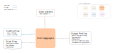

.. venco.py documentation source file, created for sphinx

.. _profileaggregators:

ProfileAggregators Level
===================================

ProfileAggregators Input
---------------------------------------------------
**Config File (user_config.yaml):**

* aggregation_timespan: weekly - Options are: daily, weekly
* weight_flow_profiles: bool - Currently only used for flow profile aggregation
* alpha: 10 - Percentile to exclude for state profiles aggregation

**venco.py Classes:**

 * ProfileAggregator class output (5 profiles)

ProfileAggregators Output
---------------------------------------------------

**Output Functions:**

 * profiles = ProfileAggregator(configs=configs, activities=diary.activities,
   profiles=diary)
 * profiles.aggregate_profiles()
 * profiles.normalise()

**Disk Files:**

 * Electric battery drain (.csv)
 * Available charging power (.csv)
 * Uncontrolled charging profile (.csv)
 * Maximum battery energy level (.csv)
 * Minimum battery energy level (.csv)

DiaryBuilders Structure
---------------------------------------------------

DiaryBuilder Class
#################################################################

TimeDiscretiser Class
#################################################################

**Aggregation Approaches**

The aggregation approach implemented in venco.py varies according to the
considered profile. Below the different approaches are illustrated:

- Profile for uncontrolled charging `uncontrolled_charging`: aggregated by
  calculating the average value per day of the week (function
  :py:meth:`profileaggregators.Aggregator.__calculate_average_flow_profiles`)
- Profile for the electric demand `drain`: aggregated by calculating the average
  value per day of the week (function
  :py:meth:`profileaggregators.Aggregator.__calculate_average_flow_profiles`)
- Profile for the charging capacity of the fleet `charging_power`: aggregated by
  calculating the average value per day of the week (function
  :py:meth:`profileaggregators.Aggregator.__calculate_average_flow_profiles`)
- Maximum and minimum battery level profile `max_battery_level` and
  `min_battery_level`: aggregated by selection (function
  :py:meth:`profileaggregators.Aggregator.__aggregate_state_profiles`), using an
  alpha value (100 - alpha), which represents the percentile from the maximum or
  minimum battery level at each hour. If alpha = 10, the 10% biggest (or
  smallest) value is selected, and all other values beyond are disregarded.
