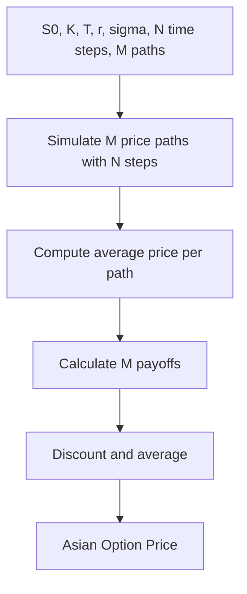

# Monter Carlo Methods in Option Pricing

Monte Carlo methods simulate randomness - to estimate values that are hard to compute exactly. **🎲** The core idea is to use random samples to estimate an expected value. 

Imagine you are estimating the average winnings of a dice game: 


You can either:

- List every possible outcome (hard)
- Or simulate 10,000 rolls and compute the average (Monte Carlo Simulation)

This works because of the **Law of the Large Numbers**


$$
\mathbb{E}[f(X)] \approx \frac{1}{M} \sum_{i=1}^{M} f(X_i)
$$


Where: 

- $X_i$ are random samples from the distribution
- $M$ is the number of simulations 
- $f(X)$ is the function we care about (e.g. option payoff)

## Monte Carlo Option Pricing for European Options (Vanilla)

Core concept: Monte Carlo simulates the many outcomes of the asset prices, compute the payoff for each, and average them. 

### Price

We define: 

- $S_0$ the initial stock price 
- $K$ strike price 
- $T$ time to maturity 
- r risk-free rate 
- $\sigma$ volatelity 
- $Z_i \sim \mathcal{N}(0,1)$ standard normal random sample 

The we can simulate the terminal stock price as:


$$
S_T^{(i)} = S_0 \cdot \exp\left[\left(r - \frac{1}{2}\sigma^2\right)T + \sigma \sqrt{T} \cdot Z_i\right]
$$


This derived from the analytical solution of the geometric Brownian motion (Black-sholes model) 

### Payoff

Then we compute the payoff:

For a call $\text{payoff}^{(i)} = \max(S_T^{(i)} - K, 0)$ or for a put $\text{payoff}^{(i)} = \max(K - S_T^{(i)}, 0)$ 

### Discount and Average


$$
\text{Price} = e^{-rT} \cdot \frac{1}{M} \sum_{i=1}^{M} \text{payoff}^{(i)}
$$


where $N$ is the number of simulations. 

In summary : 

```mermaid
graph TD
    A[S0, K, T, r, sigma] --> B[Generate M standard normals Z]
    B --> C[Simulate M terminal prices S_T]
    C --> D[Calculate M payoffs]
    D --> E[Discount each payoff]
    E --> F[Average → Option Price]
```




## Monter Carlo Option Pricing for Asian Options

### Price Paths

We define:

- $\Delta t=\frac{T}{N}$
- At each step: $S_{t+\Delta t} = S_t \cdot \exp\left[\left(r - \frac{1}{2}\sigma^2\right)\Delta t + \sigma \sqrt{\Delta t} \cdot Z\right]$ 


Meaning for each step we need to repeat: 


$$
S_{t+\Delta t} = S_t \cdot \exp\left[\left(r - \frac{1}{2}\sigma^2\right)\Delta t + \sigma \sqrt{\Delta t} \cdot Z\right]
$$


then we get full path: $[S_0, S_1, …, S_T]$

### Average Stock Price


$$
\bar{S} = \frac{1}{N+1} \sum_{j=0}^{N} S_j
$$


### Payoff

- Call : $\max(\bar{S} - K, 0)$ 
- Put: $\max(K - \bar{S}, 0)$ 

### Discount and Average


$$
\text{AsianPrice} = e^{-rT} \cdot \frac{1}{M} \sum_{i=1}^{M} \text{payoff}^{(i)}
$$


Summary workflow: 




## Note

**M and N are not the same thing** in this context.

| **Symbol** | **Meaning**                           | **Typical Use**                               |
| ---------- | ------------------------------------- | --------------------------------------------- |
| **M**      | Number of **Monte Carlo simulations** | How many paths you simulate                   |
| **N**      | Number of **time steps** in each path | How finely each path is discretized over time |

- M = **number of “students”** running through the simulation
- N = **number of “checkpoints”** each student passes before the final test

## Monte Carlo (with binomial )

### Timestep

get $dt = \frac{T}{N}$

where we calculate the time step. But it i not used to increment time in a loop, instead, its used to compute up/down factors and risk-neutral probabilities. 

### Compute u, d, p

These are binomial model components: 


$$
u = e^{\sigma \sqrt{dt}}, \quad d = e^{-\sigma \sqrt{dt}}, \quad p = \frac{e^{r dt} - d}{u - d}
$$


So this is using **binomial tree dynamics** to simulate price movements.

### For Each Path:

Instead of Brownian motion (Z ~ N(0,1)), it samples from: `np.random.binomial(1, p, N + 1)` his produces a vector of ups (1) and downs (0) → exactly like in a binomial tree.

Then it builds the full path using u and d.

### Final Payoff Only:


$$
C[j] = e^{-rT} \cdot \max(S_T - K, 0)
$$


So even though a path is generated, the final value is the only part used — like a European option. 

## Code implementation and example

We can use either methods with the `wqu` package, like below: 

```python
from wqu.dp.montecarlo import MonteCarlo

mc = MonteCarlo(S0=100, K=95, T=1, r=0.05, sigma=0.2, N=50, M=10000,
                option_type='call', option_style='asian', method='binomial')

print("Asian Option (Binomial Monte Carlo):", mc.price())

mc_cont = MonteCarlo(S0=100, K=95, T=1, r=0.05, sigma=0.2, N=50, M=10000,
                     option_type='call', option_style='asian', method='continuous')

print("Asian Option (Continuous Monte Carlo):", mc_cont.price())
```

```
Asian Option (Binomial Monte Carlo): 8.695634694961363
Asian Option (Continuous Monte Carlo): 8.672993641680282
```

```python
from wqu.dp.montecarlo import MonteCarlo

mc = MonteCarlo(S0=100, K=95, T=1, r=0.05, sigma=0.2, N=50, M=10000,
                option_type='call', option_style='european', method='binomial')

print("Europian Option (Binomial Monte Carlo):", mc.price())

mc_cont = MonteCarlo(S0=100, K=95, T=1, r=0.05, sigma=0.2, N=50, M=10000,
                     option_type='call', option_style='european', method='continuous')

print("Europian Option (Continuous Monte Carlo):", mc_cont.price())
```

```
Europian Option (Binomial Monte Carlo): 13.320182246971445
Europian Option (Continuous Monte Carlo): 13.280390336599178
```

We can also plot the convergence of price with M. 

```python
from wqu.dp.montecarlo import MonteCarlo

mc = MonteCarlo(S0=100, K=95, T=1, r=0.05, sigma=0.2,
                N=50, M=10000, option_type='call',
                option_style='asian', method='continuous')

mc.plot_convergence(M_values=[100, 500, 1000, 2500, 5000, 10000, 20000])
```


or Even better with the setting the pseudo-random number generator used by NumPy (or any RNG) for reproducibility: 

```python
import numpy as np
np.random.seed(123)
mc_asian = MonteCarlo(S0=100, K=90, T=1, r=0, sigma=0.3, N=2500, M=10000, option_style='asian', method='binomial')
print(mc_asian.price())
```


