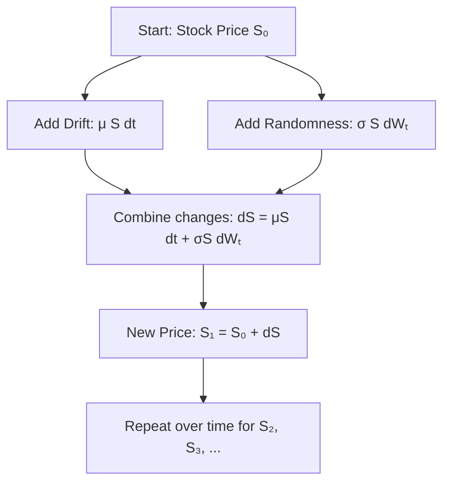

# Markov property and GBM

## Stochastic proceses 

imagine you’re watching the stock price of a company go up and down like a leaf in the wind. It seems random. A stochastic process is just a fancy name for something that changes over time in a random way. 

## Markov Process

In intuition, the markov process means: “What happens next depends only on what’s happening now, not on how we got here.” So we say, that If its sunday today and tomorrow’s weather depends only on today (not on the past week), that’s markov process. 

This is great for stock prices -traders say “everything the market knows is already in the price”

## Brownian Motion

Imagine the dust particles dancing under a microscope - totally random motion. Mathematically, this idea is called Brownian motion, or a Wiener Process. 

It has two key rules:

1. Each change is random. $\Delta z = \varepsilon \sqrt{\Delta t}, \quad \varepsilon \sim \mathcal{N}(0, 1)$
2. Each step is independent from the previous ones (like a drunk guy forgetting where he walked before)

We want to model stock price that:

1. Grows over time (hopefully) -> drift 
2. Is uncertain/random -> volatility 

We combine both: 


$$
ds = \mu Sdt + \sigma SdW_t
$$


Where:

- $S$  = current stock price 
- $\mu$ = average/expected return (drift)
- $\sigma$ = volatility 
- $dW_t$ = Wiener process = $\epsilon \sqrt{dt}$

This is the famous Geometric Brownian Motion (GBM)




## GBM (Geometric Brownian Motion)

Geometric Brownian Motion (GBM) is a model - a mathematical method - to simulate or describe how stock prices evolve over time. More precisly GBM is the standard model used in finance to describe the continuous-time dynamics of asset prices like stocks. 

The GBM formula (Stochastic Differential Equation *SDE*)


$$
dS = \mu S \,dt + \sigma S \,dW_t
$$


Where:

- $S$ = stock price at time t
- $\mu$ = expected return (drift)
- $\sigma$ = volatility
- $dW_t$ = Brownian motion = random noise

**Interpretation:**

- The term $\mu S dt$: deterministic growth → like compound interest
- The term $\sigma S dW_t$: randomness or noise → price jumps, news, volatility

## Get GMB in practice

There are mainly two ways to get GMB in practice:

### **Exact Solution (Analytical Formula)**

This uses the exact mathematical solution of the GBM differential equation: 


$$
dS = \mu S \, dt + \sigma S \, dW_t
$$


Solving it using **Itô calculus**, we get the **closed-form solution**:


$$
S_t = S_0 \cdot \exp\left[\left(\mu - \frac{1}{2} \sigma^2\right)t + \sigma W_t\right]
$$


- **Advantage**: Precise, fast, and numerically stable.
- **Used in**: Black-Scholes model, pricing options, simulations with fixed time steps.


Think of W_t like a **random seed** in a game:


- You don’t know in advance what path you’ll take,
- But once the seed is fixed, the entire path is **precisely** determined.


So each **realization** of S_t is different (because each path of W_t is different),

but the **equation** for generating that path is exact and correct.

If we take logs:


$$
\ln S_t = \ln S_0 + \left(\mu - \frac{1}{2}\sigma^2\right)t + \sigma W_t
$$


 This shows that the **log-price** follows a normal distribution. That’s why **GBM implies log-normal prices**.

```python
S[i+1] = S[i] + mu * S[i] * dt + sigma * S[i] * np.sqrt(dt) * np.random.randn()
```

### **Euler Simulation (Euler-Maruyama Approximation)**

Instead of solving the equation, you **approximate it step-by-step**:


$$
S_{t + \Delta t} \approx S_t + \mu S_t \Delta t + \sigma S_t \sqrt{\Delta t} \cdot \varepsilon
$$


Where $\varepsilon \sim \mathcal{N}(0,1)$

This gives you an **iterative simulation** of the price path.


- **Advantage**: Intuitive, flexible, can be used with more complex models.
- **Used in**: Monte Carlo simulations, multi-asset models, SDEs with no closed form.


The **Euler-Maruyama method** is a **numerical approximation** of the solution to a stochastic differential equation (SDE).

It doesn’t solve the equation exactly like we did with the closed-form GBM formula, but it simulates it **step by step**, over small time intervals.


- We start from the SDE again: $dS_t = \mu S_t \, dt + \sigma S_t \, dW_t$ 
- Euler approximation (discrete version): $S_{t+\Delta t} = S_t + \mu S_t \, \Delta t + \sigma S_t \, \sqrt{\Delta t} \cdot \varepsilon \quad\text{where } \varepsilon \sim \mathcal{N}(0, 1)$ 
- $\mu S_t \, dt$ is the deterministic part (drift)
- $\sigma S_t \, dW_t \approx \sigma S_t \, \sqrt{dt} \cdot \varepsilon$ is the noise
- We iterate over time using a for-loop:

```python
for i in range(1, N):
    S[i] = S[i-1] + mu * S[i-1] * dt + sigma * S[i-1] * np.sqrt(dt) * np.random.randn()
```


## Python

`wqu` package includes python methods for both of the above. 

```python
from wqu.dp import GBM

# Create a GBM simulator
gbm = GBM(S0=100, mu=0.05, sigma=0.2, T=1, N=252, seed=42)

# Simulate one exact path and print first 5 prices
path = gbm.simulate(method="exact")
print(path[:5])

# Plot a single Euler path
gbm.plot(M=1, method="euler", color='green', lw=2)

# Plot 100 Monte Carlo paths using exact GBM
gbm.plot(M=100, method="exact", alpha=0.2)
```


