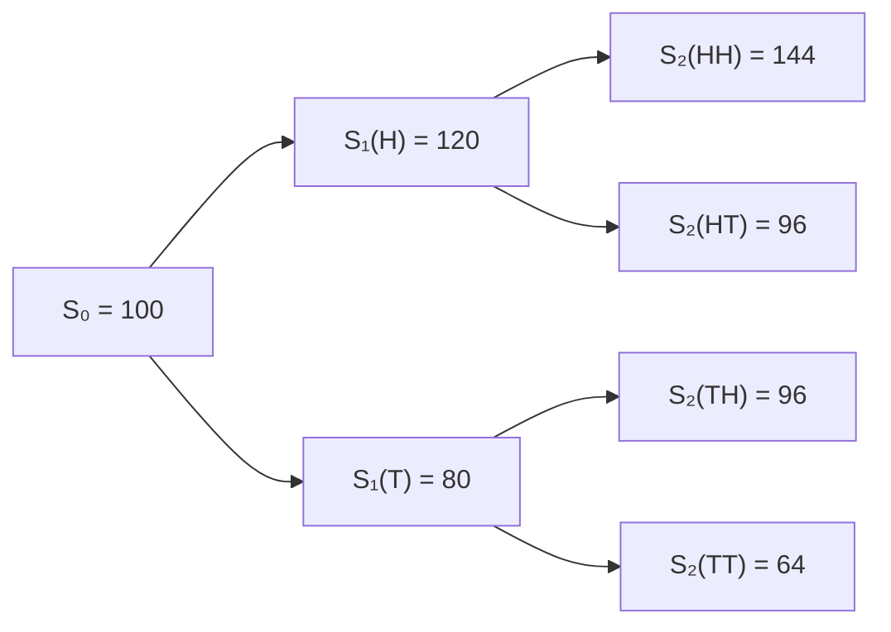

# Binomial Tree for Option Pricing

For the following data: 

```
S0 = 100
T = 1
u = 1.2 
d = 0.8 
N = 2
```

We have:



When using paths, the number of paths in the binomial tree is equal to the $2^N$

Note that in the [Cox-Ross-Rubinstein (CRR) model](https://sci-hub.al/10.1016/0304-405x(79)90015-1) (i.e., NumPy style matrix), we only track distinct price levels, not every path- so it’s much more memory efficient in calculation but loses the intuitive path flavor. 

Which can be implemented as this :

```python
import numpy as np

def binomial_call(S0, K, T, r, u, d, N):
    """
    Computes the price of a European call option using the binomial tree model.

    Args:
        S0 (float): Initial stock price.
        K (float): Strike price of the option.
        T (float): Time to maturity (in years).
        r (float): Risk-free interest rate (annualized).
        u (float): Upward movement factor for the stock price.
        d (float): Downward movement factor for the stock price.
        N (int): Number of time steps in the binomial tree.

    Returns:
        float: The price of the European call option.
        np.ndarray: The option value tree.
        np.ndarray: The stock price tree.
    """
    dt = T / N  # Time step size
    disc = np.exp(-r * dt)  # Discount factor for one time step
    q = (np.exp(r * dt) - d) / (u - d)  # Risk-neutral probability

    # Initialize trees for stock prices and option values
    S = np.zeros((N + 1, N + 1))  # Stock price tree
    C = np.zeros((N + 1, N + 1))  # Option value tree

    # Compute terminal stock prices and option payoffs
    for i in range(N + 1):
        S[N, i] = S0 * (u ** i) * (d ** (N - i))  # Stock price at maturity
        C[N, i] = max(S[N, i] - K, 0)  # Payoff for a call option at maturity

    # Perform backward induction to calculate option values at earlier nodes
    for j in range(N - 1, -1, -1):  # Iterate over time steps in reverse
        for i in range(j + 1):  # Iterate over nodes at each time step
            S[j, i] = S0 * (u ** i) * (d ** (j - i))  # Stock price at node
            # Option value is the discounted expected value of future payoffs
            C[j, i] = disc * (q * C[j + 1, i + 1] + (1 - q) * C[j + 1, i])

    # Return the option price, option value tree, and stock price tree
    return C[0, 0], C, S
```

And:	

$$
S[j, i] = S₀ × u^i × d^{(j−i)}
$$


 where:

- j = time step (row)
- i = number of up moves 


To find the europian call option price, underlying stock tree and payoffs using binomial model, we can do:

```python
from wqu.dp.binomial import binomial_call


# binomial_call(S0, K, T, r, u, d, N)
c0,_,_ = binomial_call(100, 90, 10, 0, 1.2, 0.8, 10)
```


