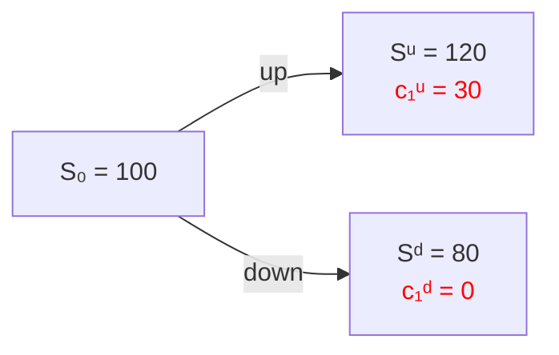
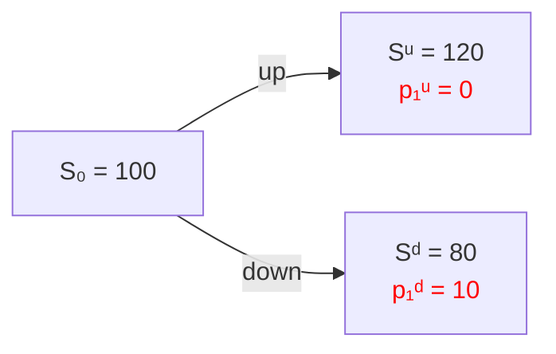

# Put-call Parity

## TL;DR

Put-call parity is a fundamental relationship in options pricing that states that the price of a European call option and a European put option with the same strike price and expiration date should be equal, after accounting for the present value of the strike price. This relationship helps ensure no arbitrage opportunity exists between the call and put options on the same underlying asset. 

## Replicating portfolios

An option ( call or put ) can be replicated with a self-financed portfolio combining:

1. A position (long or short) in shares 
2. A position in a risk-free bond (lend or borrow)

### Replicating portfolio for a call option



With X number of shares and B amount in the risk-free bond, such that ( assume r=0 for simlicity) 


$$
\begin{aligned}
C_1^u = max(120-90,0) = 30 \\
C_1^d = max(80-90,0) = 0
\end{aligned}
$$


We want to replicate this payoff using: 

- X: number of shares 
- B: money in the risk-free bond

we setup the same system:


$$
\begin{aligned}
X \cdot 120 + B = 30 \text{ (up)} \\
X \cdot 80 + B = 0 \text{ (down)}
\end{aligned}
$$


After solving the system of equations we get: X= 0.75, B = -60. 

**Initial cost of the portfolio**: 

At time 0, 


$$
C_0 = 0.75 \cdot S_0 + B = 0.75 \cdot 100 - 60 = 75 - 60 = 15
$$


So, we are replicated that when K=90, 

- Borrow 60$ 
- Buy 0.75 shares 

Total initial cost: $15, that is the fair no-arbitrage price of the option. 

### Replicating portfolio for a put option 



$$
\begin{aligned}
X \cdot 120 + B = 0 \text{ (up)} \\
X \cdot 80 + B = 10 \text{ (down)}
\end{aligned}
$$

Solving above we get: X = -0.25, B = 30.

So we have: $100*(-0.25)+30 = 5$

So the put option price is $5

## Put-call parity

Put-call parity shows the exact mathematical relationship between the price of a **European call option** and a **European put option** with the same: 

- Strike price $K$ 
- Expiration time $T$ 
- Underlying asset $S_0$


$$
\begin{aligned}
c_0 &= 0.75 S_0 - 60 e^{-rT} \\
p_0 &= -0.25 S_0 + 30 e^{-rT}
\end{aligned}
$$

A call option can be replicated as long stock + short bond, a put option can be replicated as short stock + long bond. 

At $t_1$ the stock is either $S_u=120$ or $S_d=80$, Strike price is $K=90$, call payoff is $C^u = 30, C^d=0$, put payoff is $P^u=0, P^d=10$, 

we solve two systems of linear equations ( for call and for put) using:

> Stock component + Bond component = Option payoff in each state, 

then we get:


$$
\begin{aligned}
C_0 + 90e^{-rT} = S_0 + P_0
\end{aligned}
$$


but the 90 is the K, so we can write it as:


$$
\begin{aligned}
C_0 + Ke^{-rT} = S_0 + P_0
\end{aligned}
$$


To get the Put option price we can either use one of the following:

```python
from wqu.dp.binomial import binomial_put

# binomial_put(S0, K, T, r, u, d, N)
p0 = binomial_put(100, 90, 10, 0, 1.2, 0.8, 10)
```

or 

```python
from wqu.dp import put_from_call
# binomial_put_from_call(S0, K, T, r, call_price)
p0 = put_from_call(100,90,10,0,29.38454450999999)
```


