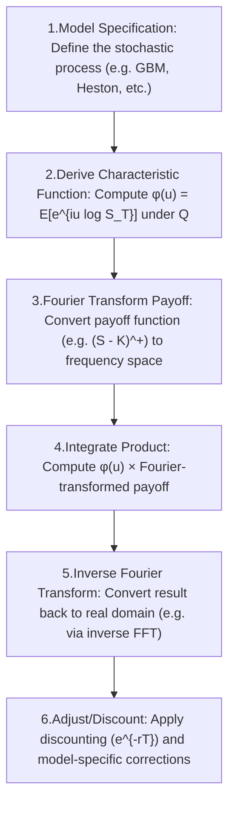

# Fourier-Based Option Pricing

In simple models like **Black-Scholes**, we have **closed-form solutions** (thanks to Ito calculus). But for more complex models (like Heston, Jump-Diffusion, etc.), there’s no closed-form formula for the price. 

So instead, we use the **characteristics function (CF)**, and price the option using **Fourier transforms**

## Generic workflow for Fourier-based option pricing

Here’s a step-by-step workflow for Fourier-based option pricing in stochastic modeling:

1. **Model Specification**: Define the model for the **underlying asset prices**, including the stochastic process that governs their movements.
   1. Defuine the **Stochastic process** for the underlying asset. 
      1. Black-Scholes: GBM
      2. Heston: Stochastic volatility 
      3. Merton: Jump-diffusion
   2. The key is that we must know the **distribution of** $\log(S_T) $ or at least its **characteristic function**.
2. **Characteristic Function**: Derive the characteristic function of the log of the underlying asset’s price. This function is crucial for the Fourier transform method.
   1. Find the **characteristic function** $\phi(u) = \mathbb{E}[e^{iu \log S_T}]$ under the **risk-neutral measure** $\mathbb{Q}$.
   2. This is the bridge into frequency space. Even if the PDF is unknown, CF is often tractable.
3. **Fourier Transform of Payoff Function**: Apply the Fourier transform to the option’s payoff function. This converts the payoff into a form that can be used in the Fourier domain.
   1. Fourier transform the **option payoff**, such as $(S_T - K)^+$. 
   2. This step ensures you’re working in **the same frequency space** as the CF.
   3. In Carr-Madan: this involves modifying the payoff to make it square-integrable (e.g. adding a damping factor $e^{-\alpha k}$).
4. **Integrate Product**: Integrate the product of the characteristic function and the transformed payoff function. This step involves complex mathematical integration.
   1. Compute the integral: $\text{Option Price} = \int_{-\infty}^{\infty} \phi(u) \cdot \hat{g}(u) \, du$ Where: $\phi(u)$ = CF of log price , $\hat{g}(u)$ = transformed payoff function 
   2. This step is often where FFT or quadrature is used.
5. **Inverse Fourier Transform**: Perform the inverse Fourier transform to convert the **result back to the time domain**. This gives the option price.
   1. Bring the result **back to the real domain** to obtain the option price: $f(x) = \frac{1}{2\pi} \int_{-\infty}^\infty e^{-iux} \hat{f}(u) \, du$
   2. Often the inverse is embedded inside the pricing formula (e.g. Carr-Madan or Lewis), so this step is implicit.
6. **Adjust for Model Characteristics**: Make any necessary adjustments to account for specific characteristics of the model or market conditions. (like discounting)
   1. Finally, multiply by $e^{-rT}$ to account for the **present value** of the expected payoff under $\mathbb{Q}$.
   2. Some models require further tweaks (e.g. jump compensators, FFT damping, etc.)

## Fourier Transform

The Fourier Transform converts a function (like a **PDF**) into frequency space. 

$$
\hat{f}(u) = \int_{-\infty}^{\infty} e^{iux} f(x) dx
$$

We can also recover the function using the Inverse Fourier Transform:

$$
f(x) = \frac{1}{2\pi} \int_{-\infty}^{\infty} e^{-iux} \hat{f}(u) du
$$

Paeseval’s relation connects the dot product in original space and frequency space. 

The PDF(probability densitiy function) is a curve, that tells you how likely it is to see different outcomes of a random variable. The area under the curve between two points tells you the probability of the variable falling in that range. 

> Suppose you’re guessing where a dart will land on a board. You can’t predict exactly **where** it will land… But you **can** describe **how likely** it is to land **in a certain area**. That’s what a PDF dose. 

Let’s say $X=log(S_T)$ (the log of future stock price)

The PDF $f(x)$ of $X$ answers:

> “What’s the probability that the log of the stock price ends up around x?”

- A **normal distribution** PDF looks like a **bell curve**.
- The **peak** is the most likely value.
- The **tails** show how much chance there is of extreme events.

To price an option, we want to **average all possible future outcomes, weighted by how likely** they are. 

Call option price: 

$$
C_0 = e^{-rT} \mathbb{E}^{\mathbb{Q}}[(S_T - K)^+]
$$

We can compute this as: 

$$
C_0 = e^{-rT} \int_0^\infty (S - K)^+ \cdot f(S)\, dS
$$

Where:

- $(S - K)^+$ is the **payoff**
- $f(S)$ is the **PDF** of the stock price under risk-neutral measure

So: The PDF tells us **how likely each payoff is**, and we multiply that by the payoff and **add it all up** to get the option price.

For complex models (e.g. Heston), we often **don’t know the PDF** of S_T… but we **can compute its characteristic function** — and that’s where **Fourier methods** come in!

## Characteristic Function (CF)

$$
\hat{q}(u) = \mathbb{E}^{\mathbb{Q}}[e^{iuX}]
$$

- This is the Fourier transform of the PDF of a random variable $X$
- It fully characterizes the distribution, even if the PDF is not known 

> This is the key: even if we can’t write down the PDF of $S_T$, we can often get its CF

Imagine you have a mysterious black box (a random variable). We can’t always see its **PDF**, but we still want to **understand its behavior** - like:

- Where it’s centered 
- How wide it is
- How it behaves over time

The Characteristic Function is a tool that lets you describe any random variable in a way that’s super flexible - even when you don’t have the PDF. 

The characteristic function of a random variable $X$ is defined as: $\phi_X(u) = \mathbb{E}[e^{iuX}]$, where:

- $u$ is a real number (like a frequency),
- $e^{iuX}$ is a complex exponential (don’t panic — it’s like encoding the shape of a wave), 
- $\mathbb{E}[\,]$ means you’re taking an **expected value** — i.e., an average.

- The term $e^{iuX}$ comes from **Euler’s formula**: $e^{iuX} = \cos(uX) + i\sin(uX)$ 

So what are we really doing?  -> We’re taking the **cosine and sine of the random variable**, then averaging them! This tells us: How “aligned” the distribution is with the **wave** of frequency u

> A **characteristic function** is like a “frequency signature” of a random variable. It encodes all its behavior — even if we don’t have the PDF. For option pricing, the CF is often much easier to work with than the PDF, and we can use **Fourier inversion** to get prices directly.

## Lewis (2001) Approach

Uses the Fourier inersion to get the call price:

$$
C_0 = S_0 - \frac{\sqrt{S_0 K} e^{-rT}}{\pi} \int_0^{\infty} \text{Re}\left[ e^{izk} \phi(z - i/2) \right] \frac{dz}{z^2 + 1/4}
$$

Where:

- $\phi(u)$: characteristic function of $\log S_T$
- $k = \log(S_0/K)$

## Carr-Madan (1999) with FFT 

They modify the call price to make it square-integrable and apply FFT:

$$
\Psi(\nu) = \frac{e^{-rT} \phi(\nu - i(\alpha+1))}{\alpha^2 + \alpha - \nu^2 + i(2\alpha + 1)\nu}
$$

Then recover the price via inverse Fourier transform:

$$
C_0 = \frac{e^{-\alpha k}}{\pi} \int_0^{\infty} e^{-i \nu k} \Psi(\nu) d\nu
$$

This is used in practice for **fast numerical pricing** using **FFT**

