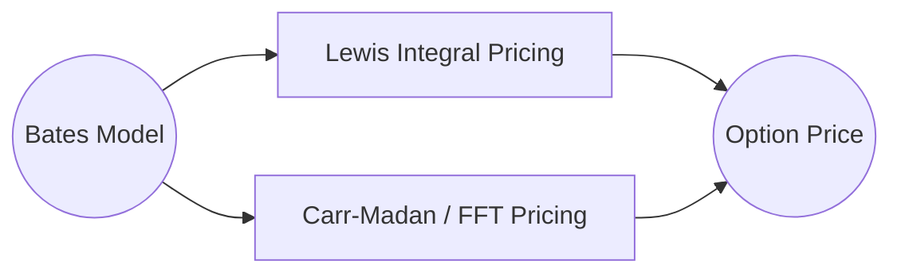
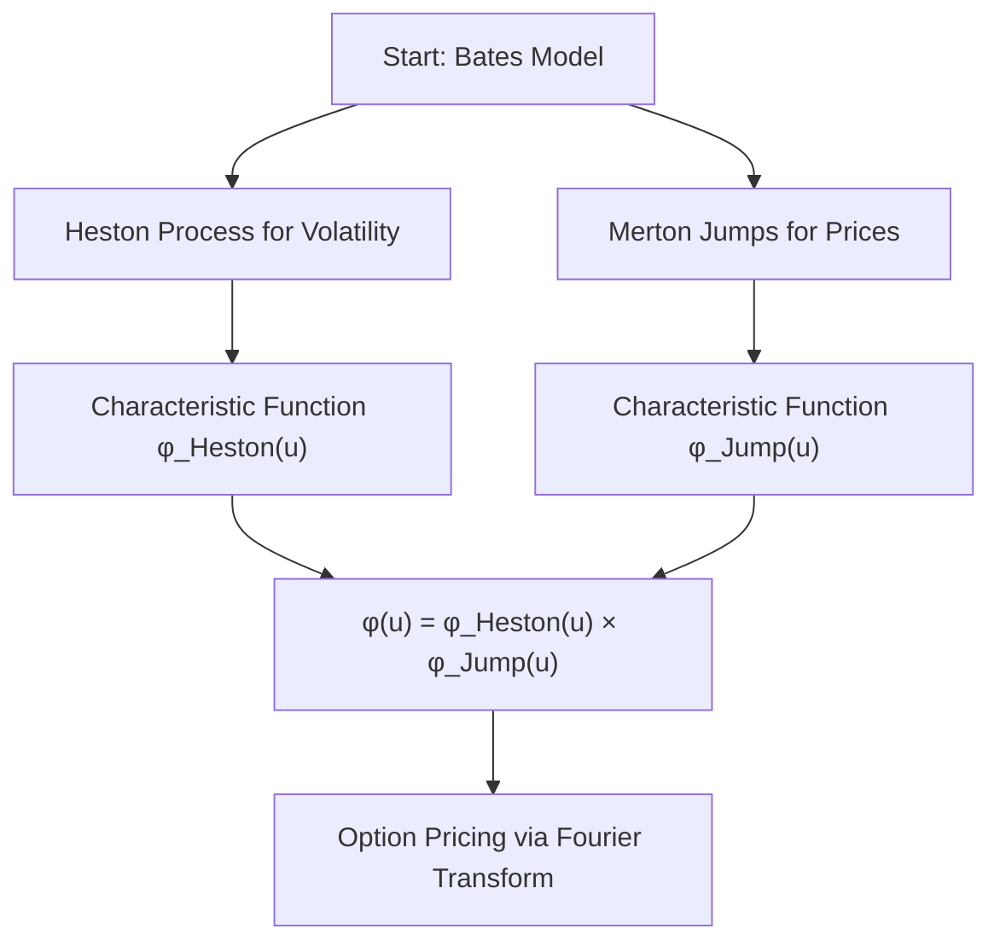

# Bates Model

So far we have two powerful models: 

- Heston (random/stochastic volatility)
- Merton (jumps in asset prices)

The bates model blends both, giving you a “supermodel” of asset prices that can handle: 

- Slowly evolving volatility 
- Sudden big jumps.

We will use the Lewis integral formula and the Carr-Madan (FFT) approach. This means:

- We take the Bates characteristic function (which is Heston’s CF x adjusted Merton jumps),
- Then either directly integrate (Lewis),
- Or use discrete transforms (Carr-Madan/FFT)

So Bates = Heston + Merton

**Bates Pricing Approaches**



## Bates Model

The Bates model describes the evolution of the stock price S_t and variance v_t with the following dynamics: 


$$
\begin{aligned}
dS_t &= \mu S_t dt + \sqrt{v_t} S_t dW_t^S + (J - 1) S_t dN_t \\
dv_t &= \kappa (\theta - v_t) dt + \sigma \sqrt{v_t} dW_t^v \\
\end{aligned}
$$


- $W_t^S, W_t^v$ are two Brownian motions with correlation $\rho$,
- $N_t$ is a Poisson process (jumps),
- $J \sim \log \mathcal{N}(\mu_J, \delta_J^2)$ represents the jump size.


- **Volatility itself fluctuates** over time: this explains why option prices don’t fit the Black-Scholes model well.
- **Jumps** add realism: big news or events can make stock prices jump.

So Bates gives a more flexible, accurate picture of real market dynamics than Heston or Merton alone. 


## Characteristic Function (CF)

The CF in Bates is: 


$$
\phi(u) = \phi_{Heston}(u) \cdot \phi_{Jump}(u)
$$


Where:


- $\phi_{Heston}(u)$: characteristic function of log-price under Heston.
- $\phi_{Jump}(u) = \exp\left( \lambda T \left( e^{i u \mu_J - \frac{1}{2} u^2 \delta_J^2} - 1 \right) \right)$

This multiplication is possible because **the Heston and jump components are independent**.


We can then plug this into the **Lewis (2001)** or **Carr-Madan (1999)** pricing formulas to compute European option prices via Fourier techniques. 




> The Bates model is a combination of Heston (for volatility) and Merton (for jumps). The asset price changes continuously with stochastic volatility, but it can also jump at random times. We find the total characteristic function by multiplying the individual CFs for Heston and Merton. This is then used in Lewis or Carr-Madan pricing frameworks.

## Bates Calibration

Imagine you’re trying to predict the price of an option, but the market is messy. Prices can move smoothly (like in Black-Scholes) *and* suddenly jump due to unexpected news. Plus, the volatility (how shaky prices are) also changes over time.

The **Bates model** combines:

- The **Heston model** (volatility that changes randomly),
- And the **Merton jump-diffusion model** (sudden jumps in price).

So, we’re dealing with:

- Random drift 
- Random volatility 
- Random jumps 

Our goal is to find the set of parameters for this model that **best fits the market data** — this is called **calibration**.

### Params to calibrate (estimate)

We want to estimate these parameters:

- $\kappa$: speed of mean reversion of volatility
- $\theta$: long-term variance
- $\sigma_v$: volatility of volatility (vol of vol)
- $\rho$: correlation between price and variance
- $v_0$: initial variance
- $\lambda$: jump intensity (how often jumps occur)
- $\mu$: average jump size
- $\delta$: std dev of jump size

We do this by minimizing the **error between market prices and model prices** using an optimization technique.

## Code

```python
bates = BatesFourier(
    S0=100, K=100, T=1, r=0.05,
    sigma=0.15,          # sigma_v
    kappa=1.5,
    theta=0.02,
    v0=0.01,
    rho=0.1,
    lam=0.25,            # lambda
    mu=-0.2,
    delta=0.1,
    method="lewis",
    option_type="call"
)

print(f"Bates Call Price (Lewis method): {bates.price():.9f}")
```

```
Bates Call Price (Lewis method): 8.904718864
```

```python
bates2 = BatesFourier(
    S0=100, K=100, T=1, r=0.05,
    sigma=0.15,          # sigma_v
    kappa=1.5,
    theta=0.02,
    v0=0.01,
    rho=0.1,
    lam=0.25,            # lambda
    mu=-0.2,
    delta=0.1,
    method="carr-madan",
    option_type="call"
)

print(f"Bates Call Price (Carr-Madan method): {bates2.price():.9f}")
```

```
Bates Call Price (Carr-Madan method): 8.904718821
```


