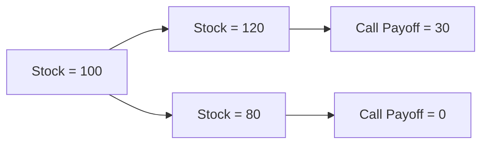

# Delta and Delta Hedging

Delta ($\Delta$) measures the change in the price of the option with respect to the change in the price of the underlying asset. 


$$
\begin{aligned}
\Delta_0 = \frac{c_1^u - c_1^d}{S_u - S_d}
\end{aligned}
$$


Delta is like an **insurance policy**:

- If your option loses value, your stock position will gain (or vice versa)
- You’re hedging - like carrying an umbrella just in case it rains. 



The option pays if the stock goes above strike price ( K=90 )

So:

- Cu = max(120 - 90, 0) = 30
- Cd = max(80 - 90, 0) = 0

Delta formulates to:


$$
\Delta = \frac{C_u - C_d}{S_u - S_d} = \frac{30 - 0}{120 - 80} = 0.75
$$


So for every 1 share of call sold, buy 0.75 shares of stock to hedge. 

For simple 1 step binomial tree, we can calculate delta by:

```python
from wqu.dp.binomial import calculate_delta

# Inputs
S0 = 100
K = 90
u = 1.2
d = 0.8

# Calculate delta for call
delta_call = calculate_delta(S0, K, u, d, option_type='call')
print(f"Delta (Call): {delta_call:.4f}")

# Calculate delta for put
delta_put = calculate_delta(S0, K, u, d, option_type='put')
print(f"Delta (Put): {delta_put:.4f}")
```

## Delta and Delta hedging in N-step binomial tree

In a 1-step tree, delta is calculated using the terminal payoffs. 

In an N-step tree, delta is calculated at each node as: 


$$
\Delta_{t,i} = \frac{C_{t+1,i+1} - C_{t+1,i}}{S_{t+1,i+1} - S_{t+1,i}}
$$


This is just applying the same logic at every point in the tree (going backwards in time).

And the Python package `wqu` provides an easy to use interface for implementing all those. Here is a simplified summary of how it works:


1. We model the **stock price over time** as a tree ( it can go up u or down d)
2. **Compute the option payoff** at each terminal node. 
3. Use **backward induction** to compute the option value at earlier nodes using expected (risk-nutral) values 
4. Optionally **compute the $\Delta$ (delta)** values - the number of shares you’d need to hedge an option position. 
5. **Check put-call parity** - a relationship that must always hold under no-arbitrage conditions. 

Where, we have $dt = T / N$ represents the length of each time step and $p=\frac{e^{r\Delta t}-d}{u-d}$, this ensures the model is free of arbitrage and consistent with expected returns under risk-free rate. And $discount=e^{-r\Delta t}$.

### Risk free measure

 **Expected stock price under risk-neutral measure**

We define:


$$
\mathbb{E}^{\mathbb{Q}}[S_{\Delta t}] = p \cdot S_0 u + (1 - p) \cdot S_0 d = S_0 \cdot (p u + (1 - p) d)
$$


**In the risk-neutral world, the expected return is the risk-free rate** (We get same result if we buy the stock or we put that money in the bond)

That means the expected stock value in the future (1 step ahead) is just the current price compounded at the risk-free rate: 


$$
\mathbb{E}^{\mathbb{Q}}[S_{\Delta t}] = S_0 \cdot e^{r \Delta t}
$$


**Equating both sides**


$$
S_0 \cdot (p u + (1 - p) d) = S_0 \cdot e^{r \Delta t}
$$


Cancel S_0 (non-zero), and solve for p: and we get: 


$$
\boxed{p = \frac{e^{r \Delta t} - d}{u - d}}
$$


That’s our **risk-neutral probability**.

### Stock price tree

Binomial stock price tree can be build numerically with :


$$
S_{t,i} = S_0 \cdot u^i \cdot d^{t-i}
$$


which represents the stock price after $i$ up moves and $t-i$ down moves. This tree represents the possible future paths of the stock over $N$ steps. 

### Option value tree

To calculate the option value in any node, we do two things: 

1. Calculate the payoff at maturity t=N, 
2. Move backward in time, use the **expected risk-neutral value** formulated as:


$$
C_{t, i} = e^{-r \Delta t} \left[ p C_{t+1,i+1} + (1 - p) C_{t+1,i} \right]
$$


This is just the present value of expected payoff under the risk-neutral measure. 

### Hedge 

For each non-terminal node, it computes 


$$
\Delta_{t, i} = \frac{C_{t+1,i+1} - C_{t+1,i}}{S_{t+1,i+1} - S_{t+1,i}}
$$


This tells you:

•	How sensitive the option is to changes in the stock price
•	How many shares to hold to replicate the option payoff at that node (important in hedging)

### Price of the Option at time t=0

To get the option price at time 0, we just need to get the option value $C_{0,0}$ (or $P_{0,0}$ for put)

This is the fair value today of the option, computed using all the logic above. 

## Calculation

```python
bt_call = BinomialTree(S0=100, K=90, T=1, r=0.1, u=1.2, d=0.8, N=3, option_type='call')
bt_call.build_stock_tree()
bt_call.build_option_tree()
bt_call.build_delta_tree()

bt_call.summary()
bt_call.plot_tree(bt_call.stock_tree, title="Stock Price Tree")
bt_call.plot_tree(bt_call.option_tree, title="Option Price Tree")
bt_call.plot_tree(bt_call.delta_tree, title="Delta Tree")

bt_call.check_put_call_parity()
```


## Risk-Neutral vs. Real-World Probabilities

| **Risk-Neutral World (**$\mathbb{Q}$**)** | **Real World (**$\mathbb{P}$**)**    |
| ----------------------------------------- | ------------------------------------ |
| Expected return = risk-free rate $r$      | Expected return = market drift $\mu$ |
| Used for pricing                          | Used for prediction                  |
| Based on no-arbitrage                     | Based on observed outcomes           |
| Discounting at $e^{-r \Delta t}$          | Discounting at $e^{-\mu \Delta t}$   |

So we have: 


$$
p = \frac{e^{r \Delta t} - d}{u - d}
\quad , \quad
p^* = \frac{e^{\mu \Delta t} - d}{u - d}
$$


Where $ p^*$ is the real-world probability. 

### Matching volatility - where $u$ and $d$ come from

To ensure that the binomial model reflects real-world  **volatility** $\sigma$ , we should set:


$$
u = e^{\sigma \sqrt{\Delta t}}, \quad
d = e^{-\sigma \sqrt{\Delta t}}
$$


We want to build a binomial tree where the **variance of returns matches the real-world (or risk-neutral) volatility** of the underlying asset. 

This lets us: 

- Model the undertainty of stock movements correctly 
- Ensure convergence to Black-Scholes as $N->\infty$

In the continious world (as in the Black-Sholes), the stock market follows **Gemetric Brownian Motion**:


$$
\frac{dS_t}{S_t} = \mu dt + \sigma dW_t
$$


This implies the **log-returns** over a small time $\Delta t$ have variance: 


$$
\text{Var}[\log(S_{t+\Delta t} / S_t)] = \sigma^2 \Delta t
$$


So we want our **binomial model** to have the same variance! 

If a stock moves from price $S$ to $S{\prime}$, the **log-return** is: $\log\left(\frac{S{\prime}}{S}\right)$

So if the stock **goes up by a factor** u: $\log\left(\frac{S_0 \cdot u}{S_0}\right) = \log(u)$ , Similarly, for a **down factor** d: $\log(d)$ 

These log-returns are additive, and in continuous models, they follow a **normal distribution**.

**In the binomial model, one step gives:**

- Up move: $\log(u) = \log(e^{\sigma \sqrt{\Delta t}}) = \sigma \sqrt{\Delta t}$ 
- Down move: $\log(d) = \log(e^{-\sigma \sqrt{\Delta t}}) = -\sigma \sqrt{\Delta t}$

So the returns (log-space) are symmetric: $+\sigma \sqrt{\Delta t}$ or $-\sigma \sqrt{\Delta t}$

We are **choosing**: $u = e^{\sigma \sqrt{\Delta t}}, \quad d = e^{-\sigma \sqrt{\Delta t}}$

Now just apply the **logarithm**: 


$$
\begin{aligned}
\log(u) &= \log\left(e^{\sigma \sqrt{\Delta t}}\right) = \sigma \sqrt{\Delta t}
\\
\log(d) &= \log\left(e^{-\sigma \sqrt{\Delta t}}\right) = -\sigma \sqrt{\Delta t}
\end{aligned}
$$


This is just applying the basic logarithmic rule: 


$$
\log(e^x) = x
$$


So:


- An **up move** corresponds to a log-return of $+\sigma \sqrt{\Delta t}$
- A **down move** corresponds to a log-return of $-\sigma \sqrt{\Delta t}$

- These returns are symmetric around 0
- They have variance $\sigma^2 \Delta t$
- Which is **exactly what Geometric Brownian Motion** assumes in the Black-Scholes model

So this clever choice of $u = e^{\sigma \sqrt{\Delta t}}, d = e^{-\sigma \sqrt{\Delta t}}$ ensures that the binomial model behaves like the continuous-time stochastic process when $\Delta t \to 0$.


