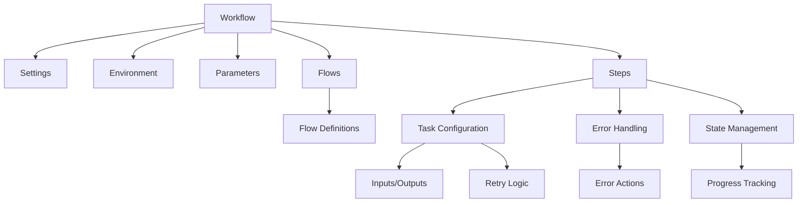
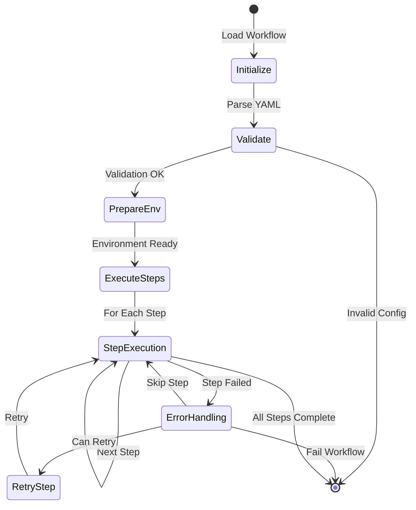
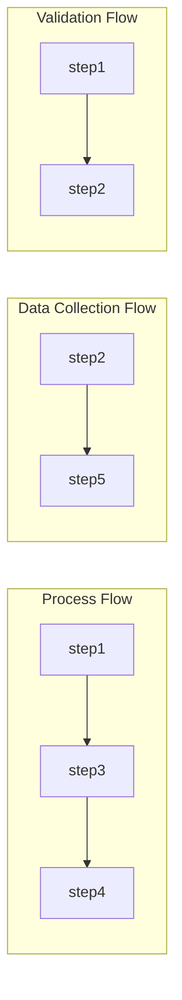
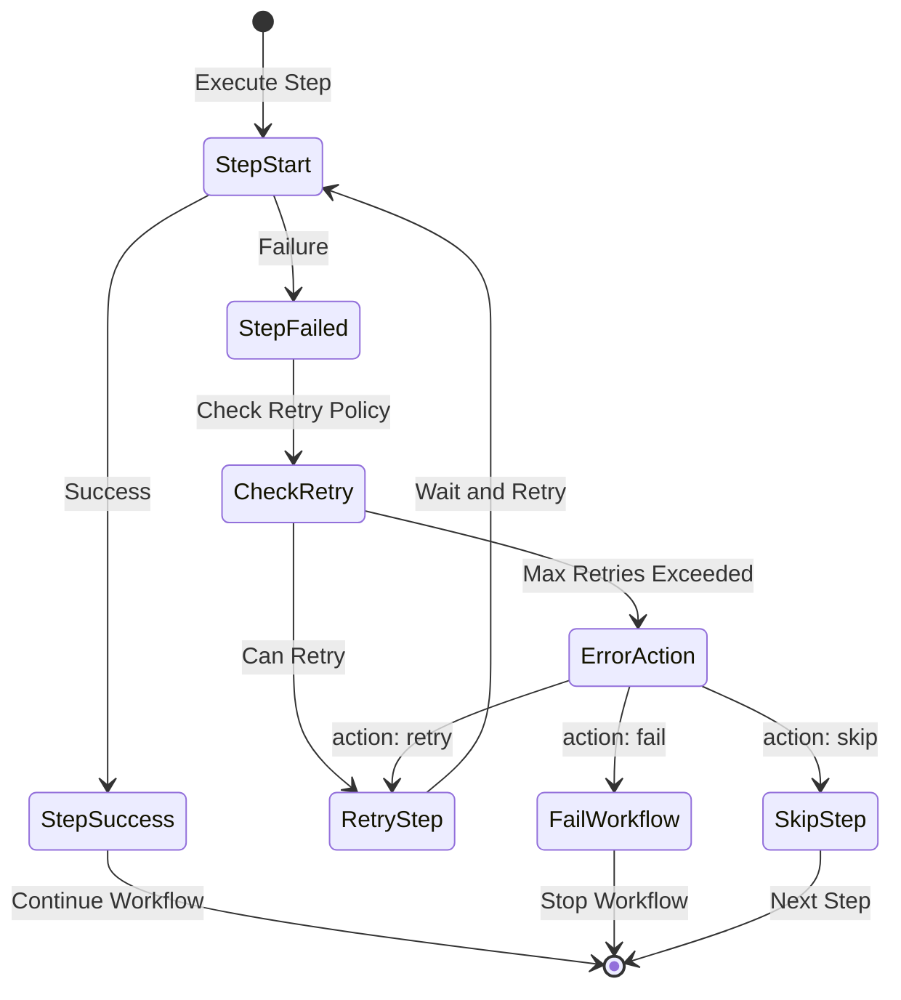
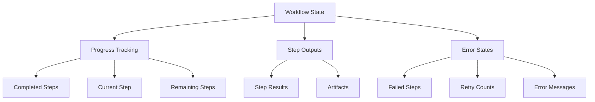

# Workflow Structure

## Component Overview



## Basic Structure
```yaml
name: My Workflow
description: Workflow description
version: "0.1.0"  # Optional

# Optional global settings
settings:
  timeout: 3600
  retry_count: 3
  max_workers: 4

# Optional environment variables
env:
  API_KEY: ${env:API_KEY}
  DEBUG: "true"

# Optional parameter definitions
params:
  input_file:
    description: Input file path
    type: string
    required: true
  batch_size:
    description: Number of items to process at once
    type: integer
    default: 10

# Optional flow definitions
flows:
  default: process  # Optional, defaults to "all" if not specified
  definitions:
    - process: [step1, step3, step4]  # Main processing flow
    - data_collection: [step2, step5]  # Data collection flow
    - validation: [step1, step2]  # Validation flow

# Workflow steps
steps:
  - name: step1
    task: task_type
    params:
      # ... step parameters ...

  - name: step2
    task: task_type
    params:
      # ... step parameters ...
```

## Workflow Lifecycle



## Flow Control

The workflow engine supports defining multiple flows within a single workflow. Each flow represents a specific sequence of steps to execute. This allows you to:

- Define different execution paths for different purposes
- Reuse steps across different flows
- Switch between flows via command line
- Resume failed flows from the last failed step

### Flow Configuration Example



```yaml
flows:
  # Optional default flow to use when no flow is specified
  default: process
  
  # Flow definitions
  definitions:
    # Each item defines a named flow with its step sequence
    - process: [step1, step3, step4]
    - data_collection: [step2, step5]
    - validation: [step1, step2]
```

## Error Handling

The workflow engine provides comprehensive error handling:



```yaml
steps:
  - name: step_with_retry
    task: shell
    command: "curl http://api.example.com"
    retry:
      max_attempts: 3
      delay: 5
      backoff: 2
    on_error:
      action: fail  # or skip, retry
      message: "API request failed"
```

## State Management

The workflow engine maintains state for each workflow run, allowing for:



State is stored in a `.workflow_metadata.json` file in the workspace directory. 